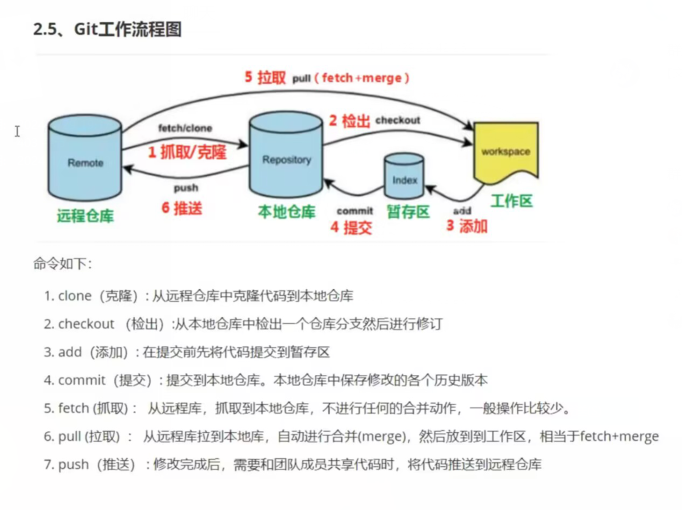
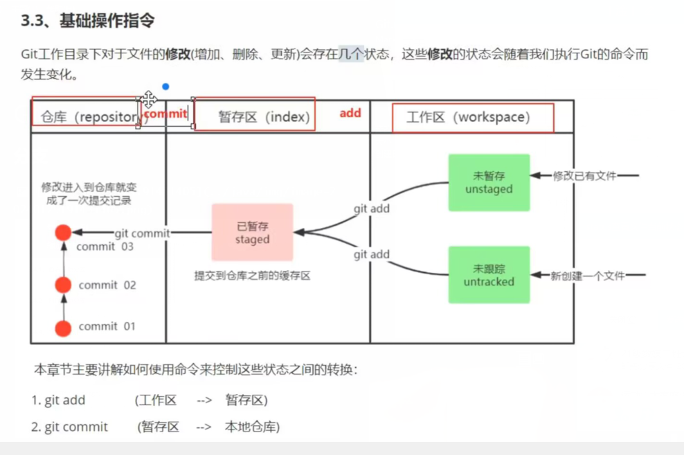
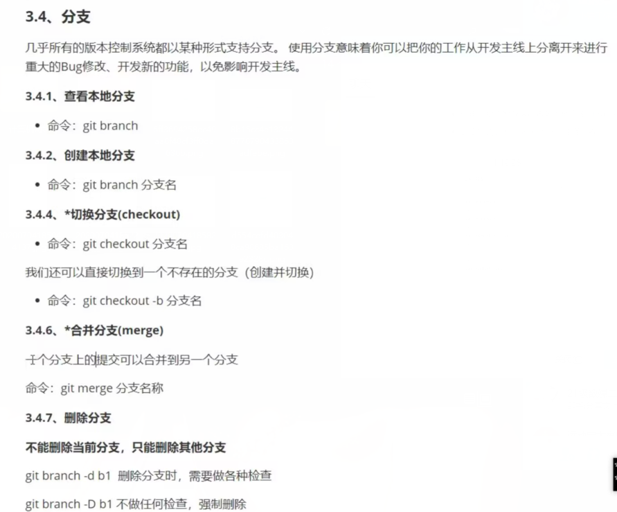

# Git

## 配置常用命令的别名

```java
git config --global alias.<简写命令> <完整命令>
git config --global alias.gst status
git config --global alias.git-log "log --pretty=oneline --all --graph --abbrev-commit"
    
```


## 分支







## 常用命令

```xml
1.初始化本地仓库
git init

2.工作区 》 暂存区	
git add .

3.暂存区 》 仓库 	
git commit -m '上传文件注释'

4.添加远程仓库
git remote add origin （gitee/github）URL

5.将本地仓库中的文件推送至远程仓库中
git push -u origin master


```

### 将远程仓库克隆到本地

```xml
git clone (gitee/github)URL 文件名
```

### 查看分支

```xml
git branch
```

### 创建切换分支

```xml
git checkout -b 分支名
```

### 合并分支

```xml
git merge
```

### 命令查看已配置的远程仓库及其对应的URL

```xml
git remote -v
```

### 要将名为 `origin` 的远程仓库的URL修改为 `https://github.com/user/repo.git`

```xml
git remote set-url origin https://gitee.com/the-yibai-daywind/hashmap.git
```

### 将master分支推送到远程仓库，并于远程仓库的master分支绑定关联关系

```xml
git push --set-uptream origin master
```

#### 查看当前工作树中未合并的文件列表

```xml	
git status
```

