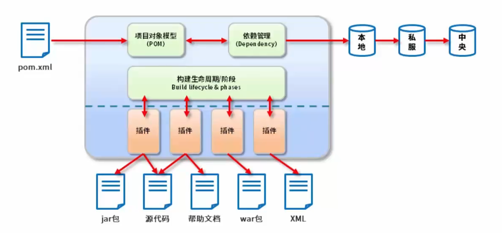
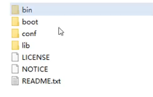
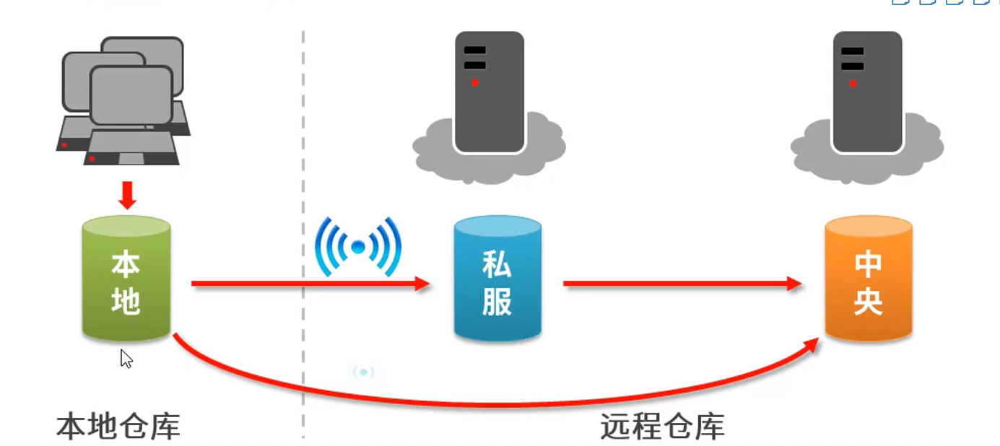
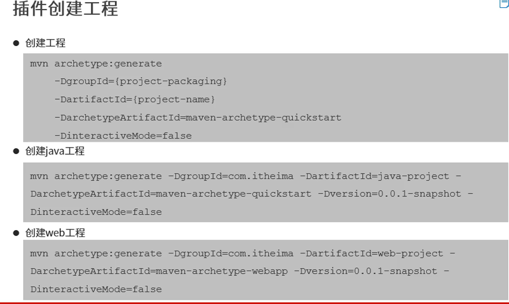
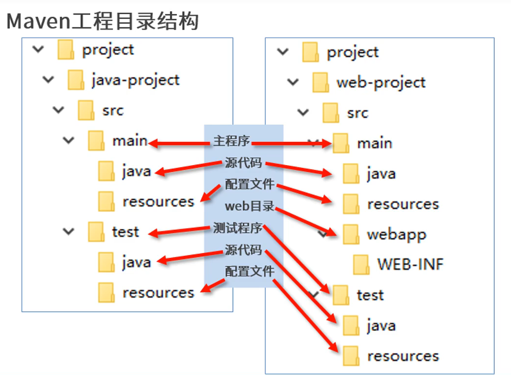
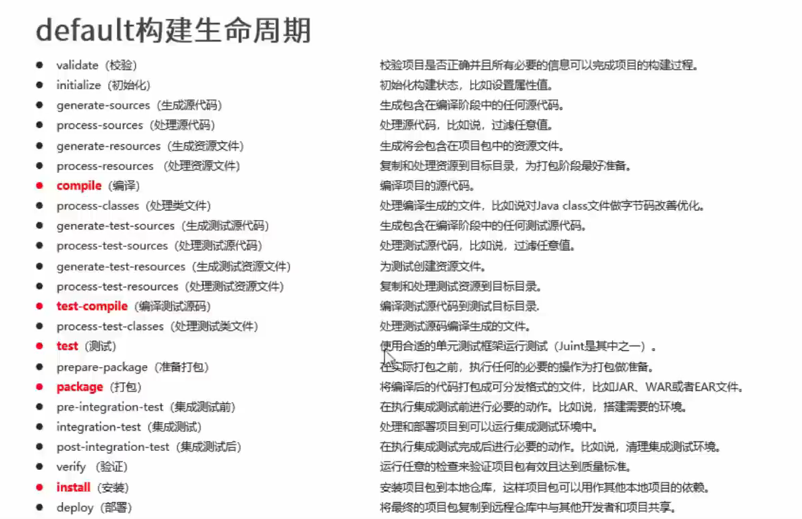

# Maven

## Maven是什么

* Maven的本质是一个项目管理工具，将项目开发和管理过程抽象成一个对象模型（POM）

* POM（Project Object Model）：项目对象模型




## 作用

* 项目构建：提供标准的、跨平台的自动化项目构建方式
* 依赖管理：方便快捷的管理项目依赖的资源（jar包），避免资源间的版本冲突问题
* 统一开发结构：提供标准的、统一的项目结构


## 安装

* **目录**
  * bin  核心运行文件
  * boot 类加载器
  * conf 核心配置文件
  * lib 依赖的jar包



1. **bin**：这个文件夹包含了Maven的可执行文件。通常情况下，它包括了`mvn`命令，这是启动Maven和执行各种任务（如编译、测试、打包等）的主要方式。用户通过在命令行中输入`mvn`命令并带上相应的参数来运行Maven。
2. **boot**：这个文件夹包含了Maven启动时所需的类加载器。Maven使用这些类加载器来加载和执行Java程序。通常，用户不需要直接修改`boot`文件夹中的内容。
3. **conf**：这个文件夹是Maven的配置目录，其中最重要的文件是`settings.xml`。这个文件包含了Maven的配置信息，如代理设置、仓库地址、认证信息等。用户可以在这个文件中进行配置，以适应特定的构建需求或企业环境。
4. **lib**：这个文件夹包含了Maven运行时所需的所有依赖库，这些库是以JAR文件的形式存在的。Maven在执行任务时会使用这些库来支持各种功能，如编译代码、运行测试等。


## 基础概念

### 仓库



* **仓库：**用于存储资源，包含各种jar包
* **仓库分类：**
  * 本地仓库：自己电脑上存储资源的仓库，连接远程仓库获取资源
  * 远程仓库：非本机电脑上的仓库，为本地仓库提供资源
    * 中央仓库：Maven团队维护，存储所有资源的仓库
    * 私服：部门/公司范围内存储资源的仓库，从中央仓库获取资源
* **私服的作用：**
  * 保存具有版权的资源，包含购买或自主研发的jar
    * 中央仓库中的jar都是开源的，不能存储具有版权的资源
  * 一定范围内共享资源，仅对内部开放，不对外共享


### 坐标

* **什么是坐标**

  ​	Maven中的坐标用于描述仓库中资源的位置

  https://mvnrepository.com/

* **Maven坐标主要组成（组织ID、项目ID、版本号）**
  * groupld：定义当前Maven项目隶属组织名称（通常是域名反写）
  * artifactld：定义当前Maven项目名称（通常是模块名称）
  * version：定义当前项目版本号
  * packaging：定义当前项目打包方式
* **Maven坐标的作用**
  
  * 使用唯一标识，唯一性定位资源位置，通过该标识可以将资源的识别与下载工作交由机器完成


### 仓库配置

* **本地仓库配置**（资源下到哪）

  maven安装目录->conf->settings.xml

  * 默认位置

    ```xml
    <localRepository>/path/to/local/repo</localRepository>
    ```

  * 自定义位置

    ```xml
     <localRepository>D:\maven\maven-repo</localRepository>
    
    ```

* **镜像仓库配置**（资源从哪来）

  在setting文件里面配置阿里云镜像仓库

  * ```xml
     <!--阿里云镜像2-->
      <mirror>
        <!-- 此镜像的唯一标识符，用来区分不同的mirror元素 -->
        <id>alimaven</id>
        <!-- 对哪种仓库进行镜像，替代哪个仓库 -->
        <mirrorOf>central</mirrorOf>
        <!-- 镜像名称 -->
        <name>aliyun maven</name>
        <!-- 镜像URL -->
        <url>https://maven.aliyun.com/nexus/content/groups/public/</url>
      </mirror>
    ```

## 项目构建命令

**Maven周期**

| **compile** |      **编译**      |
| :---------: | :----------------: |
|  **clean**  |      **清理**      |
|  **test**   |      **测试**      |
| **install** | **安装到本地仓库** |
| **package** |      **打包**      |

## 工程






## 依赖管理

```xml
	<!-- maven升级的版本号 -->
    <modelVersion>4.0.0</modelVersion>
    <!--组织ID-->
    <groupId>com.buercorp.wangyu</groupId>
    <!--项目ID-->
    <artifactId>wy-test-demo</artifactId>
    <!--版本号 RELEASE 完整版  SHAPSHOT 开发版-->
    <version>1.0-SNAPSHOT</version>

    <properties>
        <maven.compiler.source>17</maven.compiler.source>
        <maven.compiler.target>17</maven.compiler.target>
        <project.build.sourceEncoding>UTF-8</project.build.sourceEncoding>
    </properties>

    <!--设置所有的依赖-->
    <dependencies>
        <!--具体的依赖-->
        <dependency>
            <!--依赖所属群组ID-->
            <groupId>org.slf4j</groupId>
            <!--依赖所属项目ID-->
            <artifactId>slf4j-api</artifactId>
            <!--依赖版本号-->
            <version>1.7.36</version>
        </dependency>
	</dependencies>
```


### 依赖传递

* 依赖具有传递性：
  * **直接依赖：**在当前项目中通过依赖配置建立的依赖关系
  * **间接依赖：**被资源的资源，如果依赖其他资源，当前项目间接依赖其他资源

### 依赖冲突

* **路径优先：**当依赖中出现相同的资源时，层级越深，优先级越低
* **声明优先：**当资源在相同层级被依赖时，配置顺序靠前的覆盖配置顺序靠后的
* **特殊优先：**当同级配置了相同资源的不同版本，后配置的覆盖前配置的

### 可选依赖

* 可选依赖指对外隐藏当前所依赖的资源----不透明

```xml
    <dependencies>
        <dependency>
            <groupId>org.slf4j</groupId>
            <artifactId>slf4j-api</artifactId>
            <version>1.7.36</version>
            <!--可选依赖-->
            <optional>true</optional>
        </dependency>	
	</dependencies>
```

### 排除依赖

* 排除依赖指主动断开依赖的资源，被排除的资源无需指定版本----不需要

```xml
		<dependency>
            <groupId>cn.hutool</groupId>
            <artifactId>hutool-all</artifactId>
            <version>5.8.26</version>
            <!--排除依赖-->
            <exclusions>
                <exclusion>
                    <groupId>cn.hutool</groupId>
                    <artifactId>hutool-all</artifactId>
                </exclusion>
            </exclusions>
        </dependency>
```

### 依赖范围

* 依赖的jar默认情况可以在任何地方使用，可以通过scope标签设定其作用使用

* 作用范围

  * 主程序范围有效（main文件夹范围内）

  * 测试程序范围有效（test文件夹范围内）

  * 是否参与打包（package指令范围内）

    |       scope       | 主代码 | 测试代码 | 打包 |    范例     |
    | :---------------: | :----: | :------: | :--: | :---------: |
    | **compile(默认)** |   Y    |    Y     |  Y   |    log4j    |
    |     **test**      |        |    Y     |      |    junit    |
    |   **provided**    |   Y    |    Y     |      | servlet-api |
    |    **runtime**    |        |          |  Y   |    jdbc     |

  ```xml
   <dependency>
              <groupId>junit</groupId>
              <artifactId>junit</artifactId>
              <version>3.8.1</version>
     			<!--测试--> 
              <scope>test</scope>
          </dependency>
  ```

  ### 依赖范围传递性

  * 带有依赖范围的资源在进行传递时，作用范围将受到影响

  

|              | compile | test | provided | runntime |<--左行直接依赖|
| :----------: | :-----: | :--: | :------: | :------: | -------- |
| **compile**  | compile | test | provided | runtime  ||
|   **test**   |         |      |          |          ||
| **provided** |         |      |          |          ||
| **runtime**  | runtime | test | provided | runtime  ||
| **上列间接依赖** ||||||


## 生命周期

### 项目构建生命周期

* Maven对项目构建的生命周期划分为3套
  * **clean**：清理工作
  * **default**：核心工作，如编译，测试，打包，部署等
  * **site**：产生报告，发布站点等

**Clean生命周期：**

* **pre-clean**： 执行一些需要在clean之前完成的工作
* **clean：** 移除所有上一次构建生成的文件
* **post-clean：** 执行一些需要在clean之后立刻完成的工作

**default生命周期：**



**site生命周期：**

* **pre-site：** 执行一些需要在生成站点文档之前完成的工作
* **site：** 生成项目的站点文档
* **post-site：** 执行一些需要在生成站点文档之后完成的工作，并且为部署做准备
* **site-deploy：** 将生成的站点文档部署到特定的服务器上


## 分模块开发与设计


## 聚合


## 继承


## 属性


## 版本管理

### 工程版本

* SNAPSHOT（快照版本 测试）
  * 项目开发过程中，为方便团队成员合作，解决模块间相互依赖和实时更新的问题，开发者对每个模块进行构建的时候，输出的临时性版本叫快照版本（测试阶段版本）
  * 快照版本会随着开发的进程不断更新
* RELRASE（发布版本）
  * 项目开发到进入阶段里程碑后，向团队外部发布较为稳定的版本，这种版本所对应的构建文件是稳定的

### 工程版本号约定

<主版本><次版本><增量版本><里程碑版本>

## 资源配置


## 多环境开发配置


## 跳过测试


## 私服


