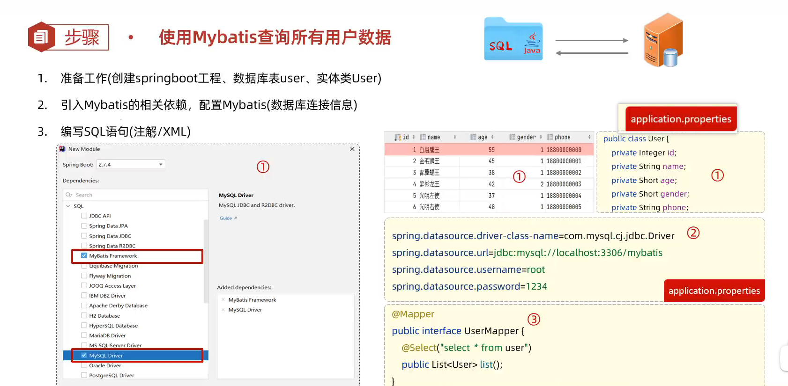
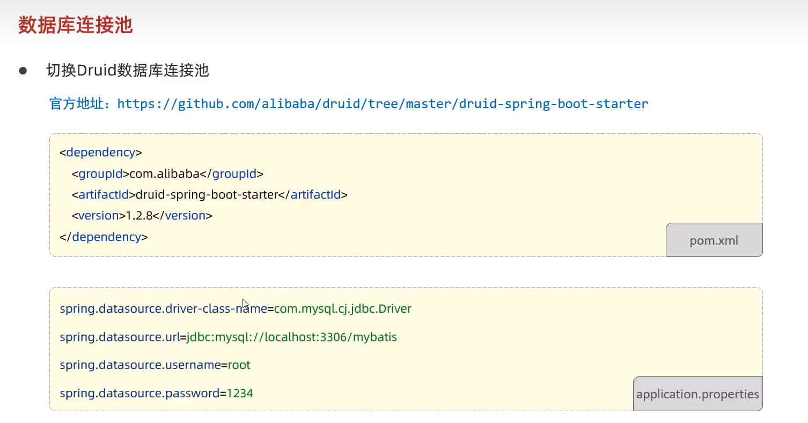
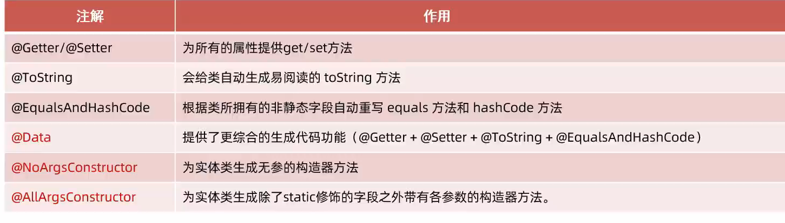
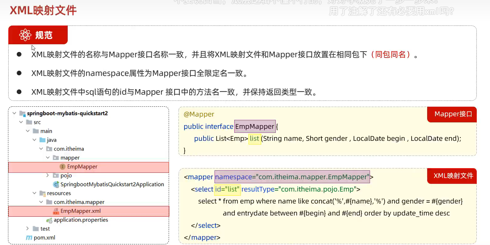

# Mybatis

## 简介：

MyBatis是一款优秀的**持久层框架**，用于**简化JDBC**开发

**持久层：**

* 负责将数据到保存到数据库的那一层代码
* javaEE三层架构：表现层、业务层、持久层

**框架：**

* 框架就是一个半成品软件，是一套可重用的、通用的、软件基础代码模型
* 在框架的基础之上构建软件编写更加高效、规范、通用、可扩展

## JDBC缺点：


## MyBatis简化


## 快速入门




## 数据库链接池

**标准接口：DataSource**

* 官方（sun）提供的数据库链接池接口，由第三方组织实现此接口
* 功能：获取链接
* Connection getConnection（）throws SQLException


* 数据库连接池是个容器，负责分配、管理数据库链接（Connection）
* 它允许应用程序重复使用一个现有的数据库链接，而不是再重新建立一个
* 释放空闲时间超过最大空闲时间的链接，来避免因为没有释放链接而引起的数据库链接遗漏

**优势：**

* 资源重用
* 提升系统响应速度
* 避免数据库链接遗漏




## lombok

是一个实用的java类库，能通过注解的形式自动生成构造器、getter/setter、equals、hashcode、toString等方法，并可以自动化生成日志变量，简化Java开发、提高效率



```xml
            <!-- lombok依赖 -->
            <dependency>
                <groupId>org.projectlombok</groupId>
                <artifactId>lombok</artifactId>
            </dependency>
```



## Mapper代理开发


## 核心配置文件


## 配置文件完成增删改查


## 注解完成增删改查


## 动态SQL


