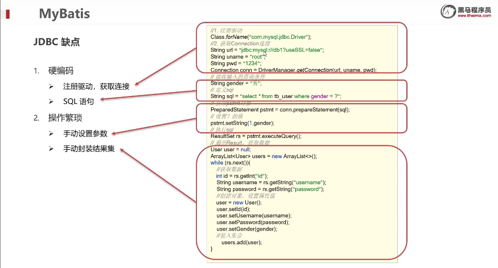
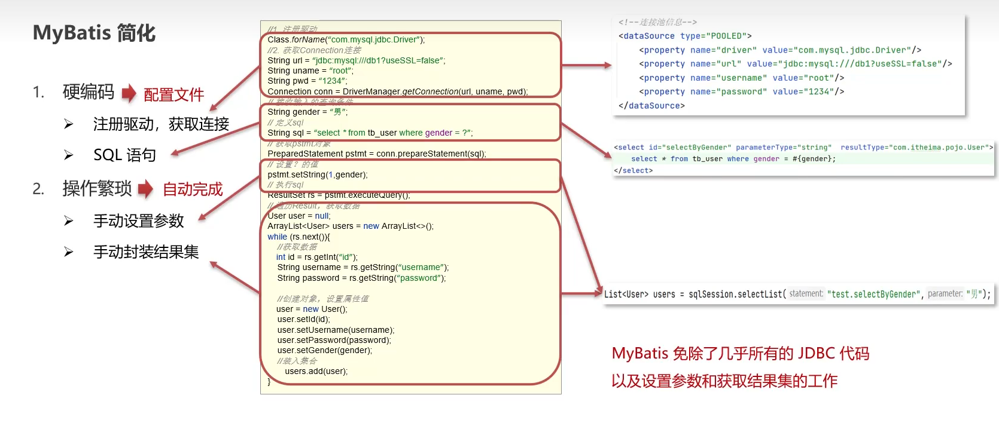
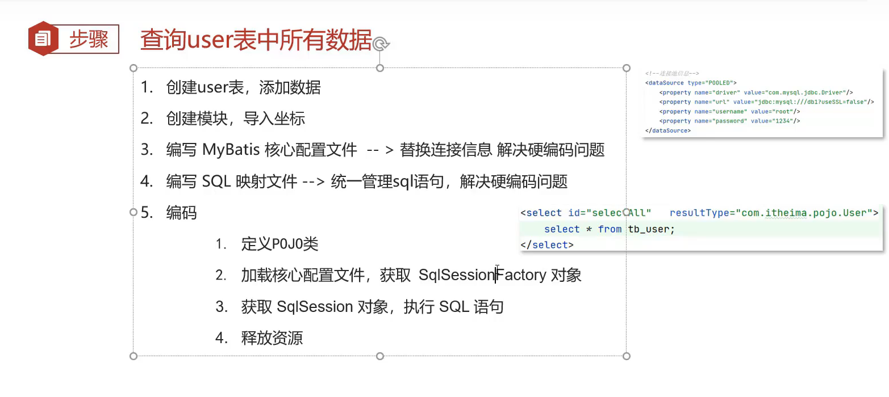

# Mybatis

## 简介：

MyBatis是一款优秀的**持久层框架**，用于**简化JDBC**开发

**持久层：**

* 负责将数据到保存到数据库的那一层代码
* javaEE三层架构：表现层、业务层、持久层

**框架：**

* 框架就是一个半成品软件，是一套可重用的、通用的、软件基础代码模型
* 在框架的基础之上构建软件编写更加高效、规范、通用、可扩展

## JDBC缺点：

## MyBatis简化

## 快速入门

## Mapper代理开发

## 核心配置文件

## 配置文件完成增删改查

## 注解完成增删改查

## 动态SQL

