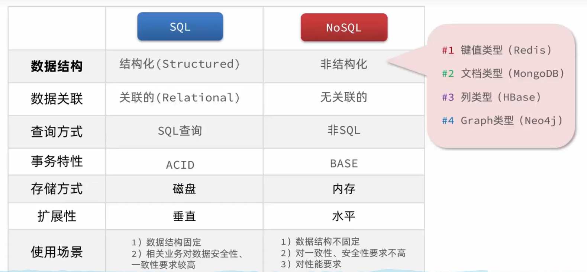

# Redis

## 认识NoSQL

## 事务

**SQL事务ACID：原子性、一致性、隔离性、持久性**

* **原子性（Atomicity）、一致性（Consistency）、隔离性（Isolation）、持久性（Durability）**

**NoSQL事务BASE：基本可用、软状态、最终一致**

* **基本可用（Basically Available）、软状态（Soft-state）和最终一致性（Eventually Consistent）**

1. **基本可用（Basically Available）**：指的是系统即使在遇到故障的情况下，依然能够提供基本的访问和操作能力，不会完全拒绝服务。这与ACID模型中强调的高可用性不同，在ACID模型中，如果出现故障可能会影响到整个系统的使用。
2. **软状态（Soft-state）**：表示系统中的数据可能会暂时处于不一致的状态。这是由于在分布式系统中，数据同步可能需要一定的时间。但最终，通过各种同步和一致化机制，数据会达到一致的状态。
3. **最终一致性（Eventually Consistent）**：指在一个分布式系统中，数据经过一段时间后最终会达到一致的状态。这个模型允许短时间内的数据不一致，但保证在较长的时间尺度上，所有节点的数据将会同步并保持一致性

## 认识Redis

**基于内存的键值型NoSQL数据库**

### 特征

* 键值型（key-value），value支持多种不同数据结构，功能丰富
* 单线程，每个命令具备原子性
* 低延迟，速度快（基于内存、IO多路复用、良好的编码）
* 支持数据持久化
* 支持主从集群、分片集群
* 支持多语言客户端