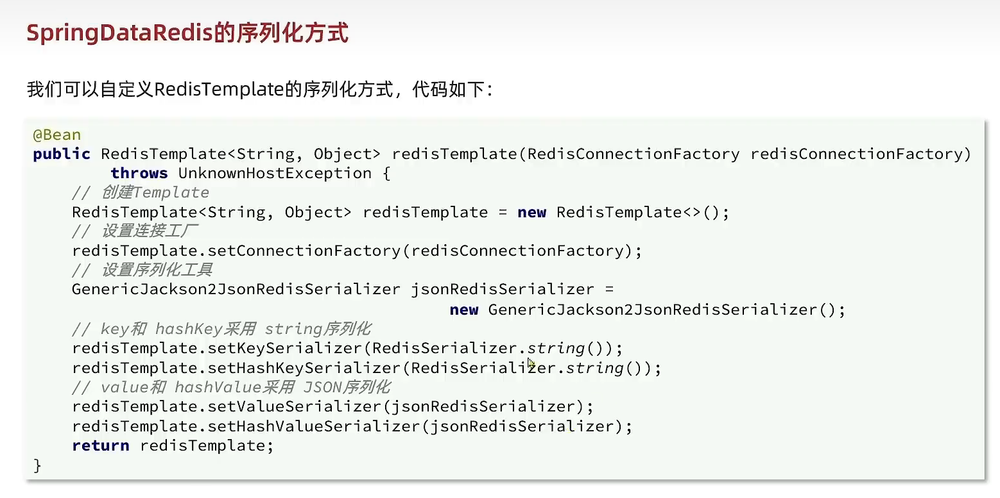

# Redis

## 认识NoSQL


## 事务

**SQL事务ACID：原子性、一致性、隔离性、持久性**

* **原子性（Atomicity）、一致性（Consistency）、隔离性（Isolation）、持久性（Durability）**


**NoSQL事务BASE：基本可用、软状态、最终一致**

* **基本可用（Basically Available）、软状态（Soft-state）和最终一致性（Eventually Consistent）**

1. **基本可用（Basically Available）**：指的是系统即使在遇到故障的情况下，依然能够提供基本的访问和操作能力，不会完全拒绝服务。这与ACID模型中强调的高可用性不同，在ACID模型中，如果出现故障可能会影响到整个系统的使用。
2. **软状态（Soft-state）**：表示系统中的数据可能会暂时处于不一致的状态。这是由于在分布式系统中，数据同步可能需要一定的时间。但最终，通过各种同步和一致化机制，数据会达到一致的状态。
3. **最终一致性（Eventually Consistent）**：指在一个分布式系统中，数据经过一段时间后最终会达到一致的状态。这个模型允许短时间内的数据不一致，但保证在较长的时间尺度上，所有节点的数据将会同步并保持一致性

## 认识Redis

**基于内存的键值型NoSQL数据库**

### 特征

* 键值型（key-value），value支持多种不同数据结构，功能丰富
* 单线程，每个命令具备原子性
* 低延迟，速度快（基于内存、IO多路复用、良好的编码）
* 支持数据持久化
* 支持主从集群、分片集群
* 支持多语言客户端


### Redis

**Redis是一个基于内存的key-value结构数据库**

* 基于内存存储，读写性能高
* 适合存储热点数据（热点商品、资讯、新闻）
* 企业应用广泛

#### 数据类型

**Redis是一个基于内存的key-value结构数据库，其中key是字符串类型，value有5种常用的数据类型：**

* **字符串string**
  * 普通字符串，Redis中最简单的数据类型
* **哈希hash**
  * 也叫散列，类似于java种的HashMap结构
* **列表list**
  * 按照插入顺序排序，可以有重复元素，类似于java种的Linked List
* **集合set**
  * 无序集合，没有重复元素，类似于java中的HashSet
* **有序集合sorted set/zset**
  * 集合中每个元素关联一个分数（score），根据分数升序排序，没有重复元素


#### 命令操作

* 字符串操作命令


* 哈希值操作命令


* 列表操作命令


* 集合操作命令


* 有序集合操作命令


* 通用命令


### java中操作Redis

#### Redis的java客户端

常见的有：

* Jedis
* Lettuce
* SpringDataRedis

#### SpringDataRedis使用

SpringDataRedis是spring的一部分，对Redis底层开发包进行了高度封装

在spring项目中，可以使用SpringDataRedis来简化操作

**操作步骤**

##### 导入SpringDataRedis

```xml
 		<dependency>
            <groupId>org.springframework.boot</groupId>
            <artifactId>spring-boot-starter-data-redis</artifactId>
        </dependency>
```


##### 配置Redis数据源

```yml
spring:
  redis:
    host: ${sky.redis.host}
    port: ${sky.redis.port}
    #password: ${sky.redis.password}
    database: ${sky.redis.database}
```

```yml
sky:
  redis:
    host: localhost
    port: 6379
    # password: 123456
    database: 10
```

##### 编写配置类，创建RedisTemplate对象

```java
package com.sky.config;

import lombok.extern.slf4j.Slf4j;
import org.springframework.context.annotation.Bean;
import org.springframework.context.annotation.Configuration;
import org.springframework.data.redis.connection.RedisConnectionFactory;
import org.springframework.data.redis.core.RedisTemplate;
import org.springframework.data.redis.serializer.StringRedisSerializer;

@Configuration
@Slf4j
public class RedisConfiguration {

        @Bean
        public RedisTemplate redisTemplate(RedisConnectionFactory redisConnectionFactory){
            log.info("开始创建redis模板对象...");
            RedisTemplate redisTemplate = new RedisTemplate();
            //设置redis的连接工厂对象
            redisTemplate.setConnectionFactory(redisConnectionFactory);
            //设置redis key的序列化器
            redisTemplate.setKeySerializer(new StringRedisSerializer());
            return redisTemplate;
        }
    }
```

##### 通过RedisTemplate对象操作Redis

```java
package com.sky.controller.admin;

import com.sky.config.RedisConfiguration;
import com.sky.result.Result;
import io.swagger.annotations.Api;
import io.swagger.annotations.ApiOperation;
import lombok.extern.slf4j.Slf4j;
import org.springframework.beans.factory.annotation.Autowired;
import org.springframework.data.redis.core.RedisTemplate;
import org.springframework.web.bind.annotation.GetMapping;
import org.springframework.web.bind.annotation.PathVariable;
import org.springframework.web.bind.annotation.RequestMapping;
import org.springframework.web.bind.annotation.RestController;

@RestController
@RequestMapping("/admin/shop")
@Api(tags = "管理员店铺相关接口")
@Slf4j
public class ShopController {
    @Autowired
    private RedisTemplate redisTemplate;

   /**
     * 设置店铺营业状态
     * @param status
     * @return
     */
    @PutMapping("/{status}")
    @ApiOperation("设置店铺营业状态")
    public Result setStatus(@PathVariable Integer status) {
        log.info("设置店铺营业状态:{}", status == 1 ? "营业" : "打烊");
        redisTemplate.opsForValue().set(KEY, status);
        return Result.success();
    }

    /**
     * 获取店铺营业状态
     * @return
     */
    @GetMapping("/status")
    @ApiOperation("获取店铺营业状态")
    public Result getStatus() {
        Integer status = (Integer) redisTemplate.opsForValue().get("SHOP_STATUS");
        log.info("获取店铺营业状态：{}", status == 1 ? "营业" : "打烊");
        return Result.success(status);
    }
}
```

## jedis


```xml
<dependency>
    <groupId>redis.clients</groupId>
    <artifactId>jedis</artifactId>
    <version>3.8.0</version>
</dependency>
```

```java
public class JedisTest {
    private Jedis jedis;

    @BeforeEach
    void setUp(){
        //1.建立连接 虚拟机ip
        jedis = new Jedis("192.168.200.130",6379);
        //2.设置密码
        jedis.auth("1234");
        //3.选择库
        jedis.select(0);
    }

    @Test
    void testString(){
        // 存入数据
        String result = jedis.set("name", "小明");
        System.out.println("result= " + result);

        // 获取数据
        String name = jedis.get("name");
        System.out.println("name= "+name);
    }

    // 释放资源
    @AfterEach
    void tearDown(){
        if(jedis!=null){
            jedis.close();
        }
    }
}
```

**jedis本身是线程不安全的，并且频繁的创建和销毁链接会有性能损耗，因此使用jedis连接池代替jedis的直接连接方式**

```java
public class JedisConnectFactory {
    private static final JedisPool jedisPool;

    static{
        //配置连接池
        JedisPoolConfig poolConfig = new JedisPoolConfig();
        poolConfig.setMaxTotal(8);
        poolConfig.setMaxIdle(8);
        poolConfig.setMinIdle(0);
        poolConfig.setMaxWait(Duration.ofMillis(1000));
        jedisPool = new JedisPool(poolConfig,"192.168.200.130",6379,1000,"1234");
    }
    
    public static Jedis getJedis(){
        return jedisPool.getResource();
    }

}
```


## SpringDataRedis
**SpringData是Spring中数据操作的模块，包含对各种数据库的集成，其中对Redis的集成模块就叫做SpringDataRedis，**

官网地址：https://spring.io/projects/spring-data-redis

* 提供了对不同Redis客户端的整合（Lettuce和Jedis）
* 提供了RedisTemplate统一API来操作Redis
* 支持Redis的发布订阅模型
* 支持Redis**哨兵**和Redis**集群**
* 支持基于Lettuce的响应式编程(Lettuce之前实在es那里有)
* 支持基于JDK.JSON.字符串.Spring对象的数据序列化及反序列化
* 支持基于Redis的JDKCollection实现


```xml
        <!--Redis依赖-->
        <dependency>
            <groupId>org.springframework.boot</groupId>
            <artifactId>spring-boot-starter-data-redis</artifactId>
        </dependency>
        <!--连接池依赖-->
        <dependency>
            <groupId>org.apache.commons</groupId>
            <artifactId>commons-pool2</artifactId>
        </dependency>
```

```java

```

```java
    @Autowired
    private RedisTemplate redisTemplate;
    @Test
    void contextLoads() {
        // 写入一条String数据
        redisTemplate.opsForValue().set("name", "小李子");
        // 获取string数据
        Object name = redisTemplate.opsForValue().get("name");
        System.out.println("name = " + name);
    }
```




```xml
        <!--jackson-->
        <dependency>
            <groupId>com.fasterxml.jackson.core</groupId>
            <artifactId>jackson-databind</artifactId>
            <version>2.14.1</version>
        </dependency>
```

```java
package com.buercorp.wangyu.redis.config;

import org.springframework.context.annotation.Bean;
import org.springframework.context.annotation.Configuration;
import org.springframework.data.redis.connection.RedisConnectionFactory;
import org.springframework.data.redis.core.RedisTemplate;
import org.springframework.data.redis.serializer.RedisSerializer;

@Configuration

public class RedisConfig {
    @Bean
    public RedisTemplate<String,Object> redisTemplate(RedisConnectionFactory factory){
        RedisTemplate<String,Object> template = new RedisTemplate<>();
        template.setConnectionFactory(factory);

        // 设置key的序列化方式
        template.setKeySerializer(RedisSerializer.string());
        // 设置value的序列化方式
        template.setValueSerializer(RedisSerializer.json());
        // 设置hash的key的序列化方式
        template.setHashKeySerializer(RedisSerializer.string());
        // 设置hash的value的序列化方式
        template.setHashValueSerializer(RedisSerializer.json());

        template.afterPropertiesSet();
        return template;
    }
}
```

```java
    @Autowired
    private RedisTemplate<String, Object> redisTemplate;
    @Test
    void contextLoads() {
        // 写入一条String数据
        redisTemplate.opsForValue().set("name", "小李子");
        // 获取string数据
        Object name = redisTemplate.opsForValue().get("name");
        System.out.println("name = " + name);
    }
```

