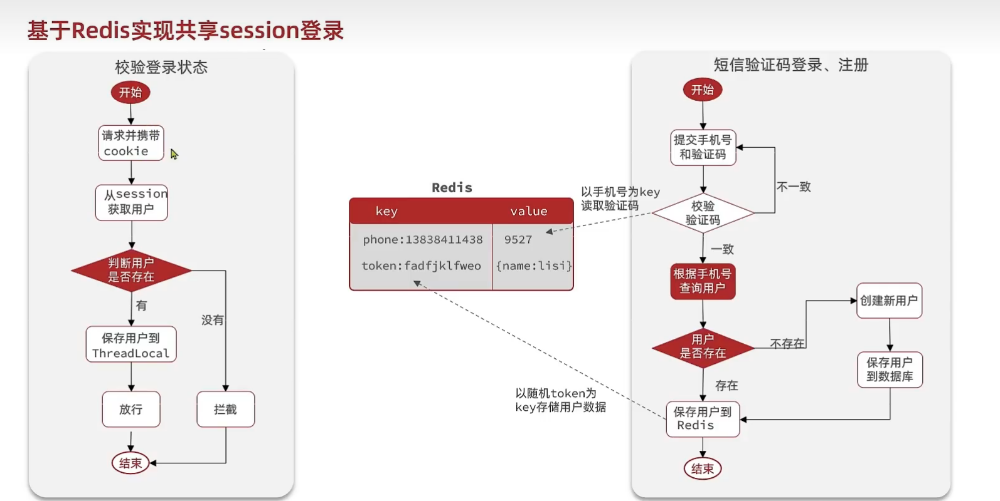
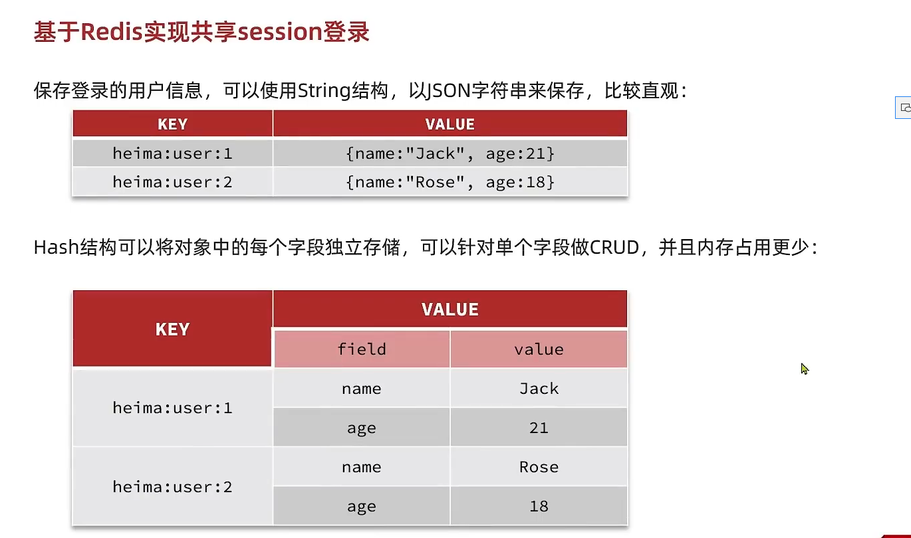
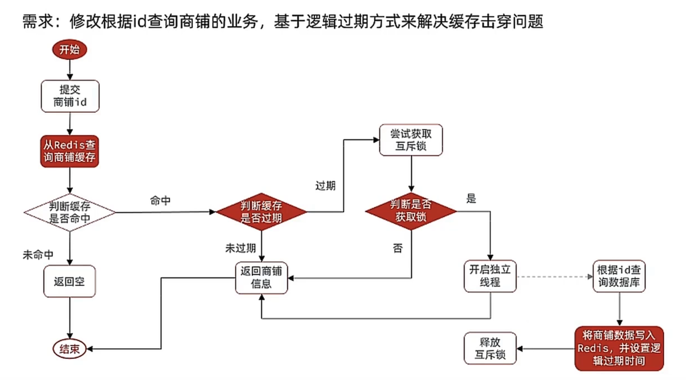
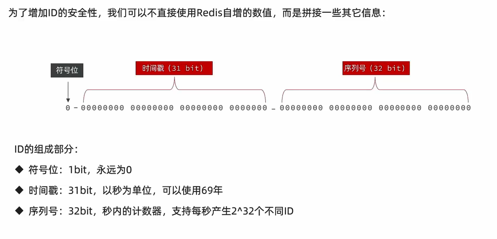
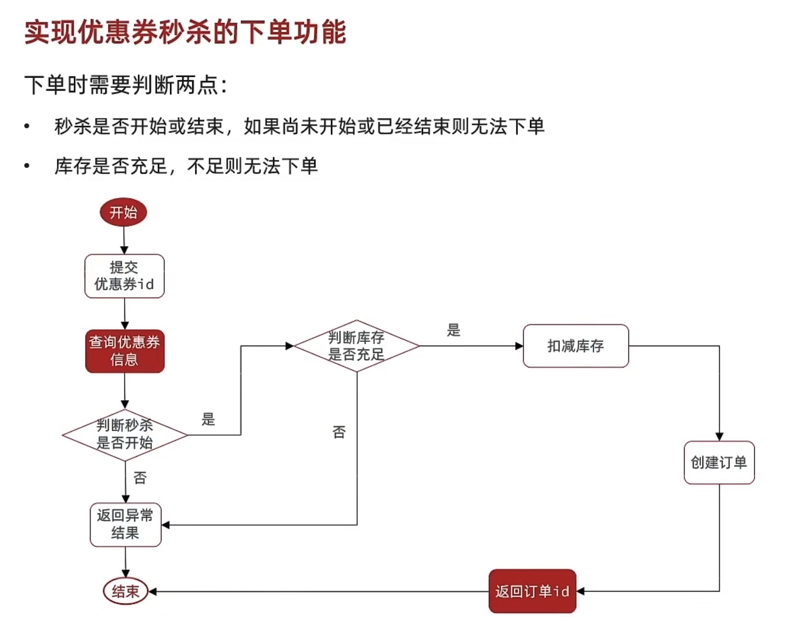
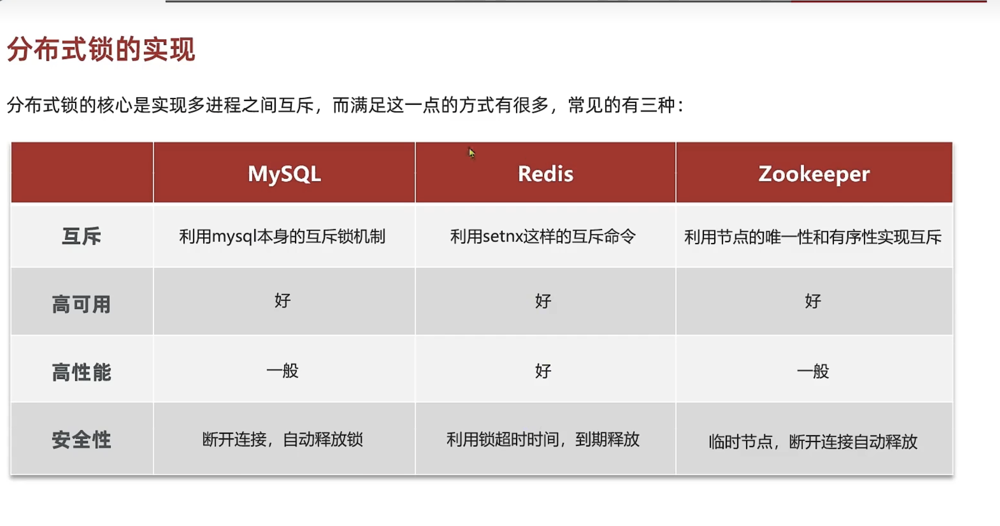
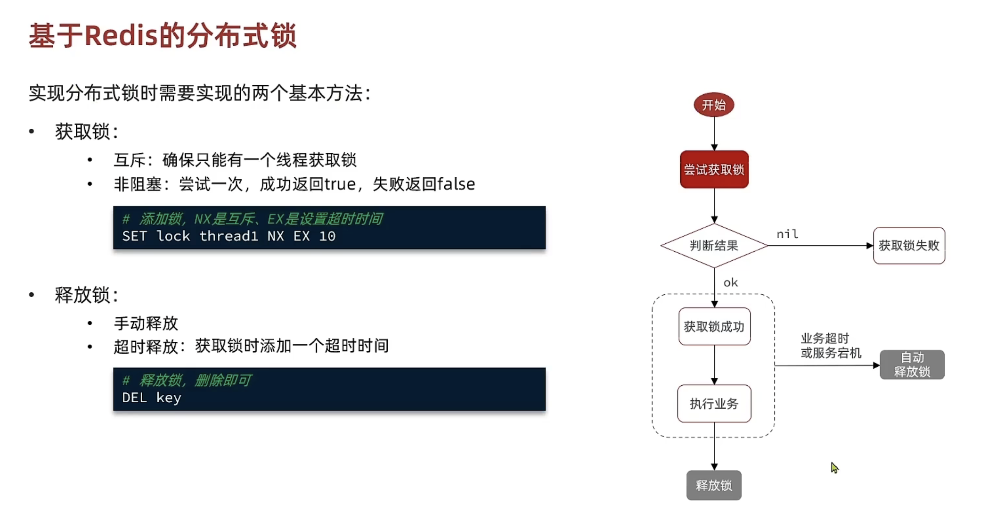
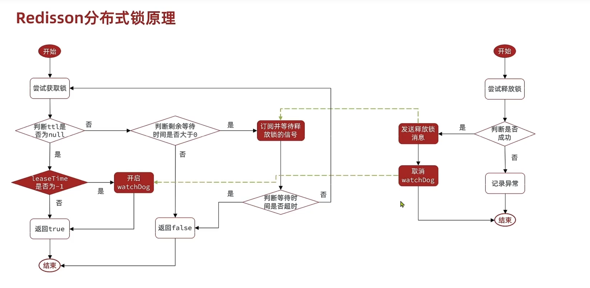
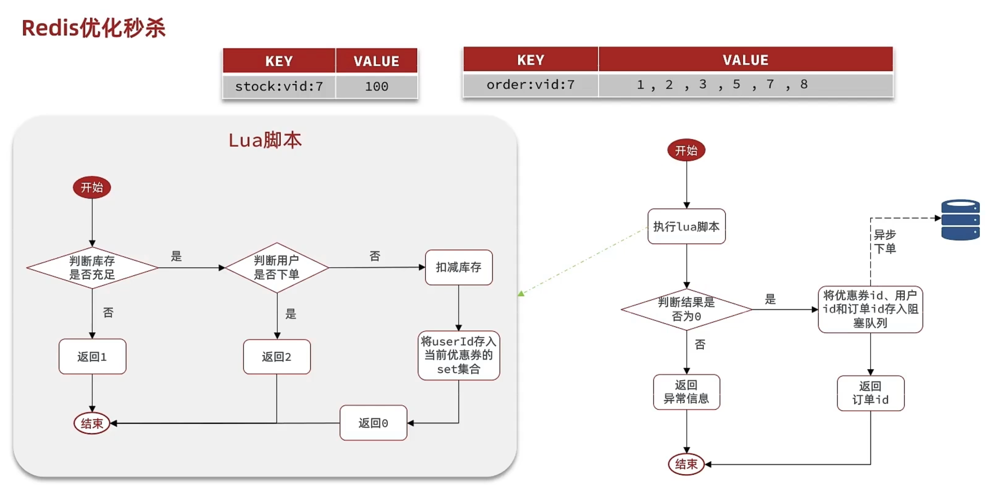

# heima-redis

## redis黑马点评介绍


## 功能介绍

###### 

## 项目结构

######  


**start nginx.exe**


## 短信登录模块

### 

### 基于session实现登入

```java
@Override
    public Result login(LoginFormDTO loginForm, HttpSession session) {
        // 1.校验手机号
        String phone = loginForm.getPhone();
        if (RegexUtils.isPhoneInvalid(phone)) {
            log.warn("手机号格式错误！{}", phone);
            // 2.如果不符合，返回错误信息
            return Result.fail("手机号格式错误！");
        }
        // 3.从redis获取验证码并校验
        String cacheCode = stringRedisTemplate.opsForValue().get(LOGIN_CODE_KEY + phone);
        String code = loginForm.getCode();
        // 防止空指针异常 Objects.equals(cacheCode, code)
        if (ObjectUtil.isEmpty(cacheCode) || !Objects.equals(cacheCode, code)) {
            log.warn("验证码错误！{}", code);
            // 不一致，报错
            return Result.fail("验证码错误");
        }

        // 4.一致，根据手机号查询用户 select * from tb_user where phone = ?
        User user = query().eq("phone", phone).one();

        // 5.判断用户是否存在
        if (user == null) {
            // 6.不存在，创建新用户并保存
            user = createUserWithPhone(phone);
        }

        // 7.保存用户信息到 redis中
        // 7.1.随机生成token，作为登录令牌
        String token = UUID.randomUUID().toString(true);
        // 7.2.将User对象转为HashMap存储 拷贝
        UserDTO userDTO = BeanUtil.copyProperties(user, UserDTO.class);
        Map<String, Object> userMap = BeanUtil.beanToMap(userDTO, new HashMap<>(16),
                CopyOptions.create()
                        .setIgnoreNullValue(true)
                        .setFieldValueEditor((fieldName, fieldValue) -> fieldValue.toString()));
        // 7.3.存储
        String tokenKey = LOGIN_USER_KEY + token;
        stringRedisTemplate.opsForHash().putAll(tokenKey, userMap);
        // 7.4.设置token有效期
        stringRedisTemplate.expire(tokenKey, LOGIN_USER_TTL, TimeUnit.MINUTES);

        // 8.返回token
        return Result.ok(token);
    }
```

```java
    private User createUserWithPhone(String phone) {
//        // 1.创建用户
//        User user = new User();
//        user.setPhone(phone);
//        // 随机生成用户昵称
//        user.setNickName(USER_NICK_NAME_PREFIX + RandomUtil.randomString(10));
//        // 2.保存用户
//        save(user);
//        return user;
        User user = User.builder()
                .phone(phone)
                .nickName(USER_NICK_NAME_PREFIX + RandomUtil.randomString(10))
                .build();
        save(user);
        return user;
    }
```

```java
@Configuration
public class MvcConfig implements WebMvcConfigurer {

    @Resource
    private StringRedisTemplate stringRedisTemplate;

    @Override
    public void addInterceptors(InterceptorRegistry registry) {
        // 登录拦截器
        registry.addInterceptor(new LoginInterceptor())
                .excludePathPatterns(
                        "/shop/**",
                        "/voucher/**",
                        "/shop-type/**",
                        "/upload/**",
                        "/blog/hot",
                        "/user/code",
                        "/user/login"
                ).order(1);
        // token刷新的拦截器
        registry.addInterceptor(new RefreshTokenInterceptor(stringRedisTemplate)).addPathPatterns("/**").order(0);
    }
}
```

```java
@Override
    public boolean preHandle(@Nullable HttpServletRequest request, @Nullable HttpServletResponse response, @Nullable Object handler) throws Exception {
        // 1.判断是否需要拦截（ThreadLocal中是否有用户）
        if (UserHolder.getUser() == null) {
            log.warn("请先登录{}", request.getRequestURI());
            // 没有，需要拦截，设置状态码
            Objects.requireNonNull(response).setStatus(401);
            // 拦截
            return false;
        }
```

```java
public final class UserHolder {
    private static final ThreadLocal<UserDTO> TL = new ThreadLocal<>();

    public static void saveUser(UserDTO user) {
        TL.set(user);
    }

    public static UserDTO getUser() {
        return TL.get();
    }

    public static void removeUser() {
        TL.remove();
    }
}
```




### Session问题

1、多台Tomcat之间并不共享Session存储空间，当请求切换到不同的服务器时会导致数据丢失的问题。

2、Session在重启服务器时也会将数据丢失。

### Session替代方案

- 数据共享
- 内存存储
- key、value结构

### 基于Redis实现共享Session登录

- 验证码存储使用String结构
- 用户信息存储
  - 字符串结构：将对象序列化为JSON存储在Redis中。
  - HASH结构：将对象的每个字段进行存储，支持单个字段CRUD，内存占用比String更少

###### 

### 拦截器优化

**新增token拦截器：负责刷新redis中token的有效时间**




## 商户查询模块

#### 1、店铺增加缓存


#### 2、练习：店铺类型查询业务添加缓存


#### 3、缓存更新策略

- 内存淘汰：不用自己维护，利用Redis的内存淘汰机制，当内存不足时淘汰部分数据，下次查询时更新缓存。一致性弱、维护成本无
- 超时剔除：给缓存数据添加TTl时间，到期后自动删除数据，下次查询时更新缓存。一致性一般，维护成本低
- 主动更新：编写业务代码逻辑，在修改数据库的同时，更新缓存。一致性好，维护成本高

​    **业务场景**：

 低一致性需求：数据长期不发生改变，可采用Redis中自带的内存淘汰策略。

高一致性：数据时常需要改动，可采用主动更新+设置过期时间来确保缓存一致性。

读操作：

缓存命中直接返回，缓存未命中先查询数据库，数据库查询后更新缓存并设置超时时间。

写操作：

先写后删，使用Spring事务或TCC补偿，来保证数据库和缓存的数据一致性。

#### 4、实现商铺缓存和数据的双写一致性

(1) 查询时设置过期时间

(2) 修改时先更新数据库再删除redis，使用@Transactional注解保证事务操作

#### 5、缓存问题

- 缓存穿透：客户端发出的请求在缓存和数据库中都未命中，则为缓存穿透。

    - 缓存空对象：当缓存和数据库中都查询不到数据时，则缓存一个空对象并设置TTL过期时间；优点：实现简单，缺点：额外内存消耗，可能导致数据不一致。
    - 布隆过滤：前置过滤器，用于检测缓存中的数据是否存在，不存在直接返回，存在则继续向下查询

- 缓存雪崩：同一时间段大量的缓存key同时失效或者Redis服务宕机，导致大量请求到达数据库。

    - 给Key设置不同的TTL随机值
    - 提高redis的可用性(使用集群方案哨兵机制)
    - 使用sentinel给缓存业务添加降级限流策略
    - 给key不设置TTL，永不过期
    - 给业务添加多集缓存

- 缓存击穿：热点key被高并发访问并且key的缓存失效了，无数的请求越过缓存直接请求数据库

  时序图：

  解决方案：

  

    - 互斥锁方案：多个线程进行查询时，对数据加互斥锁处理，保证同一时间只有一个线程请求数据库进行缓存重建，其他线程休眠等待；
        - 优点：保证了数据的一致性；
        - 缺点：牺牲了系统的可用性，如果重构时间过长，其他的请求都需要等待。并且还有死锁风险。
    - 逻辑过期方案：在缓存的数据中增加一个新的逻辑过期字段，当查询请求来后，先判断当前时间是否过期，如果过期获取锁并开启新线程负责缓存重建，自己则直接返回旧数据，其他线程访问时，同样尝试获取锁，获取不到则直接返回已过期数据。
        - 优点：性能好，系统可用性大大增强。
        - 缺点：有额外内存消耗，在数据的可用性和一致性之间选择了可用性，牺牲了强一致性。实现复杂。

  流程图：

  互斥锁方案解决缓存击穿：


逻辑删除解决缓存击穿：



## 优惠券秒杀

### 秒杀功能铺垫：

#### 全局唯一ID



#### 优惠券秒杀分析

**悲观锁方案**：添加同步锁，让线程串行执行。synchronized或者Lock

- 优点：简单粗暴，对共享资源对象加锁处理
- 缺点：性能一般

**乐观锁方案**：不加锁，只是在更新时判断是否其他线程修改数据，CAS版本号方式或利用update数据库行锁

- 优点：性能好
- 缺点：存在成功率低的问题

#### 优惠券秒杀流程图



#### 分布式锁实现方案



### 秒杀实现：

#### 基于Redis实现分布式锁



```redis
#使用命令添加redis锁并设置有效时间


set lock value NX EX 10


#解锁


del lock
```

#### Lua脚本操作redis实现原子性解锁操作

```lua
unlock.lua
-- key
if (ARGV[1] == redis.call('get', KEYS[1])) then
    -- 释放锁
    return redis.call('del', KEYS[1])
end
return 0
```

#### 使用Redisson分布式锁解决秒杀问题

##### **不可重入问题解决方案**：


##### Redisson分布式锁原理：



##### Redisson分布式锁总结


### 优惠券秒杀优化方案：

#### 优惠券秒杀优化流程：Redis+Lua+BlockingQueue

##### 整体流程：

1、使用Lua+Redis实现秒杀业务逻辑判断，同时保证原子性。

2、对于生成订单功能，采用开启独立线程任务异步操作阻塞队列数据持久化到数据库



##### 存在的问题

1、内存问题：BlockingQueue使用的是JVM内存，有限制，大量订单创建后会导致内存溢出或订单创建不成功

2、数据安全问题：JVM挂了后BlockingQueue中的订单信息都会丢失

#### 优惠券秒杀优化：Redis消息队列

##### List结构实现消息队列

通过**BLPUSH+BRPOP**或**BRPUSH+BLPOP**实现使用List阻塞队列

###### 优点：

- 利用Redis存储，没有内存限制
- 基于Redis持久化，消息数据安全性有保证
- 可以满足消息的有序性

###### 缺点：

- 无法避免消息丢失
- 只支持单消费者

##### 基于Pub/Sub发布订阅模式的消息队列

使用PUBLIST 发送、SUBSCRIBE或PSUBSCRIBE接收

###### 优点：

- 采用发布订阅模型，支持多生产、多消费

###### 缺点：

- 不支持数据持久化
- 无法避免消息丢失
- 消息堆积有上限，超出时数据丢失

###### 基于Stream实现消息队列

优点：

- 可持久化，有ACK确认机制，支持多消费着

## 好友关注

### 点赞排行榜

使用zset有序列表基于Scope时间戳进行点赞排行榜功能实现

### 好友关注

共同关注：采用zset多集合求交集方式来实现共同关注功能。

### Feed流

- TimeLine：不做内容筛选，简单的按照内容发布时间排序，常用于好友关注。例如朋友圈信息推送
    - 优点：信息全面，不会有确实。实现较为简单。
    - 缺点：信息噪音较多，用户不一定会感兴趣，内容获取效率低。
- 智能排序：利用智能算法屏蔽违规的、用户不感兴趣的内容。推送用户感兴趣信息来吸引用户
    - 优点：投喂用户感兴趣信息，用户粘度很高，容易沉迷
    - 缺点：如果算法不精确，可能起到反作用。
    -

**拉模式(读扩散)：**每次查看文章时，都要先去关注的人中读取到新发布的文章，然后进行时间的排序。延时较高，内存占用低。

**推模式(写扩散)**：发布文章时，对关注用户进行文章推送，适用于关注量少的用户。消息延时低，内存占用高。

**推拉结合模式**：也叫做读写混合，兼具推和拉两种模式的优点。

对用户分类，推送的角色如果关注人数多，给活跃粉丝采用推模式，普通粉丝采用拉模式；

如果关注人数较少，则采用推模式，推送给每一个粉丝的收件箱。


**滚动分页查询：**

使用Redis中Zset数据类型ZrangeByScore命令实现滚动分页功能。

参数：


