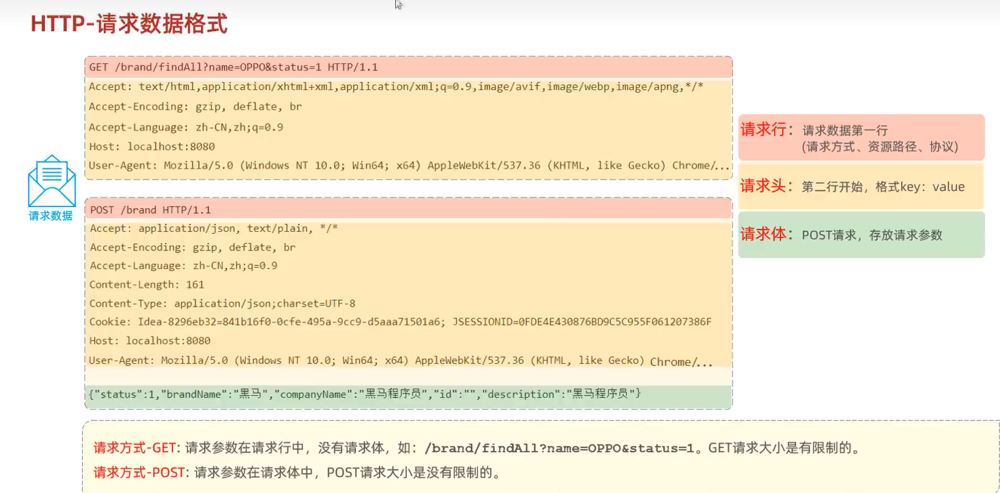
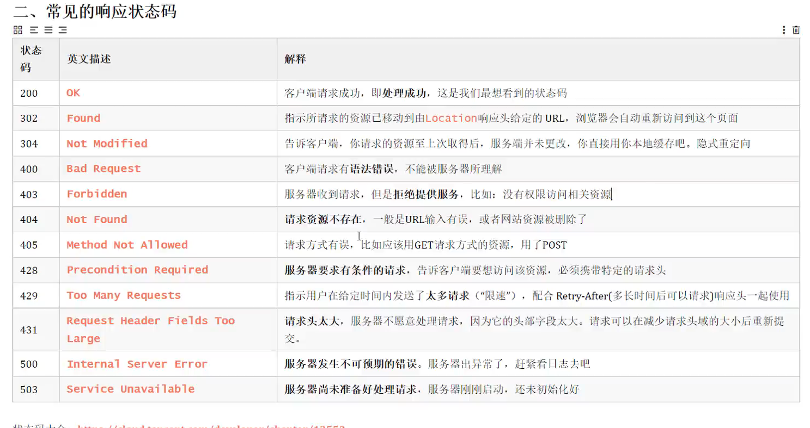
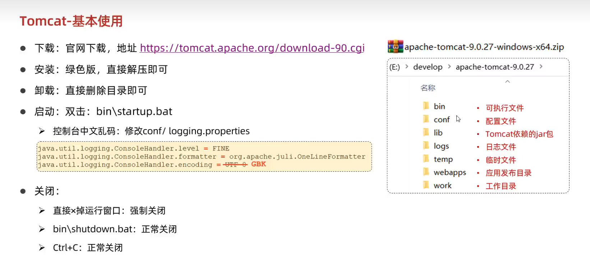

# Tomcat&Servlet

## Http协议

### 概述

Hyper Text Transfer Protocol，超文本传输协议，规定了浏览器和服务器之间数据传输的规则

**特点：**

* 基于TCP协议：面向链接，安全
* 基于请求-响应模型的：一次请求对应一次响应
* HTTP协议是无状态的协议：对于事物处理没有记忆能力。每次请求-响应都是独立的
  * 缺点：多次请求间不能共享数据
  * 优点：速度快

### 请求协议

### 响应协议

### 协议解析

## web服务器

* 对HTTP协议操作进行封装，简化web程序开发
* 部署web项目，对外提供网上信息浏览服务

## Tomcat

* 一个轻量级的web服务器，支持servlet、jsp等少量javaEE规范
* 也称为web容器、servlet容器

**主要功能**：

- Tomcat能够启动和停止Java Servlets和JSP。
- 它处理HTTP请求和响应，管理会话和Cookie。
- 支持SSL（安全套接字层），提供连接池和线程池以提高性能。
- Tomcat还提供了一些其他工具，如用于管理Web应用程序的管理器应用、用于监视Tomcat性能的状态页等。

**基本使用：**

Tomcat部署项目：

* 将项目放置到webapps目录下，即部署完成

localhost:8080

## Servlet

### 生命周期：

**被创建**：执行**init**方法，只执行一次

* Servlet什么时候被创建？
  * 默认情况下，第一次被访问时，Servlet被创建
  * 可以配置执行Servlet的创建时机
    * 在<Servlet>标签下配置
    * 第一次被访问时创建
      * <load-on-startup>的值为负数
    * 在服务器启动时创建
      * <load-on-startup>的值为0或正整数
  * 多个用户同时访问时，可能存在线程安全问题
  * 解决：尽量不要在Servlet中定义成员变量 即使定义了成员变量 也不要修改值

**提供服务**：执行**service**方法，执行多次

* 每次访问Servlet时，service方法都会被调用一次

**被销毁**：执行**destroy**方法，只执行一次

* Servlet被销毁时执行 服务器关闭时 Servlet被销毁
* 只有服务器正常关闭时，才会执行destroy方法
* destroy方法在Servlet被销毁之前执行，一般用于资源释放

了解：

* 获取ServletConfig对象  ServletConfig：Servlet的配置对象
* 提供服务方法 每一次Servlet被访问是，执行多次