## Http协议

### 概述

Hyper Text Transfer Protocol，超文本传输协议，规定了浏览器和服务器之间数据传输的规则

**特点：**

* 基于TCP协议：面向链接，安全
* 基于请求-响应模型的：一次请求对应一次响应
* HTTP协议是无状态的协议：对于事物处理没有记忆能力。每次请求-响应都是独立的
  * 缺点：多次请求间不能共享数据
  * 优点：速度快


### 请求协议

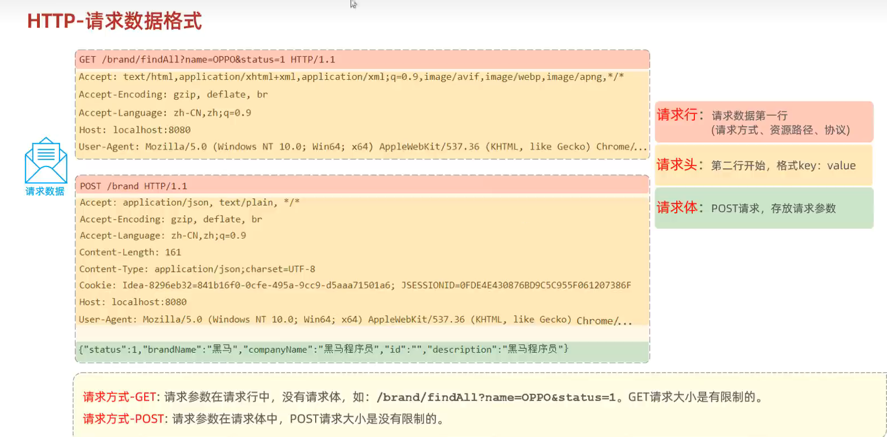

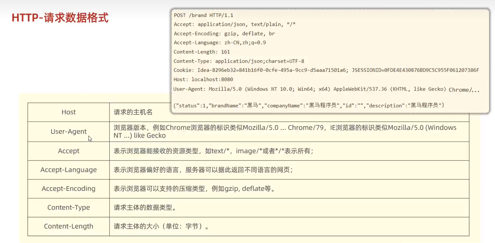


### 响应协议

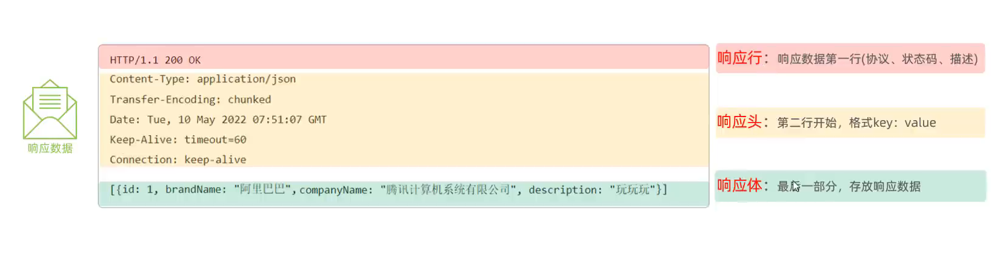

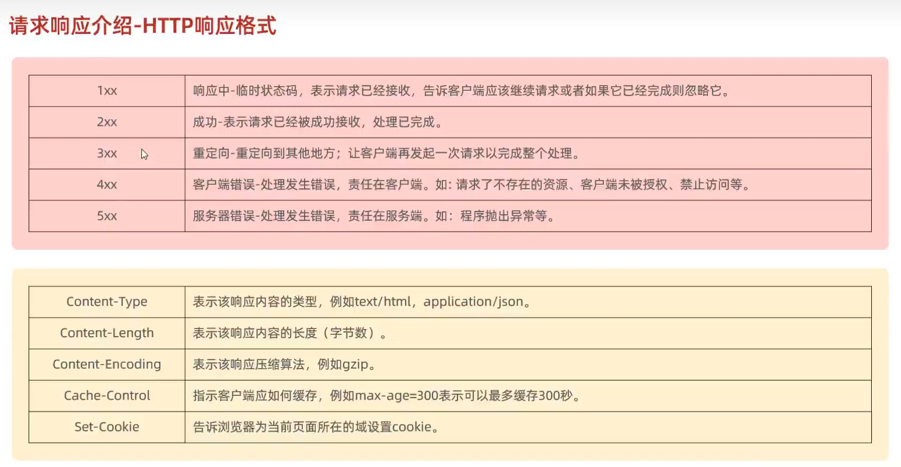

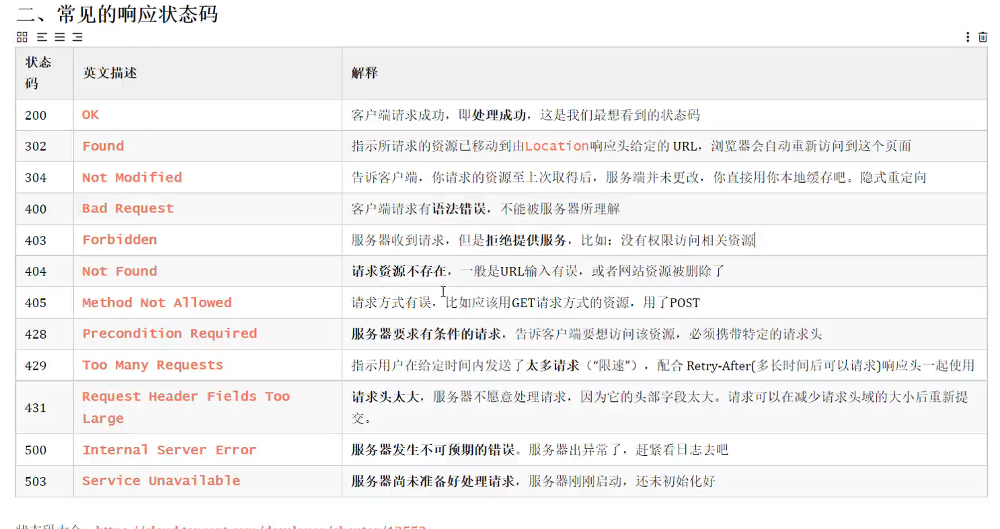

### 协议解析


## web服务器

* 对HTTP协议操作进行封装，简化web程序开发
* 部署web项目，对外提供网上信息浏览服务

## Tomcat

* 一个轻量级的web服务器，支持servlet、jsp等少量javaEE规范
* 也称为web容器、servlet容器

**主要功能**：

- Tomcat能够启动和停止Java Servlets和JSP。
- 它处理HTTP请求和响应，管理会话和Cookie。
- 支持SSL（安全套接字层），提供连接池和线程池以提高性能。
- Tomcat还提供了一些其他工具，如用于管理Web应用程序的管理器应用、用于监视Tomcat性能的状态页等。

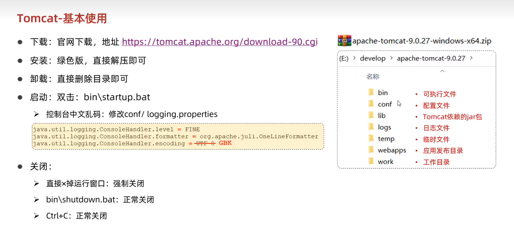


**基本使用：**

Tomcat部署项目：

* 将项目放置到webapps目录下，即部署完成

localhost:8080


## Servlet

### 简介：

Servlet运行在服务端的Java小程序，是sun公司提供—套规范(接口)用来处理客户端请求、响应给浏览器的动态资源。Servlet是JavaWeb三大组件之一(Servlet、Filter、Listener)，且最重要

### **工作流程：**

1. 客户端（浏览器）发送请求到服务器。
2. 服务器接受到请求并调用相关的Servlet做业务处理。
3. 服务器将响应返回给客户端


### 快速启动：

```java
package main.web.servlet;

import javax.servlet.ServletException;
import javax.servlet.annotation.WebServlet;
import javax.servlet.http.HttpServlet;
import javax.servlet.http.HttpServletRequest;
import javax.servlet.http.HttpServletResponse;
import java.io.IOException;

/**
 * 实现Servlet
 * 1.创建普通Java类
 * 2.实现Servlet的规范 继承HttpServlet类
 * 3.重写servlet
 * 4.设置注解 访问路径  / 不要忘记写
 * @author liyiyu
 */
@WebServlet("/ser01")
public class SrevletDemo03 extends HttpServlet {
    @Override
    protected void service(HttpServletRequest req, HttpServletResponse resp) throws ServletException, IOException {
        // 控制台打印
        System.out.println("Hello Servlet");
        // 通过流输出数据到浏览器
        
        resp.getWriter().write("Hello Servlet");
        // 获取请求的方式
        String method = req.getMethod();
        System.out.println("请求的方法：" + method);
        
        // 获取ServletContext对象
        ServletContext context = getServletContext();
        //在 ContextServlet1 存储数据 以及 读取数据
        context.setAttribute("key1", "value1"); // 存储数据
        System.out.println("ContextServlet1 读取数据: " + context.getAttribute("key1")); // 读取数据
    }
}
```

### 生命周期：

Servlet没有main（）方法，不能独立运行，它的运行完全由Servlet引擎来控制和调度

**被创建**：执行**init**方法，只执行一次

* Servlet什么时候被创建？
  * 默认情况下，第一次被访问时，Servlet被创建
  * 可以配置执行Servlet的创建时机
    * 在<Servlet>标签下配置
    * 第一次被访问时创建
      * <load-on-startup>的值为负数
    * 在服务器启动时创建
      * <load-on-startup>的值为0或正整数
  * 多个用户同时访问时，可能存在线程安全问题
  * 解决：尽量不要在Servlet中定义成员变量 即使定义了成员变量 也不要修改值


**提供服务**：执行**service**方法，执行多次

* 每次访问Servlet时，service方法都会被调用一次

**被销毁**：执行**destroy**方法，只执行一次

* Servlet被销毁时执行 服务器关闭时 Servlet被销毁
* 只有服务器正常关闭时，才会执行destroy方法
* destroy方法在Servlet被销毁之前执行，一般用于资源释放

了解：

* 获取ServletConfig对象  ServletConfig：Servlet的配置对象
* 提供服务方法 每一次Servlet被访问是，执行多次


### request功能

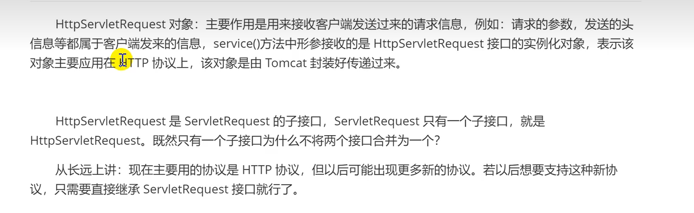

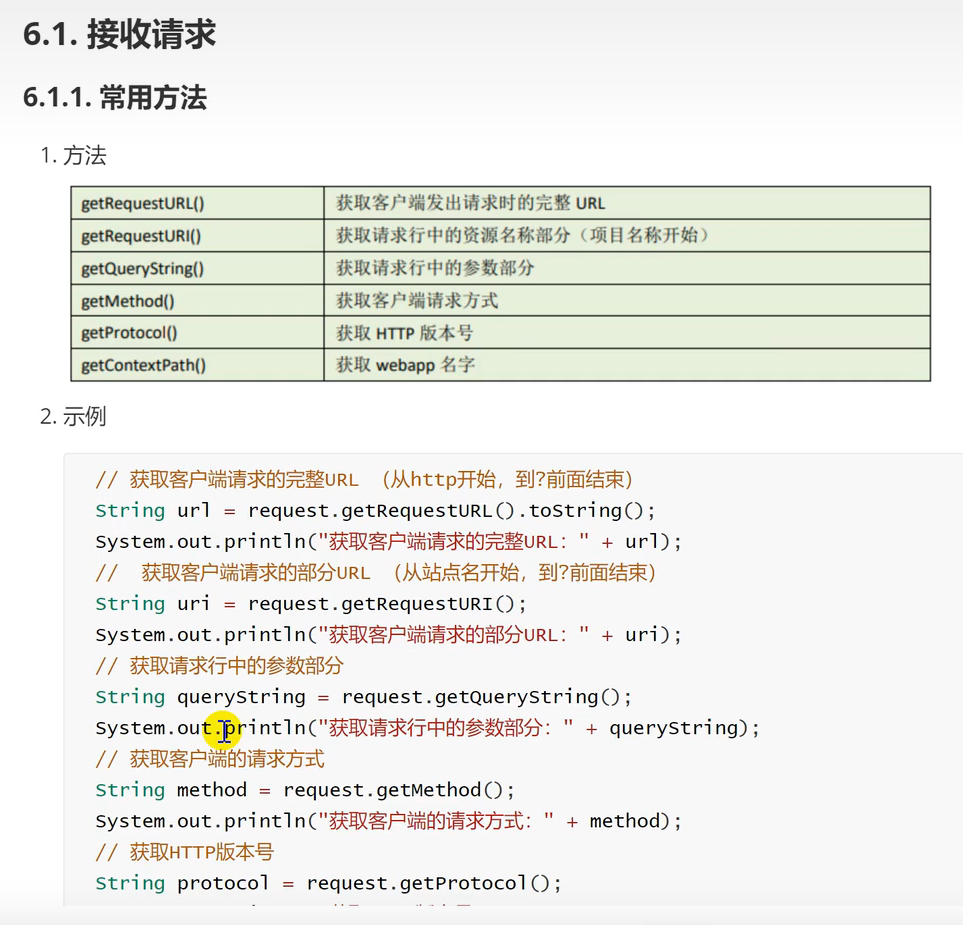

#### **获取请求消息数据:**

**1.获取请求行数据：**

* GET / day33/demo1?name=zhangsan HTTP/1.1
* 方法：
  * 获取请求方式：GET
    * String getMethod（）
  * **获取虚拟目录**：/day33
    * String getContextPath（）
  * 获取Servlet路径：/demo1
    * String getServletPath（）
  * 获取get方式请求参数：name=zhangsan
    * String getQueryString（）
  * **获取请求URI**：/day33/demo1
    * String getRequestURI（） /day33/demo1
    * StringBuffer getRequestURL（）:http://localhost/day33/demo
    * URI 统一资标识符
    * URL 统一资源定位符
  * 获取协议及版本：HTTP/1.1
    * String getProtocol（）
  * 获取客户机的IP地址：
    * String getRemoteAddr（）

**2.获取请求头数据：**

* 方法
  * String getHeader（String name）：通过请求头的名称获取请求头的值
  * Enumeration<String> getHeaderNames（）：获取所有的请求头名称

**3.获取请求体数据**

* 请求体：只有POST请求方式，才有请求体，在请求体中封装了POST请求的请求参数
* 步骤：
  * 获取流对象
    * BufferedReader getReader()：获取字符输入流 只能操作字符数据
    * SerletInputStream getInputStream（）：获取字节输入流，可以操作所有类型数据
  * 再从流对象中拿数据

**乱码：**

GET在Tomcat8之后不会出现乱码

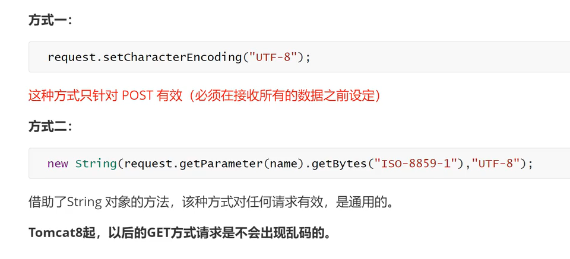

#### **其他功能**

**1.获取请求参数通用：**

* String getParameter(String naem)：根据参数名称获取参数值
* String[] getParameterValues(String name)：根据参数名称获取参数值的数组
* Enumeration<String[]> getParameterMap()：获取所有参数的map集合

```java
package main.web.servlet;

import javax.servlet.ServletException;
import javax.servlet.annotation.WebServlet;
import javax.servlet.http.HttpServlet;
import javax.servlet.http.HttpServletRequest;
import javax.servlet.http.HttpServletResponse;
import java.io.IOException;

/**
 * @WebServlet
 * 继承 HttpServlet
 */
@WebServlet("/requestDemo02")
public class SrevletDemo02 extends HttpServlet {
    /**
     * 获取请求方式：GET
     * * String getMethod（）
     * 获取虚拟目录：/day33
     * * String getContextPath（）
     * 获取Servlet路径：/demo1
     * * String getServletPath（）
     * 获取get方式请求参数：name=zhangsan
     * * String getQueryString（）
     * 获取请求URI：/day33/demo1
     * * String getRequestURI（） /day33/demo1
     * * StringBuffer getRequestURL（）:http://localhost/day33/demo
     * 获取协议及版本：HTTP/1.1
     * * String getProtocol（）
     * 获取客户机的IP地址：
     * * String getRemoteAddr（）
     */
    @Override
    protected void doPost(HttpServletRequest req, HttpServletResponse resp) throws ServletException, IOException {

    }

    @Override
    protected void doGet(HttpServletRequest req, HttpServletResponse resp) throws ServletException, IOException {
        String contextPath = req.getContextPath();
        System.out.println(contextPath);
        // 获取完整的路径
        StringBuffer requestURL = req.getRequestURL();
        System.out.println(requestURL);
        // 获取指定名称的参数值
        // ?uname=zhangsan&pws=123
        String uname = req.getParameter("uname");
    }
}
```

**2.请求转发**

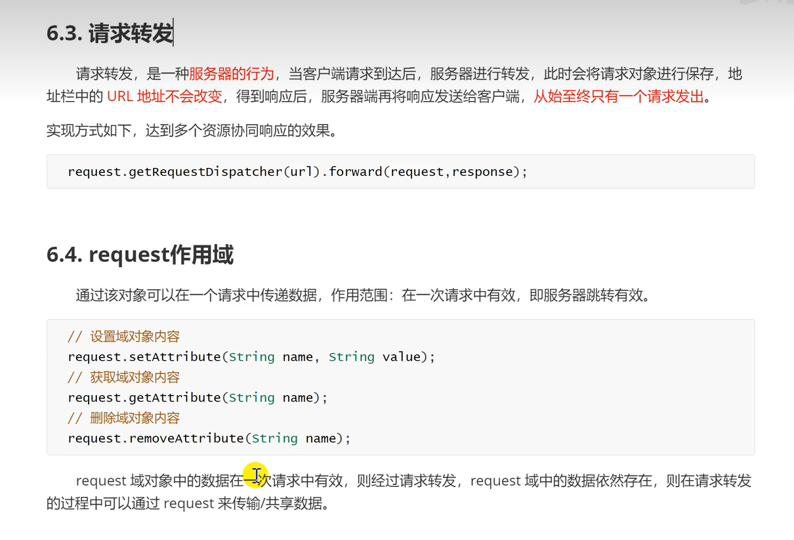

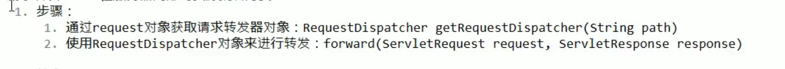

**特点：**

* 浏览器地址路径不发生变化
* 只能转发到当前服务器内部资源中
* 转发是一次请求

**3.共享数据**

* 域对象：一个有作用范围的对象，可以在范围内共享数据
* request域：代表一次请求的范围，一般用于请求转发的多个资源中共享数据

方法

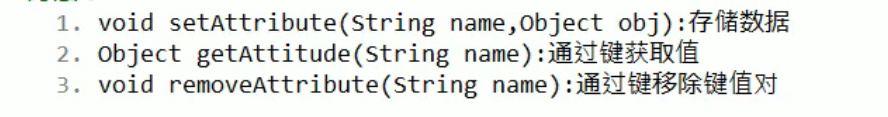


4.获取ServletContext

#### HttpServletRequest

**字符乱码**

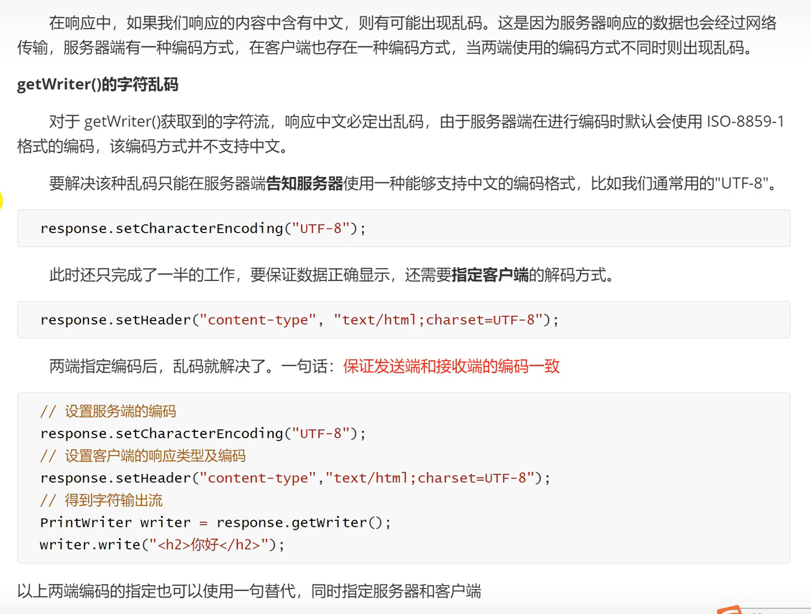

**字节乱码**

#### 重定向

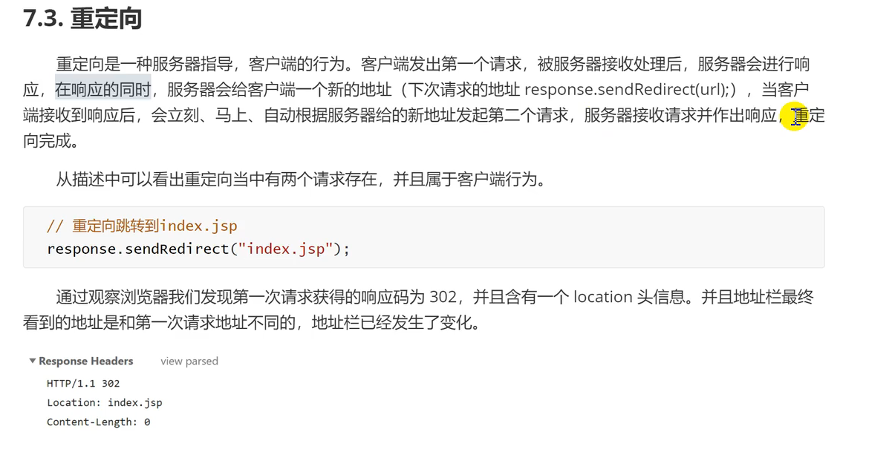

不共享数据

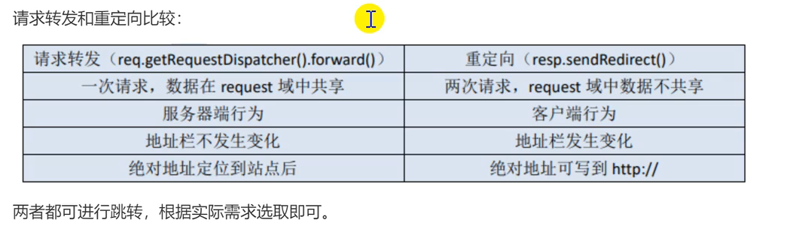


#### 获得所有的请求参数 getParameterMap()。key为参数名,value为key对应的所有的值

```java
// 获得所有的请求参数 getParameterMap()
System.out.println("获得所有的请求参数 getParameterMap()： ");
Map<String, String[]> parameterMap = request.getParameterMap();
// 遍历所有参数 map
for (Map.Entry<String, String[]> entry : parameterMap.entrySet()) {
    // 遍历参数的value
    for (String value : entry.getValue()) {
        System.out.println(entry.getKey() + ": " + value);
    }
}
```


## Cookie

Cookie是浏览器提供的一种技术，通过服务器的程序能将一些只保存在客户端，或者在客户端进行处理的数据，放在本地的计算机上，不需要通过网络传输，因而提高网页处理的效率，并且能够减少服务器的负载，但是由于Coolie是服务器端保存在客户端的信息，所以其安全性是很差的，列如常见的记住密码则可以通过Coolie来实现的

有一个专门操作Coolie的类javax.servlet.http.Cookit 随着服务器端的响应发送给客户端，保存在浏览器。当下次再访问服务器是把Coolie再带回服务器

**Cookie的特点**
\1. cookie保存在客户端(浏览器), 往往是由服务器产生发送给浏览器
\2. cookie只能保存字符串, 格式是 entry(name : value)
\3. cookie的大小有限制: 4k
\4. 一般, 同一域名下的cookie限制数量50个

**Coolie的格式：**键值对用"="等号链接，多个键值对间通过";"分号隔开

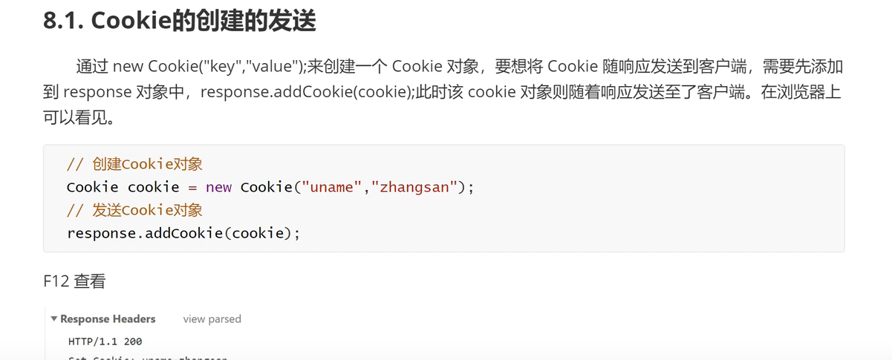

## 三层架构

- 软件中分层：按照不同功能分为不同层，通常分为三层：表现层(web层)，业务层，持久(数据库)层。

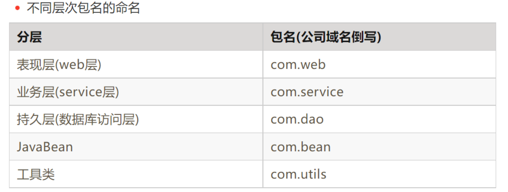

### 分层的意义:

- 1. 解耦：降低层与层之间的耦合性。
  2. 可维护性：提高软件的可维护性，对现有的功能进行修改和更新时不会影响原有的功能。
  3. 可扩展性：提升软件的可扩展性，添加新的功能的时候不会影响到现有的功能。
  4. 可重用性：不同层之间进行功能调用时，相同的功能可以重复使用。
  5. 
. 
### 程序设计的宗旨:

* 高内聚低耦合

* 可扩展性强

  - 可维护性强
  - 可重用性强