# *JAVA**

## **类常量**

某个常量可以在一个类中的多个方法使用  （static final）

定义位于 main 方法的外部，在同一个类的其他方法中也可以使用这个常量

## **基本数据类型**


## **方法**


## 面向对象

**本质**：以类的方式组织代码，以对象的组织（封装）数据

###   **类** ：是构造对象的模板

* 如何使用别人已经写好的东西
* 我们自己如何设计一个类


### **隐式参数与显示参数**


### 私有方法

只需将关键字public改成private


### final


实例字段： 这样的字段必须在构造对象时初始化，必须在构造器执行之后，这个字段的值已经设置，并且不能在修改这个字段

final类：不予许扩展的类

将方法和类声明final主要原因：确保他们不会在子类中改变语义

### 静态字段和静态方法

1.假设需要给每一个员工赋予唯一的标识码。Employee类添加一个实例字段id和一个静态字段nextid

```java
class Employee
{
    // 静态字段
    private static int nextid = 1;
    // 实例字段
    private int id;
}
```

### 静态绑定

如果是private方法、static方法、final方法或者是构造器，那么编译器将可以准确地知道应该调用哪个方法

### **三大特性**：

### * **封装**（private 数据的隐藏）

通常应禁止直接访问一个对象中数据的实际表示，而应通过操作接口来访问，

* 高内聚：就是类内部数据操作细节自己完成，不允许外部干涉
* 低藕合：仅少量的方法给外部使用
* 优点：
  * 提高程序的安全性，保护数据
  * 隐藏代码的实现细节
  * 统一接口
  * 系统可维护增加

### * **继承**（extends 扩展，子类是父类的扩展）


继承是类与类之间的一种关系

本质是对某一批类的抽象，从而实现对现实世界更好的建模


### 子类到底能继承父类中的哪些内容

1. 成员变量（字段）：子类可以继承父类的非私有（public、protected、默认）成员变量。
2. 方法：子类可以继承父类的非私有（public、protected、默认）方法。
3. 构造方法：子类不能直接继承父类的构造方法，但可以通过super关键字调用父类的构造方法。
4. 静态变量和静态方法：子类可以继承父类的静态变量和静态方法。
5. 内部类：子类可以继承父类的内部类，但内部类必须是static的才能被继承。
6.   public（公共） > Protected（保护） > Default（不写默认） > private（私有）

```java
class Parent {
    public int publicVar = 1;
    protected int protectedVar = 2;
    int defaultVar = 3;
    private int privateVar = 4;

    public void publicMethod() {
        System.out.println("Public method in Parent");
    }

    protected void protectedMethod() {
        System.out.println("Protected method in Parent");
    }

    void defaultMethod() {
        System.out.println("Default method in Parent");
    }

    private void privateMethod() {
        System.out.println("Private method in Parent");
    }

    static int staticVar = 5;

    static void staticMethod() {
        System.out.println("Static method in Parent");
    }

    class InnerClass {
        void innerMethod() {
            System.out.println("Inner method in Parent");
        }
    }
}

class Child extends Parent {
    void testInheritance() {
        System.out.println("publicVar: " + publicVar);
        System.out.println("protectedVar: " + protectedVar);
        System.out.println("defaultVar: " + defaultVar); // 编译错误，不能访问默认访问级别的变量
        System.out.println("privateVar: " + privateVar); // 编译错误，不能访问私有变量

        publicMethod();
        protectedMethod();
        defaultMethod(); // 编译错误，不能访问默认访问级别的方法
        privateMethod(); // 编译错误，不能访问私有方法

        System.out.println("staticVar: " + staticVar);
        staticMethod();

        InnerClass inner = new InnerClass(); // 编译错误，内部类不是static的，不能被继承
        inner.innerMethod(); // 编译错误，内部类不是static的，不能被继承
    }
}

```


是否被继承


### **static静态**

静态代码块：只执行一次，前面加static修饰


### **super** 注意点：		

* super调用父类的构造函数方法，必须在构造方法的第一个
* super必须只能出现在子类的方法或者构造方法中
* super和this不能同时调用构造方法

**与this的区别** ：

* 代表的对象不同：

  * this：本身调用者这个对象
  * super：代表父类对象的应用
* 前提：

  * this：没有继承可以使用
  * super：只能在继承条件才可以使用
* **构造方法**：（构造器、构造函数）

构造器总是伴随着 new 操作符的执行被调用，而不能对一个已经存在的对象调用构造来达到重新设置实例域的目的

在创建对象的时候给成员变量进行赋值的

方法名与类名相同，大小写也要一致

没有返回值类型，连void都没有

构造器可以有 0个、1个、多个参数

构造器总是伴随 new 操作一起调用

没有具体的返回值（不能有retrun带回结果数据）

* this：本类的构造

* super：父类的构造

* 

  

### **lambda**

Lambda表达式的标准格式

组成Lambda表达式的三要素：形式参数，箭头，代码块
Lambda表达式的格式
①格式：(形式参数) -> {代码块}
②形式参数：如果有多个参数，参数之间用逗号隔开；如果没有参数，留空即可
③->：由英文中画线和大于符号组成，固定写法。代表指向动作
④代码块：是我们具体要做的事情，也就是以前我们写的方法体内容


```java
package com.buercorp.wangyu.oop.LambdaDemo;

public class Lambda01 {
    public static void main(String[] args) {
        method(new Swim() {
            @Override
            public void Swimming() {
                System.out.println("正在游泳");
            }
        });

        // Lambda
        method(
                () -> {
                    System.out.println("正在游泳");
                }
        );
    }
    public static void method(Swim s){
        s.Swimming();
    }

    // 函数式接口 
    @FunctionalInterface
    interface Swim{
        public abstract void Swimming();
    }
}

```

```java
package com.buercorp.wangyu.oop.LambdaDemo;
// 接口
public interface Swim {
    public abstract void Swimming();
}

```


### **重写** ：

在面向对象编程中，重写（Override）指的是子类重新定义和实现了从父类继承而来的方法，以改变方法的行为。子类通过重写方法可以提供自己特定的实现，使得父类方法的行为在子类对象的身上有不同的表现。

重写是**方法**的重写，和属性无关

需要有继承关系，子类重写父类的方法

* 方法名必须相同
* 参数列表必须相同
* 修饰符：范围可以扩大，但不能缩小   public（公共） > Protected（保护） > Default（不写默认） > private（私有）
* 抛出的异常：范围可以缩小但不能扩大    ClassNotFoundException  --> Exception（大）

重写，子类的方法和父类必要一致，方法体不同


静态方法


非静态方法


**为什么需要重写：**

* 父类的功能，子类不一定需要，或者不一定满足

Alt + Insert  override


### * **多态**

多态是**面向对象编程**中的一个重要概念，它**允许不同类型的对象对同一方法进行不同的实现**。具体来说，**多态性指的是通过父类的引用变量来引用子类的对象，从而实现对不同对象的统一操作**。

即同一方法可以根据发送对象的不同而采用多种不同的行为方式

一个对象的实际类型是确定的，但可以指向对象的引用类型有很多


**成员方法**的调用时，Java遵循“**编译看左边，运行看右边**”的原则。这意味着在编译时，会检查对象声明的类型（左边的类型），而在运行时，则会执行实际对象类型（右边的类型）的方法。如果子类重写了父类的方法，那么将调用子类中的版本。这就是所谓的动态绑定或晚期绑定。

最后，对于**成员变量**的访问，情况则稍有不同。无论是在编译时还是在运行时，成员变量的访问都是基于对象声明的类型，即“**编译看左边，运行还看左边**”。这意味着如果你有一个父类类型的引用指向一个子类对象，并且尝试访问一个在子类中定义的成员变量，那么这个变量是不可见的，除非你通过强制类型转换将引用转换为子类类型。

**多态存在的条件**

* 有继承关系
* 子类重写父类方法
* 父类引用指向子类对象

**注意**：

* 多态是方法的多态，属性没有多态性
* 父类和子类，有联系   类型转化异常  ClassCastException
* 存在条件：继承关系，方法需要重写，父类引用指向子类对象 
  * static 方法，属于类，它不属于实例
  * final 常量
  * private 方法

### this的内存原理

* this的作用：区分局部变量（方法中的变量）和成员变量（类中方法外的变量）
* this的本质：所在方法调用者的地址值


### **API**（应用程序编程接口）

简单理解：API就是别人已经写好的东西，我们不需要编写，直接使用即可

#### System工具类


#### Runtime


#### BigDecimal

精确计算


#### 正则表达式

boolean q = qq.matches("[1-9]\\d{5,19}")


```java
public class regexqq {
    /*
    * 规则： 6位及20位，不能以0开头 必须全是数字
    * */
    public static void main(String[] args) {
        String qq = "34738249798";
        boolean q = qq.matches("[1-9]\\d{5,19}");
        System.out.println(q);
    }
}
```


#### 爬虫


### **字符串**（string）

### * 创建字符串


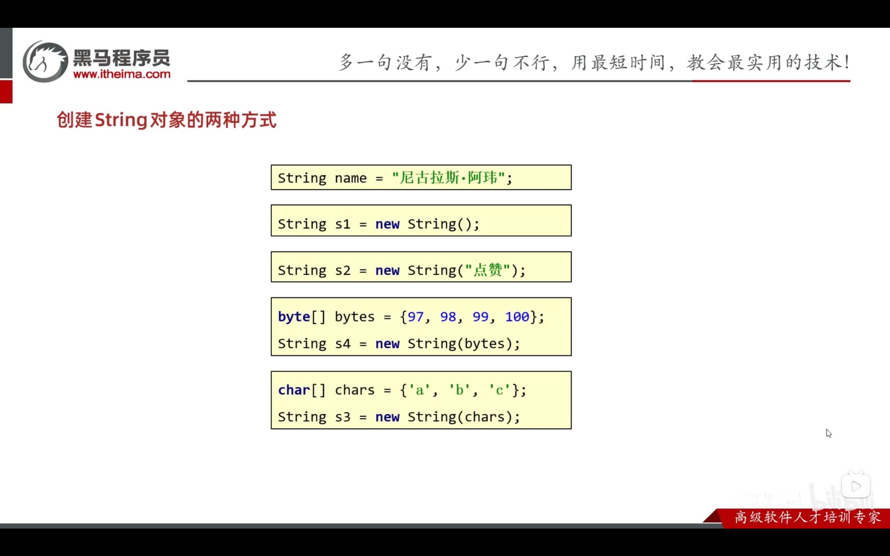


### * java内存模型

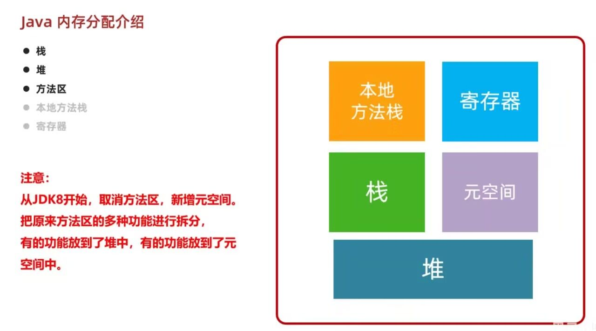


### * 字符串比较


### * StringBuilder

StringBuilder可以看成是一个容器，创建之后里面的内容是可变的

作用：提高字符串的操作效率


### * StringJoiner


## 。。。。。。。。。。。。。。。。


## **集合**

### **与数组的区别**


### **增删改查遍历**


```java
public class Arraylist {
    public static void main(String[] args) {
        // 泛型：限定集合中存储数据的类型
        // 创建集合对象
        ArrayList<String> list = new ArrayList<>();

        // 添加元素 返回true
        list.add("aaaa");
        list.add("bbbb");
        list.add("cccc");
        list.add("dddd");
        System.out.println(list); // [aaaa, bbbb, cccc, dddd]

        // 删除 删除成功返回true 失败返回false
        list.remove("aaaa");
        // 索引删除 返回的是删除元素的值
        String str = list.remove(1);
        System.out.println(list + "索引删除的是" + str); // [bbbb, dddd]索引删除的是cccc

        // 改
        String resule = list.set(0,"cccc");
        System.out.println(list + "索引修改的是" + resule); // [cccc, dddd]索引修改的是bbbb

        // 查
        String str1 = list.get(0);
        System.out.println(list + "索引查找的是" + str1);
        
        // 遍历
        for (int i = 0; i < list.size(); i++) {
            System.out.println(list.get(i));
        }
    }
}
```


### 体系结构


### set和list**接口的区别**

（1）Set 接口集合存储的是无序的，不重复的数据。List 接口集合存储的是有序的，可以重复的元素。

（2）Set 集合 底层使用的是 链表数据结构，其检索效率低下，删除和插入效率高，插入和删除不会引起元素位置改变 （实现子类有 HashSet , TreeSet 等）。

（3）List 结合 底层和数组类似，但是它可以动态增长，根据实际存储的数据的长度自动增长 List 的长度。其检索元素效率高，插入和删除效率低，插入和删除会引起其他元素位置改变 （实现子类有 ArrayList , LinkedList , Vector 等）。


### **Collection**


比较值


#### 三种通用遍历

* **迭代器遍历**


* **增强for**


* lambda


### **List集合**


### 数据结构


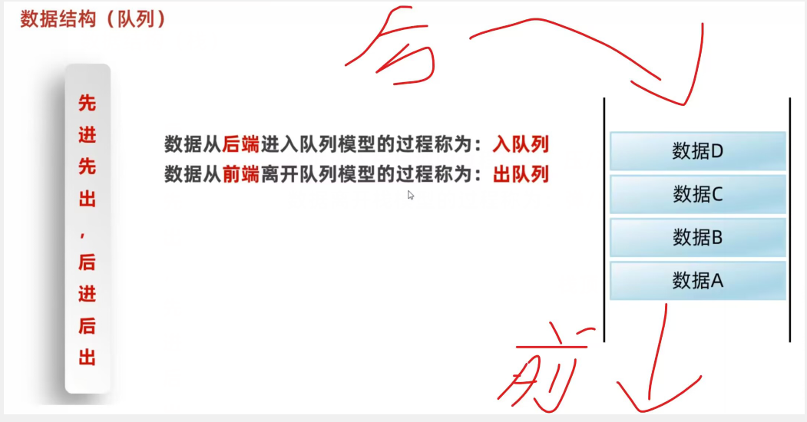


### 枚举

特殊的类，用于表示一组固定的常量值

1. 义一组具名的常量，这些常量可以用作变量的类型，提供了一种更安全、更具可读性的替代方案。
2. 枚举类可以具有构造函数、方法和字段，使得它们不仅仅是简单的常量集合，而是具有行为和属性的完整类。
3. 枚举类可以实现接口，从而为每个枚举常量提供特定的行为。
4. 枚举类可以用于switch语句中，提供了更清晰、更易于维护的代码。

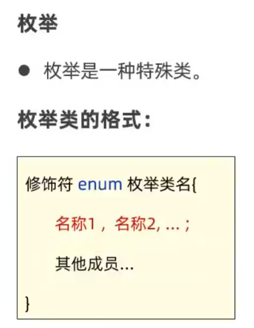


### **ArrayList集合**

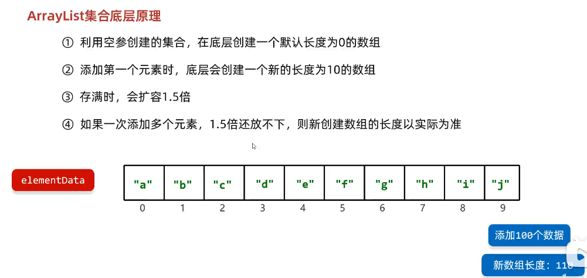

###  LinkedList集合


###  set集合

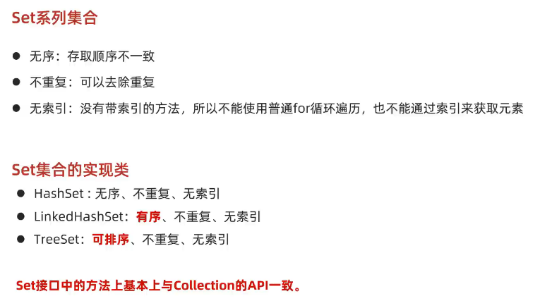


### HashSet


加载因子：数组扩容


### LinkedHashSet


### TreeSet


compareTo底层ask码表比字符

public class Student implements Comparable<Student>

```java
// 方式一
public class Text {
    public static void main(String[] args) {
        Student st1 = new Student(20,"zhangsan");
        Student st2 = new Student(18,"lisi");
        Student st3 = new Student(26,"wangwu");
        TreeSet<Student> ts = new TreeSet<>();
        ts.add(st1);
        ts.add(st2);
        ts.add(st3);
        for (Student t : ts) {
            System.out.println(t);
             // Student{age = 18, name = lisi}
			// Student{age = 20, name = zhangsan}
			// Student{age = 26, name = wangwu}
        }
    }
}
```

```java
public class Student implements Comparable<Student> {
    private int age;
    private String name;

    public Student() {
    }

    public Student(int age, String name) {
        this.age = age;
        this.name = name;
    }


    /**
     * 获取
     *
     * @return age
     */
    public int getAge() {
        return age;
    }

    /**
     * 设置
     *
     * @param age
     */
    public void setAge(int age) {
        this.age = age;
    }

    /**
     * 获取
     *
     * @return name
     */
    public String getName() {
        return name;
    }

    /**
     * 设置
     *
     * @param name
     */
    public void setName(String name) {
        this.name = name;
    }

    public String toString() {
        return "Student{age = " + age + ", name = " + name + "}";
    }

    @Override
    public int compareTo(Student o) {
        return this.age - o.age;
        /*
         *  this:表示当前要添加的元素
         *   o：表示已经在红黑树存在的元素
         *  返回值：
         *       负数：认为要添加的元素是小的，存左边
         *       正数：认为要添加的元素是大的，存右边
         *       0：添加的元素已经存在，舍弃
         *
         * */
    }
}
```


### 比较

```java
Comparable接口是用于自然排序的，即实现Comparable接口的类需要重写compareTo方法，用于定义该类对象之间的比较规则。例如，String、Integer等类都实现了Comparable接口，可以直接进行比较。

Comparator接口是用于自定义排序的，即实现Comparator接口的类需要重写compare方法，用于定义两个对象之间的比较规则。这种方式适用于那些没有实现Comparable接口的类，或者需要自定义排序规则的场景。

两者的关系是：如果一个类实现了Comparable接口，那么它的实例可以直接进行比较；而如果一个类没有实现Comparable接口，或者需要自定义排序规则，那么可以使用Comparator接口来实现。
```


### 总结


###  双列集合的特点


### map映射


####  遍历

* 键找值


* 键值对


* lambda


### HashMap


### LinkedHashMap


### TreeMap


有键


键是自定义的


### 可变参数


### Collections


## 泛型


## 类

**类的五大成员：**

​	属性、方法、构造方法、代码块、内部类


### 抽象类和抽象方法

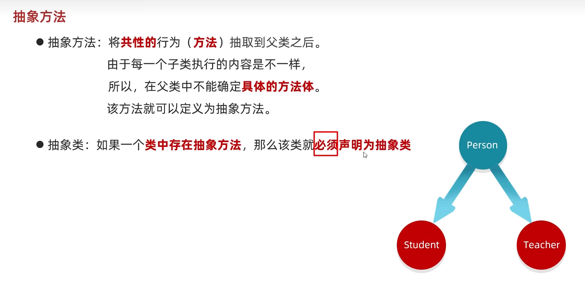

定义格式：

​	加abstract


注意事项：

​	不能实例化（不能创建对象）


### 内部类

定义：在一个类里面在定义一个类


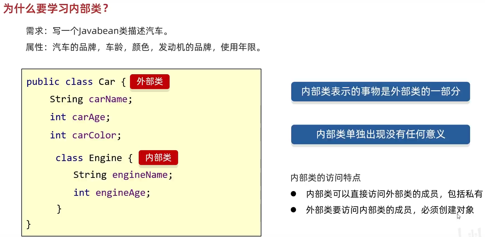

#### 成员内部类

写在成员位置的


#### 静态内部类

前面用static修饰


#### 局部内部类


#### 匿名内部类


## **接口**

接口就是一种规则


接口不是类，而是对希望符合这个接口的类的一组需求

接口中的所有方法都自动是public方法，在接口声明方法时，不必提供关键字public

接口没有实例

### **让类实现接口**

* 将类声明为实现给定的接口
* 对接口中的所有方法提供定义
* 需要使用关键字 implements

```java
class Employee impements Comparable
这里的 Employee 类需要提供 CompareTo 方法
```

### 接口中成员的特点：


### 接口和类的关系


### 函数式接口

可写lambda表达式


## 红黑树


## 散列

### 散列表

**散列表是一种数据结构，它通过散列函数将关键字转换为索引，以便快速访问存储在表中的数据**

散列表提供了一种高效的方式来存储和检索数据，特别适合于那些需要快速查找的场景。在Java中，HashMap是散列表的一种常见实现，它提供了丰富的API来操作键值对集合。

### 散列

**散列（hashing）是将数据映射到固定大小的值，即散列值的过程**


## 快速排序

**核心思想是分而治之**

快速排序通过选择一个基准数（pivot），将待排序的序列分割成两个子序列，一个包含所有小于基准数的元素，另一个包含所有大于或等于基准数的元素。这个过程称为分区操作（partitioning）。然后，快速排序递归地对这两个子序列进行同样的操作，直到每个子序列只包含一个元素，此时整个序列就变得有序了。

## 异常


## 。。。。。。。。。。。。。。。。


## 并发编程

### 进程

* 程序由指令和数据组成，但这些指令要运行，数据要读写，就必须将指令加载至CPU，数据加载至内存。在指令运行过程中还需要用到磁盘、网络等设备。进程就是要用来加载指令、管理内存、管理IO的
* 当一个程序被运行，从磁盘加载这个程序的代码至内存，这时就开启了一个进程
* 进程可以视为程序的一个实例
* 资源分配的基本单位（静态概念）


### 线程

一个线程就是一个指令流，将指令流中的一条条指令以一定的顺序交给CUP执行

### **创建线程**：资源调度的基本单位（动态概念）

**方法主要有以下三种**

#### 1.直接使用 继承Thread类 重写run方法

​	**继承Thread类**：通过创建一个继承自Thread类的子类，并重写run()方法来定义线程执行的任务。然后实例化该子类并调用start()方法来启动线程。


```java
// 创建线程对象
Thread t = new Thread(){
    public void run() {
        // 要执行的任务
    }
}；
// 启动线程   
t.start();
```

```java
public class ThreadText2 extends Thread{
    //创建线程方式一：继承Thread类，重写run方法，调用start开启线程
        @Override
        public void run() {
            for (int i = 0; i < 200; i++) {
                System.out.println("run方法执行！--"+i);
            }
        }


        public static void main(String[] args) {

            //main主线程

            //创建一个线程
            ThreadText2 threadTest2 = new ThreadText2();
            //调用start开启线程
            threadTest2.start();

            for (int i = 0; i < 2000; i++) {
                System.out.println("主方法执行！-----"+i);
            }
        }
		// 运行结果中，两个线程是同时执行的，交替打印！
}
```


#### 2.使用Runnable接口配合Thread

**实现Runnable接口**：创建一个实现Runnable接口的类，并实现run()方法来定义线程执行的任务。然后创建一个Thread对象，将Runnable接口的实现类实例作为参数传递给Thread对象，最后调用Thread对象的start()方法来启动线程。


```java
Runnable runnable = new Runnable() {
    public void run(){
        // 要执行的任务
    }
};
// 创建线程对象
Thread t = new Thread(runnable);
// 启动线程
t.start();
```

```java
// Runnable 接口
public class RunnableText implements Runnable{
    //创建线程方式二：实现Runnable接口，重写run方法，调用start开启线程
    @Override
    public void run() {
        //run方法线程体
        for (int i = 0; i < 200; i++) {
            System.out.println("我在学习=="+i);
        }
    }

    public static void main(String[] args) {
        //创建runnable接口的实现类
        RunnableText threadTest3 = new RunnableText();
        //创建线程对象，通过线程对象来开启我们的线程,代理
        Thread thread = new Thread(threadTest3);

        thread.start();

        for (int i = 0; i < 1000; i++) {
            System.out.println("我在好好摆烂==="+i);
        }
    }
}
```


#### 3.实现Callable接口 重写call方法 配合FutureTask


```java
/**
 * 创建线程方式三 Callable 接口 重写call 配合FutureTask
 * @author 忆白
 */
public class ThreaText6 implements Callable<String> {
    private int n;

    public ThreaText6(int n) {
        this.n = n;
    }

    // 2.重写call方法
    @Override
    public String call() throws Exception {
        // 描述线程的任务 返回线程执行后的结果
        // 需求 求1-n 的和
        int sum = 0;
        for (int i = 1; i <= n; i++) {
            sum += i;
        }
        return "计算的结果是： " + sum;
    }

    public static void main(String[] args) throws ExecutionException, InterruptedException {
        // 3.创建一个Callable 的对象
        Callable<String> call = new ThreaText6(100);
        // 4.把Callable 的对象封装成一个 FutureTask对象(任务对象)
        FutureTask<String> f1 = new FutureTask<>(call);
        // 5.把任务对象交给一个Thread对象
        new Thread(f1).start();
        // 6.获取线程执行完毕后返回的结果
        String str = f1.get();
        System.out.println(str);
    }
}
```


#### 4.线程池


### start & run


### runnable & callable


1. **使用Callable和Future**：通过实现Callable接口来创建线程任务，它可以返回结果并且可以抛出异常。然后将Callable实例提交给ExecutorService，它会返回一个Future对象，可以用来获取线程执行的结果或者取消线程的执行。
2. **使用Lambda表达式**：结合Functional Interface（如Runnable或Callable），可以使用Lambda表达式简洁地创建线程。例如，使用Runnable接口时，可以这样创建线程：`Thread thread = new Thread(() -> { /* 线程执行的代码 */ });`。
3. **使用线程池**：线程池是一种管理线程的工具，可以避免频繁地创建和销毁线程，提高系统性能。Java提供了Executor框架，其中包括Executors工厂类来创建不同类型的线程池，如固定大小的线程池、缓存线程池等。


### 进程与线程的区别

* 进程是正在运行程序的实例，进程中包含了线程，每个线程执行不同的任务
* 不同的进程使用不同的内存空间，在当前进程下的所有线程可以共享内存空间
* 线程更轻量，线程上下文切换成本一般要比进程上下文切换低（上下文切换指的是从一个线程切换到另一个线程）


### join()

 `.join()` 方法来等待线程1执行完毕后再继续执行主线程


### 条件对象（条件变量）

线程里的条件对象（条件变量）是一种同步机制，用于在多线程环境下实现线程之间的协调和通信。它的作用是允许线程在某个条件下等待，直到另一个线程发出通知或满足某个条件时才继续执行


### 集合不安全


### Condition接口

使用`Condition`对象和`Lock`对象，可以实现线程之间的协调和通信，确保在特定条件下才执行相应的操作

`Condition`对象是一个接口，它提供了一种方式来等待某个条件成立，并在条件成立时通知其他等待的线程。它通常与`Lock`对象一起使用，以确保线程在访问共享资源时的同步和互斥性。

`Lock`对象是一个接口，它提供了比传统的`synchronized`关键字更灵活的锁定机制。它允许线程尝试获取锁，而不是一直阻塞直到锁可用。此外，`Lock`还提供了更多的功能，如可中断的锁定、公平锁和非公平锁等。

Condition通常与Lock配合使用，以提供更灵活的线程同步机制。以下是关于Condition的一些详细说明：

1. **等待/唤醒机制**：Condition提供了一种机制，允许线程在满足特定条件之前等待，并在条件满足时被其他线程唤醒。这种机制可以用于实现生产者-消费者模型、信号量等复杂的同步模式。
2. **绑定到锁**：Condition对象必须与一个Lock对象相关联，这样才能确保线程在等待条件时释放锁，而在被唤醒后重新获取锁。
3. **多条件等待**：与synchronized块中的wait()方法不同，一个Lock可以关联多个Condition对象，这意味着可以有多个独立的等待队列，每个队列对应一个特定的等待条件。
4. **公平性**：与Lock类似，Condition也可以设置为公平或不公平。公平的Condition会保证等待时间最长的线程首先被唤醒。
5. **Condition接口**：Condition是一个接口，它的主要方法包括await()（使线程等待）、signal()（唤醒一个等待的线程）和signalAll()（唤醒所有等待的线程）。这些方法都需要在Lock的保护下调用。
6. **错误处理**：在使用Condition时，需要确保在发生异常的情况下线程能够正确响应。这通常需要在调用await()方法时使用try...finally结构来确保Lock最终被释放。
7. **与Object的wait/notify比较**：在早期的Java版本中，线程间的通信主要通过Object类的wait()、notify()和notifyAll()方法来实现。这些方法的缺点是它们不提供任何关于锁的公平性或可中断性的控制。Condition提供了更高级的功能，但使用时也更复杂

**Condition和Lock可以配合使用来实现线程的等待和唤醒。Condition接口提供了await()、signal()和signalAll()等方法，用于线程之间的协调和通信。**

```java
package com.buercorp.wangyu.core1.ch12.threads;

import java.util.concurrent.locks.Condition;
import java.util.concurrent.locks.Lock;
import java.util.concurrent.locks.ReentrantLock;

public class ThreadTest8 {

        private Lock lock = new ReentrantLock();
        private Condition condition = lock.newCondition();

        public void method1() {
            try {
                lock.lock();
                while (/* some condition */) {
                    condition.await();
                }
                // do something
            } catch (InterruptedException e) {
                e.printStackTrace();
            } finally {
                lock.unlock();
            }
        }

        public void method2() {
            try {
                lock.lock();
                // change the condition
                condition.signalAll();
            } finally {
                lock.unlock();
            }
        }
    }


```


### 原子性

原子性是指**一个操作执行的过程中不会被中断，要么完全执行成功，要么完全不执行，一个线程在执行时，另外一个线程不会影响到他** 

原子性的作用主要是**在多线程环境下保证数据的一致性和程序的正确性**。当多个线程同时访问和修改共享数据时，如果操作不是原子的，就可能出现数据不一致的问题

1. **volatile关键字**：使用volatile修饰的变量可以保证变量的**可见性**，并且对该变量的读写操作都是原子的。但是，对于复合操作（如i++）则不能保证原子性。
2. **同步代码块**：通过synchronized关键字可以创建同步代码块，确保同一时间只有一个线程能够执行该代码块内的代码。
3. **原子类**：java.util.concurrent.atomic包中的原子类（如AtomicInteger、AtomicLong等）提供了一种无锁的方式来实现原子操作，它们使用了CPU的原子指令来保证操作的原子性。

synchronized CAS Lock ThreadLocal


### voilatile

**`volatile`是Java提供的一种轻量级的同步机制，它主要用来保证共享变量在多线程环境下的可见性和有序性**。

具体来说，`volatile`字段有以下几个关键特性：

- **可见性**：当一个线程修改了一个`volatile`变量的值，这个修改对其他所有线程立即可见。这是由于`volatile`变量的读/写操作直接发生在主内存中，而不是在线程的本地缓存中，因此可以确保所有线程都能看到最新的值。
- **有序性**：`volatile`变量的读写操作具有一种“happens-before”关系，即对`volatile`变量的读操作可以看做是在之前对该变量的写操作之后发生的。这保证了指令的执行顺序，防止了编译器对这些指令进行重排序优化。
- **不保证原子性**：尽管`volatile`可以保证单个共享变量的读写操作是原子性的，但它并不适用于复合操作。也就是说，如果一个线程在没有同步的情况下对`volatile`变量进行了一系列操作，其他线程可能会看到这些操作的部分结果，这称为竞态条件。
- **防止指令重排**：`volatile`还防止了编译器对代码进行重排序（读或写不可换顺序），确保程序按照预期的顺序执行。

需要注意的是，在使用`volatile`时，需要注意以下几点：

- `volatile`不能替代`synchronized`或`Lock`来保证复杂操作的原子性。
- `volatile`只能保证单个共享变量的读写操作是原子性的。
- `volatile`不能保证线程的执行顺序。

```java
public class VolatileExample {
    // 使用 volatile 修改对其他所有线程立即可见
    private volatile boolean flag = false;

    public void setFlag() {
        flag = true;
    }

    public void checkFlag() {
        while (!flag) {
            // 等待flag变为true
        }
        System.out.println("Flag is now true");
    }

    public static void main(String[] args) {
        VolatileExample example = new VolatileExample();

        Thread t1 = new Thread(() -> {
            example.setFlag();
        });

        Thread t2 = new Thread(() -> {
            example.checkFlag();
        });

        t1.start();
        t2.start();
    }
}

```

```java
package com.buercorp.wangyu.core1.ch12.threads;

/**
 * 多线程提高效率，本地缓存数据，造成数据修改不可见
 * 要想保证可见 要么出发同步指令 要么加上 volatile 被修饰的内存 只要有修改 马上同步涉及到每个线程
 * @auter liyiyu
 */

import javax.naming.Name;

public class ThreadText10 {
    volatile boolean running = true;

    void run() {
        System.out.println("run start");
        while (running) {
//			 System.out.println包含了刷新内存做内存同步            
//            System.out.println("hello");
        }
        System.out.println("run end");
    }


    public static void main(String[] args) throws InterruptedException {
        ThreadText10 t = new ThreadText10();
        Thread thread = new Thread(() ->{
            t.run();
        });
        thread.start();
        thread.sleep(1000);
        t.running =false;

    }


}

```


### 可见性

多线程提高效率，本地缓存数据，造成数据修改不可见

要想保证可见 要么出发同步指令 要么加上 volatile 被修饰的内存 只要有修改 马上同步涉及到每个线程

可见性问题是基于CPU位置出现的，CUP处理速度非常快，相对CPU来说，去主内存获取数据这个事情太慢了，CUP就提供了L1,L2,L3的三级缓存，每次去主存拿完数据后，就会存储到CPU的三级缓存，每次去三级缓存拿数据，效率肯定会提升

这就带来问题，现在CPU都是多核，每个线程的工作内存（CPU三级缓存）都是独立的，会告知每个线程中做修改时，只改自己的工作内存，没有及时的同步到主内存，导致数据不一致问题

**解决：**volatile synchronized Lock final


### 有序性

### as-if-serial

单个线程的 两条语句 未必是按顺序执行

单线程的重排序（读或写不可换顺序），必须保证最终一致性

```java
package com.buercorp.wangyu.core1.ch12.threads;

/**
 * 证明单个线程的 两条语句 未必是按顺序执行
 * 反正法 如果单线程 两条语句 是按顺序执行 应该出现 x = 0 y = 1 || x = 1 y = 0 || x = 1 y = 1 则不可能出现 x = 0 b = 0
 * @author liyiyu
 */
public class ThreadTxet11 {
    private static int x = 0, y = 0;
    private static int a = 0, b = 0;
    public static void main(String[] args) throws InterruptedException {
        int j = 0;
        for (;;){
            j++;
            x = 0; y = 0;
            a = 0; b = 0;
            Thread thread1 = new Thread(() ->{
                a = 1;
                x = b;
            });
            Thread thread2 = new Thread(() ->{
                b = 1;
                y = a;
            });
            thread1.start();
            thread2.start();
            thread1.join();
            thread2.join();
            if (x == 0 && y == 0) {
                System.out.println("第" + j + "次"+ "x = " + x + "y = " + y);
                break;
            }else {

            }
        }
    }
}
// 时间可能会久一点 看运气
```


### CUP的乱序执行

为什么会乱序 主要是为了提高效率


### 使用内存屏障阻止乱序执行

内存屏障是特殊指令：前面的必须执行完，后面的才能执行

intel:Ifence sfence mfence(CPU特有指令)


**线程就是独立的执行路径**；

- 在程序运行时，即使没有自己创建线程，后台也会有多个线程，如主线程，gc(垃圾回收)线程；
- main()称之为主线程，为系统的入口，用于执行整个程序；
- 在一个进程中，如果开辟了多个线程，线程的运行有调度器(cpu)安排调度，调度器是与操作系统紧密相关的，先后顺序是不能人为的干预的；
- 对同一份资源操作时，会存在资源抢夺的问题，需要加入并发控制；
- 线程会带来额外的开销，如cpu调度时间，并发控制开销。
- 每个线程在自己的工作内存交互，内存控制不当会造成数据不一致
- 线程时cpu调度的最小单位


#### **6种状态**

Thread类中的枚举 State

```java
public enum State {
        /**
         * Thread state for a thread which has not yet started.
         */
        NEW,

        /**
         * Thread state for a runnable thread.  A thread in the runnable
         * state is executing in the Java virtual machine but it may
         * be waiting for other resources from the operating system
         * such as processor.
         */
        RUNNABLE,

        /**
         * Thread state for a thread blocked waiting for a monitor lock.
         * A thread in the blocked state is waiting for a monitor lock
         * to enter a synchronized block/method or
         * reenter a synchronized block/method after calling
         * {@link Object#wait() Object.wait}.
         */
        BLOCKED,

        /**
         * Thread state for a waiting thread.
         * A thread is in the waiting state due to calling one of the
         * following methods:
         * <ul>
         *   <li>{@link Object#wait() Object.wait} with no timeout</li>
         *   <li>{@link #join() Thread.join} with no timeout</li>
         *   <li>{@link LockSupport#park() LockSupport.park}</li>
         * </ul>
         *
         * <p>A thread in the waiting state is waiting for another thread to
         * perform a particular action.
         *
         * For example, a thread that has called {@code Object.wait()}
         * on an object is waiting for another thread to call
         * {@code Object.notify()} or {@code Object.notifyAll()} on
         * that object. A thread that has called {@code Thread.join()}
         * is waiting for a specified thread to terminate.
         */
        WAITING,

        /**
         * Thread state for a waiting thread with a specified waiting time.
         * A thread is in the timed waiting state due to calling one of
         * the following methods with a specified positive waiting time:
         * <ul>
         *   <li>{@link #sleep Thread.sleep}</li>
         *   <li>{@link Object#wait(long) Object.wait} with timeout</li>
         *   <li>{@link #join(long) Thread.join} with timeout</li>
         *   <li>{@link LockSupport#parkNanos LockSupport.parkNanos}</li>
         *   <li>{@link LockSupport#parkUntil LockSupport.parkUntil}</li>
         * </ul>
         */
        TIMED_WAITING,

        /**
         * Thread state for a terminated thread.
         * The thread has completed execution.
         */
        TERMINATED;
    }
```


获取当前状态：getState


### 协程（纤程）

纤程可以在一个线程内部创建多个纤程，这些纤程之间可以共享同一个线程的资源

纤程是在一个进程内部运行的，不需要操作系统的介入，可以在用户空间内实现协作式多任务处理


### 并发（concurrent）

**交替执行** 同一时间对应多件事情的能力，线程轮流使用 cpu 的做法

进程中的线程是由CPU负责调度执行的，但CPU能同时处理线程的数量有限，为了保证全部线程都能往前执行，CPU会轮询为系统的每个线程服务，由于CPU切换的速度很快，给我们感觉这些线程在同时执行


### 并行（parallel）

**同时执行** 同一时间动手做多件事情的能力 


### 串行

**一个一个执行，排队执行**


### 并行和并发的区别

单核


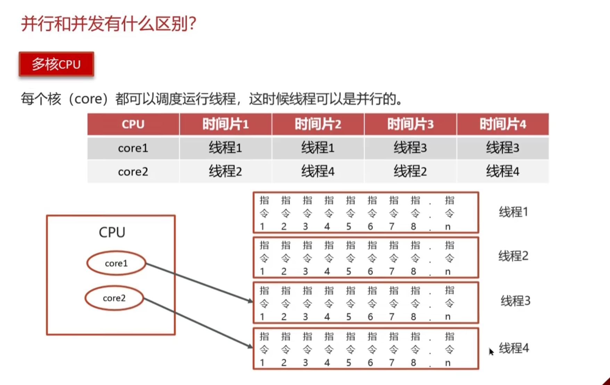


### 上下文切换

**指的是在多线程环境下，当一个运行中的线程被另一个线程抢占CPU资源时，该线程需要将当前的执行状态保存下来，以便之后能够恢复执行**

**下文切换涉及到以下几个关键步骤**

1. **保存当前线程的状态**：这包括CPU寄存器值、程序计数器（指向下一条要执行的指令）、虚拟内存映射表等。这些信息是线程恢复执行所必需的。
2. **载入下一个线程的状态**：操作系统从就绪队列中选择一个新的线程，将其之前保存的状态载入到CPU寄存器中，然后继续执行这个线程的任务。
3. **时间片轮转**：由于CPU时间片非常短，通常是几十毫秒，操作系统通过快速地在不同的线程之间进行切换，给用户造成多个线程同时运行的错觉。


### 优雅的停止线程

#### interrupt


|      |      |
| ---- | ---- |
|      |      |
|      |      |
|      |      |
|      |      |
|      |      |
|      |      |
|      |      |
|      |      |
|      |      |


### **sleep & wait**


### notifyAll&notify

notifyAll:唤醒**所有wait**的线程

notify：只**随机唤醒一个wait**线程


### ThreadLocal

ThreadLocal代表**线程本地变量**。

ThreadLocal是Java提供的一种线程绑定机制，它允许将变量与线程绑定在一起，为每个线程维护一个独立的变量副本。这种机制的目的是为了解决多线程环境下的数据共享问题，同时避免多线程之间的数据污染和竞争条件。以下是ThreadLocal的一些关键特点：

1. **线程隔离性**：ThreadLocal为每个线程提供了一个独立的变量副本，这意味着每个线程都可以独立地读写自己的副本，而不会影响到其他线程的副本。

2. **数据可见性**：ThreadLocal使得变量的可见范围限制在同一个线程内，这样可以减少同一个线程内多个函数或者组件之间公共变量传递的复杂度。

3. **生命周期**：ThreadLocal中填充的变量在线程的生命周期内有效，即从线程创建到销毁的过程中，这些变量都可以被访问和使用。

4. **存储结构**：ThreadLocal实际上是一个以ThreadLocal对象为键、任意对象为值的存储结构，每个线程都可以通过ThreadLocal对象查询到绑定在该线程上的值。

5. **适用场景**：适用于需要保持线程独立性的场景，如用户请求信息、数据库连接、会话信息等，这些信息在多线程环境下需要隔离，以避免数据混淆和安全风险。

6. **注意事项**：使用ThreadLocal时需要注意**内存泄漏**的问题，因为每个线程都会有自己独立的副本，如果线程长时间存活且频繁使用ThreadLocal，可能会导致内存占用过高。因此，适当的时候需要对ThreadLocal进行清理。

7. 线程间共享数据变量时存在一些风险，主要包括以下几点：

   1. **数据不一致性**：当多个线程同时对共享变量进行读写操作时，可能会导致数据的不一致性。例如，一个线程在读取数据的同时，另一个线程可能正在修改这个数据，这样就会导致读取到的数据是不确定的状态。
   2. **脏读**：脏读是指在一个线程修改了共享数据后，另一个线程立即读取该数据，由于修改操作还未完成，导致读取到的是不一致或者无效的数据。
   3. **丢失更新**：当两个或多个线程同时尝试更新同一个数据时，由于线程调度的不确定性，可能会出现一个线程的更新覆盖了另一个线程的更新，导致数据丢失。
   4. **不可预见的错误**：由于线程间的执行顺序无法预测，共享变量的操作可能会以意想不到的顺序执行，从而导致难以追踪和调试的错误。

   为了解决这些风险，通常需要采取同步措施来保证线程安全。常见的同步措施包括加锁，但这会增加系统的复杂度并可能影响性能。另一种方法是使用**`ThreadLocal`类**，它为每个线程提供了变量的本地副本，从而避免了线程安全问题。

总的来说，ThreadLocal提供了一种在多线程环境下管理和使用线程特定数据的简便方法，它有助于简化代码并提高线程安全性。然而，也需要注意合理使用，避免可能引起的内存管理问题。

```java
package com.buercorp.wangyu.core1.ch12.threads;

/**
 * ThreadLocal是Java中一个用于实现线程本地存储的类。
 * 它允许每个线程都拥有自己的变量副本，从而实现线程之间的数据隔离。
 * ThreadLocal实现了线程之间的数据隔离
 * @author liyiyu
 */
public class ThreadLocalExample {
    private static final ThreadLocal<Integer> threadLocal = new ThreadLocal<>();

    public static void main(String[] args) {
        // 在主线程中设置threadLocal的值
        threadLocal.set(10);
        System.out.println("Main thread: " + threadLocal.get());

        // 创建一个新的子线程并启动
        Thread thread = new Thread(() -> {
            // 在子线程中设置threadLocal的值
            threadLocal.set(20);
            System.out.println("Child thread: " + threadLocal.get());
        });
        thread.start();

        // 等待子线程执行完毕
        try {
            thread.join();
        } catch (InterruptedException e) {
            e.printStackTrace();
        }

        // 在主线程中获取threadLocal的值
        System.out.println("Main thread after child thread: " + threadLocal.get());
    }
}
// 结果：
// Main thread: 10
// Child thread: 20
// Main thread after child thread: 10

```


### ReentrantReadWriteLock

**读写锁的实现原理**还是基于AQS实现的，还是对state进行操作，拿到锁资源就去干活，如果没有拿到，依然去AQS队列中排队

**读锁操作：**基于state的高16位进行操作

**写锁操作：**基于state的低16位进行操作

**概念：** 一个资源可以被多个读线程访问，或者可以被一个写线程访问，但是不能同时存在读写线程，读写互斥，读读共享

**缺点：**

* 造成锁饥饿，一直读，没有写操作
* 读时候不能写，只有读完成后才能写 写操作可以读

ReentrantReadWriteLock依然是可重入锁

**写锁重入：**读写锁中的写锁的重入方式，基本和ReentrantLock一致，没有什么区别，依然是对state进行+1操作即可，只要确认持有锁资源的线程，是当前写锁线程即可，只不过之前ReentrantLock的重入次数是state的正数取值范围，但是读写锁中写锁范围就变小了

**读锁重入：**


为什么需要读写锁


### ReentrantLock

**ReentrantLock是一个可重入的互斥锁**。

ReentrantLock是Java并发编程中的一个锁实现，它提供了比synchronized关键字更加丰富和灵活的线程同步机制。以下是关于ReentrantLock的一些详细解释：

1. **可重入性**：ReentrantLock允许同一个线程多次获得锁，而不会导致自己被阻塞。这种特性称为可重入性，它使得锁可以被安全地用于递归调用的情况。
2. **公平性选择**：ReentrantLock可以实现公平锁和非公平锁两种策略。公平锁会保证等待时间最长的线程先获得锁，而非公平锁则不保证这一点。在创建ReentrantLock时可以选择使用哪种策略。
3. **加锁与释放锁**：使用ReentrantLock时，需要在代码中显式地进行加锁和释放锁的操作，通常使用try...finally结构来确保锁最终被释放。这要求开发者必须谨慎管理锁的生命周期。
4. **基于AQS框架**：ReentrantLock是基于AbstractQueuedSynchronizer（AQS）框架的实现。AQS为构建高性能的同步器提供了底层支持，ReentrantLock是其上的一个具体应用。
5. **Condition支持**：与synchronized不同，ReentrantLock还支持Condition对象，这使得线程可以在等待特定条件时释放锁，从而允许更灵活的线程通信和控制。
6. **内存可见性**：虽然ReentrantLock主要用于同步控制，它也提供了与synchronized相同的互斥性和内存可见性保证。这意味着对共享变量的修改在一个线程中释放锁后，对其他线程立即可见。
7. **锁绑定**：ReentrantLock对象必须在创建时绑定到一个特定的对象上，这个对象作为锁的标识，用于协调多个线程之间的访问。
8. **异常安全性**：由于需要手动释放锁，ReentrantLock的使用必须确保在发生异常时锁能够被正确释放，以避免死锁或资源泄露的问题。
9. **API丰富**：ReentrantLock提供了丰富的API，包括尝试获取锁、定时获取锁等，这些功能在synchronized中是不可用的。

```java
import java.util.concurrent.locks.ReentrantLock;
/**
 * 
 * 创建了一个ReentrantLock对象，并在doSomething方法中使用lock()方法获取锁，在finally块中使用unlock()方法释放锁。
 * 这样可以保证在多线程环境下，只有一个线程能够进入临界区代码，从而避免了竞态条件和死锁等问题。
 * @author liyiyu
 */
public class ReentrantLockExample {
    private final ReentrantLock lock = new ReentrantLock();

    public void doSomething() {
        // 获取锁
        lock.lock();
        try {
            // 执行临界区代码
            System.out.println("Doing something...");
        } finally {
            // 释放锁
            lock.unlock();
        }
    }

    public static void main(String[] args) {
        ReentrantLockExample example = new ReentrantLockExample();
        Thread thread1 = new Thread(example::doSomething);
        Thread thread2 = new Thread(example::doSomething);
        thread1.start();
        thread2.start();
    }
}

```


### synchronized同步代码块


synchronized是Java提供的一种同步机制，它主要用来实现线程之间的互斥与同步。当它修饰一个方法或者一个代码块时，可以确保在同一时刻最多只有一个线程执行该段代码。这有助于防止多线程同时访问共享资源时发生数据不一致的问题。具体来说：

1. **对象锁**：当synchronized修饰非静态方法时，它锁定的是调用该方法的对象。每个Java对象都有且仅有一个锁，也被称作对象锁。如果一个对象有多个synchronized方法，那么这些方法将会互斥执行。
2. **类锁**：当synchronized修饰静态方法时，它锁定的是该类的类对象。对于静态synchronized方法，无论创建多少个该类的实例对象，它们的静态synchronized方法都是对同一个类对象加锁，因此也会互斥执行。
3. **不同实例的同步方法**：如果有多个不同的对象实例，它们各自调用同一个对象的synchronized方法，这些调用之间不会互斥，因为各自的对象锁是不同的。
4. **同步代码块**：synchronized还可以修饰某个代码块。当它修饰一个代码块时，需要指定一个对象作为锁，只有获得了该对象锁的线程才能执行被修饰的代码块。这提供了更灵活的锁定范围，只在必要的时候才进行加锁。
5. 

synchronized的作用不仅限于实现互斥，它**还可以保证线程之间的可见性**

`wait()`方法**需要**与`synchronized`关键字一起使用

**底层：**Monitor


### **8锁深刻理解**

```java
package com.buercorp.wangyu.core1.ch12.lock8;

import java.util.concurrent.TimeUnit;

/**
 * 深刻理解锁
 * 在标准情况下 先打印 发短息 后 打电话
 * send延迟4秒 先打印 发短息 后 打电话
 * @author liyiyu
 */
public class Test1 {
    public static void main(String[] args) {

        Phone phone = new Phone();

        new Thread(() -> {
            phone.send();
        },"A").start();

        try {
            TimeUnit.SECONDS.sleep(1);
        } catch (InterruptedException e) {
            throw new RuntimeException(e);
        }

        new Thread(() -> {
            phone.call();
        },"B").start();


    }

}

class Phone {
    // synchronized 锁的对象时方法调用者
    // 两个方法用的是同一个锁 谁先拿到谁执行
    public synchronized void send (){
        try {
            TimeUnit.SECONDS.sleep(4);
        } catch (InterruptedException e) {
            throw new RuntimeException(e);
        }
        System.out.println("发短信");
    }

    public synchronized void call(){
        System.out.println("打电话");
    }
}
```

```java
package com.buercorp.wangyu.core1.ch12.lock8;

import java.util.concurrent.TimeUnit;

/**
 * 深刻理解锁
 * 3. 增加了一个普通方法 先打印 hello 后 发短息
 * 4.
 * @author liyiyu
 */
public class Test2 {
    public static void main(String[] args) {

        Phone2 phone = new Phone2();

        new Thread(() -> {
            phone.send();
        },"A").start();

        try {
            TimeUnit.SECONDS.sleep(1);
        } catch (InterruptedException e) {
            throw new RuntimeException(e);
        }

        new Thread(() -> {
            phone.hello();
        },"B").start();


    }

}

class Phone2 {
    // synchronized 锁的对象时方法调用者
    // 两个方法用的是同一个锁 谁先拿到谁执行
    public synchronized void send (){
        try {
            TimeUnit.SECONDS.sleep(4);
        } catch (InterruptedException e) {
            throw new RuntimeException(e);
        }
        System.out.println("发短信");
    }

    public synchronized void call(){
        System.out.println("打电话");
    }

    // 没有锁 不受锁的影响
    public void hello() {
        System.out.println("hello");
    }
}
```

```java
package com.buercorp.wangyu.core1.ch12.lock8;

import java.util.concurrent.TimeUnit;

/**
 * 深刻理解锁
 *
 * 4.两个对象 两个同步方法  看时间 先执行 打电话 后发短信（sleep）
 * @author liyiyu
 */
public class Test3 {
    public static void main(String[] args) {
        // 两个调用者
        Phone3 phone = new Phone3();
        Phone3 phone2 = new Phone3();
        new Thread(() -> {
            phone.send();
        },"A").start();

        try {
            TimeUnit.SECONDS.sleep(1);
        } catch (InterruptedException e) {
            throw new RuntimeException(e);
        }

        new Thread(() -> {
            phone2.call();
        },"B").start();


    }

}

class Phone3 {
    // synchronized 锁的对象时方法调用者
    // 两个方法用的是同一个锁 谁先拿到谁执行
    public synchronized void send (){
        try {
            TimeUnit.SECONDS.sleep(4);
        } catch (InterruptedException e) {
            throw new RuntimeException(e);
        }
        System.out.println("发短信");
    }

    public synchronized void call(){
        System.out.println("打电话");
    }


}
```

```java
package com.buercorp.wangyu.core1.ch12.lock8;

import java.util.concurrent.TimeUnit;

/**
 * 深刻理解锁
 *
 * 5.增加两个静态同步方法 只有一个对象   先执行 发短信   后打电话
 * @author liyiyu
 */
public class Test4 {
    public static void main(String[] args) {
        // 一个调用者
        Phone4 phone = new Phone4();
        new Thread(() -> {
            phone.send();
        },"A").start();

        try {
            TimeUnit.SECONDS.sleep(1);
        } catch (InterruptedException e) {
            throw new RuntimeException(e);
        }

        new Thread(() -> {
            phone.call();
        },"B").start();


    }

}

class Phone4 {
    // synchronized 锁的对象时方法调用者
    // 两个方法用的是同一个锁 谁先拿到谁执行
    // 静态方法 类一加载就有了
    public static synchronized void send (){
        try {
            TimeUnit.SECONDS.sleep(4);
        } catch (InterruptedException e) {
            throw new RuntimeException(e);
        }
        System.out.println("发短信");
    }

    public static synchronized void call(){
        System.out.println("打电话");
    }


}
```

```java
package com.buercorp.wangyu.core1.ch12.lock8;

import java.util.concurrent.TimeUnit;

/**
 * 深刻理解锁
 *
 * 6.增加两个静态同步方法 只有一个对象   先执行发短信  后 打电话
 * @author liyiyu
 */
public class Test5 {
    public static void main(String[] args) {
        // 两个对象的 class 都是一个
        Phone5 phone = new Phone5();
        Phone5 phone2 = new Phone5();
        new Thread(() -> {
            phone.send();
        },"A").start();

        try {
            TimeUnit.SECONDS.sleep(1);
        } catch (InterruptedException e) {
            throw new RuntimeException(e);
        }

        new Thread(() -> {
            phone2.call();
        },"B").start();


    }

}

class Phone5 {
    // synchronized 锁的对象时方法调用者
    // 两个方法用的是同一个锁 谁先拿到谁执行
    // 静态方法 类一加载就有了
    public static synchronized void send (){
        try {
            TimeUnit.SECONDS.sleep(4);
        } catch (InterruptedException e) {
            throw new RuntimeException(e);
        }
        System.out.println("发短信");
    }

    public static synchronized void call(){
        System.out.println("打电话");
    }


}
```


```java
package com.buercorp.wangyu.core1.ch12.lock8;

import java.util.concurrent.TimeUnit;

/**
 * 深刻理解锁
 * <p>
 * 7.一个静态的同步方法 一个普通的同步方法 一个对象 先执行打电话  后发短信
 *
 * @author liyiyu
 */
public class Test6 {
    public static void main(String[] args) {
        Phone6 phone = new Phone6();
        new Thread(() -> {
            phone.send();
        }, "A").start();

        try {
            TimeUnit.SECONDS.sleep(1);
        } catch (InterruptedException e) {
            throw new RuntimeException(e);
        }

        new Thread(() -> {
            phone.call();
        }, "B").start();


    }

}

class Phone6 {
    // synchronized 锁的对象时方法调用者
    // 两个方法用的是同一个锁 谁先拿到谁执行
    // 静态方法 类一加载就有了 锁的是class
    public static synchronized void send() {
        try {
            TimeUnit.SECONDS.sleep(4);
        } catch (InterruptedException e) {
            throw new RuntimeException(e);
        }
        System.out.println("发短信");
    }

    // 普通的同步方法 锁的是调用者
    public synchronized void call() {
        System.out.println("打电话");
    }


}
```

```java
package com.buercorp.wangyu.core1.ch12.lock8;

import java.util.concurrent.TimeUnit;
/**
 * 深刻理解锁
 * 8.一个静态的同步方法 一个普通的同步方法 两个对象 先执行打电话  后发短信
 *
 * @author liyiyu
 */

public class Test7 {
    public static void main(String[] args) {
        Phone7 phone = new Phone7();
        Phone7 phone2 = new Phone7();
        new Thread(() -> {
            phone.send();
        }, "A").start();

        try {
            TimeUnit.SECONDS.sleep(1);
        } catch (InterruptedException e) {
            throw new RuntimeException(e);
        }

        new Thread(() -> {
            phone2.call();
        }, "B").start();


    }

}

class Phone7 {
    // synchronized 锁的对象时方法调用者
    // 两个方法用的是同一个锁 谁先拿到谁执行
    // 静态方法 类一加载就有了 锁的是class
    public static synchronized void send() {
        try {
            TimeUnit.SECONDS.sleep(4);
        } catch (InterruptedException e) {
            throw new RuntimeException(e);
        }
        System.out.println("发短信");
    }

    // 普通的同步方法 锁的是调用者
    public synchronized void call() {
        System.out.println("打电话");
    }
}

```


### **LockSupport**

线程同步工具类，可以用于实现线程的阻塞和唤醒操作，

**主要作用：**提供了一个线程级别的阻塞和唤醒机制，可以更加灵活地**控制线程的执行状态 **提供了一种简单而灵活的方式来控制线程的阻塞和唤醒

相比于其他同步机制，如synchronized关键字、ReentrantLock等，LockSupport的性能更高、更灵活，同时也可以避免由于线程间的协作不当而引起的死锁问题

- **线程阻塞**：`LockSupport`的`park()`方法可以使当前线程阻塞，即暂停执行，直到另一个线程调用同一个`LockSupport`对象的`unpark(Thread)`方法来解除阻塞。这种阻塞方式不会抛出中断异常，但会响应中断，即如果线程在阻塞状态时被中断，那么它会抛出一个`InterruptedException`。
- **线程唤醒**：`LockSupport`的`unpark(Thread)`方法可以唤醒由`park()`方法阻塞的线程。这个方法接受一个线程作为参数，只有当这个线程因调用`park()`方法而阻塞时，调用`unpark(Thread)`才会有效。
- **许可机制**：`LockSupport`使用了一种名为“许可（Permit）”的概念来实现阻塞和唤醒功能。每个线程都有一个许可，许可只有两个值：0和1，默认情况下是0。可以将许可看作是一种(0,1)信号量，但与Semaphore不同的是，许可的累加上限是1

```java
package com.buercorp.wangyu.core1.ch12.threads;

import java.util.concurrent.locks.LockSupport;

/**
 * LockSupport
 * 提供了一种简单的线程阻塞和唤醒的机制
 * 主要作用是在多线程编程中，实现线程之间的同步和协作
 * @author liyiyu
 */
public class ThreadTest17 {
    public static void main(String[] args) {
        Thread t1 = new Thread(() -> {
            System.out.println("线程1开始执行");
            LockSupport.park(); // 阻塞当前线程
            System.out.println("线程1继续执行");
        });

        t1.start();

        try {
            Thread.sleep(3000); // 主线程休眠3秒
        } catch (InterruptedException e) {
            e.printStackTrace();
        }

        System.out.println("主线程唤醒线程1");
        LockSupport.unpark(t1); // 唤醒线程1
    }
}
```

`LockSupport` 类中的 `park()` 和 `unpark()` 方法用于线程的阻塞和解除阻塞。具体如下：

- **`park()`** : 这个方法用于阻塞当前线程，直到其他线程调用该线程的 `unpark()` 方法为止。`park()` 方法接受两个参数，一个是表示是否在被许可后应该中断线程的布尔值，另一个是超时时间（以毫秒为单位）。如果传递了超时时间，即使没有收到 `unpark()` 调用，线程也会在超时后自动解除阻塞。如果没有指定超时时间，那么线程将无限期地等待 `unpark()` 的调用。
- **`unpark(Thread thread)`** : 这个方法用于解除对特定线程的阻塞。它接受一个线程作为参数，使得该线程在调用 `park()` 方法时不会阻塞，或者如果已经阻塞，则会立即解除阻塞。需要注意的是，`unpark()` 并不会唤醒正在等待获取监视器锁的线程。

总的来说，`LockSupport` 提供了一种机制，允许线程在没有获得必要的资源时主动放弃执行权，而不是无休止地循环检查条件是否满足，从而提高了程序的性能


### Lock锁

四种八类 底层 aqs + cas


### 锁的分类


* **乐观锁、悲观锁**

java中提供的synchronized  RentrantLock  ReenteantReadWriteLock 都是**悲观锁**

java中提供的**CAS操作**，就是**乐观锁**的一种实现

**悲观锁：**获取不到锁资源时，会将当前线程挂起（进入BLOCKED、WAITING），线程挂起会涉及到用户态和内核态的切换，消耗资源

​	**用户态：**JVM可以自行执行的指令，不需要借助操作系统执行

​	**内核态：**JVM不可以自行执行，需要操作系统才可以执行

**乐观锁：**获取不到锁资源，可以再次让CPU调度，重新尝试获取锁资源

Atomic原子类中，就是基于CAS乐观锁实现


* **公平锁、非公平锁**

Java中提供的synchronization只能是**非公平锁**

Java中提供的ReentrantLock  ReentrantReadWriteLock 可以实现公平锁和非公平锁

**公平锁：**线程A获取到了锁资源，线程B没有拿到，线程B去排队了，线程C来了，锁被A持有，同时线程B在排队。直接排到B后面，等待B拿到锁资源或者B取消后，才可以尝试去竞争资源

**非公平锁：**线程A获取到了锁资源，线程B没有拿到，线程B去排队，线程C来了，先尝试竞争一波

​	拿到锁资源：开心，插队成功

​	没有拿到锁资源：依然要排到B后面，等待B拿到锁资源或者B取消后，才可以尝试去竞争锁资源


* **可重入锁、不可重入锁**

java中提供的synchronized  RentrantLock  ReenteantReadWriteLock 都是可重入锁

**重入**：当前线程获取到A锁，在获取之后尝试再次获取A锁是可以直接拿到的

**不可重入：**当前线程获取到A锁，在获取之后尝试再次获取A锁，无法获取到的，因为A锁被当前线程占用着，需要等待自己释放锁在获取锁


* **互斥锁、共享锁**

java中提供的synchronized、ReetrantLock 是互斥锁

Java中提供的ReentrantReadWriteLock 有互斥锁也有共享锁

**互斥锁：**同一时间点，只会有一个线程持有

**共享锁：**同一时间点，可以有多个线程同时持有

​	一般不单独用，配合读写锁ReentrantReadWriteLock，读写互斥，读读共享，查询不会造成数据安全问题


### Synchronized && Lock

1. **Synchronized**：
   
   - `synchronized`是Java的内置关键字，可以用于方法或者代码块。
   - 它是一个独占锁，意味着当一个线程获得对象的锁后，其他任何试图获取该锁的线程将被阻塞，直到锁被释放。
   - `synchronized`方法通常称为同步方法，它锁定的是对象实例（对于静态方法，则是类对象）。
   - `synchronized`代码块可以锁定任何对象，不仅限于当前对象实例。
   - `synchronized`无法被中断，即一旦线程等待获取锁，它必须等待锁被释放。
   - `synchronized`不需要手动释放锁，当`synchronized`方法或代码块执行完成后，线程会自动释放锁。
2. **Lock**：
   - `Lock`是一个接口，属于`java.util.concurrent.locks`包，需要显式地创建`Lock`对象。
   
   - `Lock`提供了比`synchronized`更灵活的锁定机制，例如可中断的获取锁操作、尝试获取锁操作、多个条件的同步等。
   
   - `Lock`可以实现更细粒度的锁定控制，因为有不同的类型如`ReentrantLock`、`ReadWriteLock`等。
   
   - `Lock`需要手动加锁和释放锁，通常使用`try...finally`结构来确保锁最终被释放。
   
   - `Lock`可以被中断，即在等待锁的过程中可以响应中断。
   
   - `Lock`可以实现公平锁和非公平锁，公平锁是指等待时间最长的线程会优先获得锁。
   
     
   
     `wait()`方法**需要**与`synchronized`关键字一起使用
   
     

### 死锁


| 方法名             | 作用                                                         |
| ------------------ | ------------------------------------------------------------ |
| wait()             | 表示线程一直等待，直到其他线程通知，与sleep不同，会释放锁    |
| wait(long timeout) | 指定等待的毫秒数                                             |
| notify()           | 唤醒一个处于等待状态的线程                                   |
| notifyAll()        | 唤醒同一个对象上所有调用wait()方法的线程，优先级别高的线程优先调度 |


### AQS

有一个值state ，队列双向链表，实现锁的框架

AQS就是AbstractQueuedSynchronizer抽象类，AQS其实就是JUC包下的一个基类，JUC下的很多内容都是基于AQS实现了部分功能，

比如ReentrantLock  ThreadPoolExecutor  阻塞队列  CountDownLatch  Semaphore CyclicBarrier等都是基于AQS实现

首先AQS中提供了一个由volatile 修饰，并且采用CAS方式修改的int类型的state变量

其次AQS中维护 了一个双向链表，有head，有tail，并且每个节点都是Node对象


### CAS

compare and swap 也就是比较和交换，他是一条CPU的并发原语

他在替换内存的某个位置的值时，首先查看内存中的值与预期值是否一致，如果一致，执行替换操作，这个操作时一个原子性操作

java中基于Unsafe的类提供了对 CAS 的操作的方法，JVM会帮助我们将方法实现CAS汇编指令

要清楚 CAS 只是比较和交换，在获取原值的这个操作上，需要自己实现

**CAS的缺点**：

CAS只能保证对一个变量的操作是原子性的，无法实现对多行代码实现原子性

**CAS的问题**：

* **自旋时间过长问题**：

  * 可以指定CAS一共循环多少次，如果超过这个次数，直接失败或者挂起线程（自旋锁、自适应自旋锁）
  * 可以在CAS一次失败后，将这个操作暂存起来，后面需要获取结果时，将暂存的操作全部执行，再返回最后的结果

* **ABA问题：**  可以引用版本号的方式，来解决ABA的问题

* 

  


```java
package com.buercorp.wangyu.core1.ch12.threads;

import java.util.concurrent.atomic.AtomicInteger;

/**
 * CAS 乐观锁
 * @author liyiyu
 */
public class ThreadText12 {
    public static AtomicInteger m = new AtomicInteger(0);

    public static void main(String[] args) {
        m.incrementAndGet(); // m++
    }
}

```


### 阻塞队列


#### ArrayBlockingQueue

由数组结构组成的有界阻塞队列

#### LinkedBlockingQueue

有界 默认大小integer.MAX_VALUE


```java
package com.buercorp.wangyu.core1.ch12.threads.queue;

import java.util.concurrent.ArrayBlockingQueue;
import java.util.concurrent.BlockingQueue;
import java.util.concurrent.TimeUnit;

/**
 * 阻塞队列的使用
 * 抛出异常 特殊值 阻塞 超时
 * 插入
 * 移除
 * 检查
 * add remove element,  offer poll peek,  put take,  offer poll
 * 检查 element为空抛出异常  peek为空返回null 都返回队头元素
 * @author liyiyu
 */
public class QueueTest1 {
    public static void main(String[] args) throws InterruptedException {
        // 创建阻塞队列
        BlockingQueue<String> blockingQueue = new ArrayBlockingQueue<>(3);

        // 抛出异常
    /*    System.out.println(blockingQueue.add("aaa")); // true
        System.out.println(blockingQueue.add("bbb")); // true
        System.out.println(blockingQueue.add("ccc")); // true
        System.out.println(blockingQueue.add("aaa")); // 异常
        System.out.println(blockingQueue.remove());
        System.out.println(blockingQueue.element());*/


        // 特殊值
       /* System.out.println(blockingQueue.offer("aaa")); // true
        System.out.println(blockingQueue.offer("bbb")); // true
        System.out.println(blockingQueue.offer("ccc")); // true
//        System.out.println(blockingQueue.offer("aaa")); // false
        System.out.println(blockingQueue.poll());
        System.out.println(blockingQueue.poll());
        System.out.println(blockingQueue.poll());
//        System.out.println(blockingQueue.poll()); // null
        System.out.println(blockingQueue.peek());*/


        // 阻塞
        /*blockingQueue.put("aaa"); //
        blockingQueue.put("bbb"); //
        blockingQueue.put("ccc"); //
//        blockingQueue.put("aaa"); // 阻塞

        blockingQueue.take();
        blockingQueue.take();
        blockingQueue.take();
        blockingQueue.take(); // 阻塞*/


        // 超时
        System.out.println(blockingQueue.offer("aaa")); // true
        System.out.println(blockingQueue.offer("bbb")); // true
        System.out.println(blockingQueue.offer("ccc")); // true
//        System.out.println(blockingQueue.offer("aaa",3l, TimeUnit.SECONDS)); // 设置阻塞时间 false

        System.out.println(blockingQueue.poll()); // true
        System.out.println(blockingQueue.poll()); // true
        System.out.println(blockingQueue.poll()); // true
        System.out.println(blockingQueue.poll(3l,TimeUnit.SECONDS)); // 设置阻塞时间 null

    }
}

```


### 线程池

我们使用线程的时候就去创建一个线程，这样实现起来非常简便，但是有问题：

​	如果并发的线程数量很多，并且每个线程都是执行一个时间很短的任务就结束了，这样频繁创建线程就会大大降低系统的效率，因为频繁创建线程和销毁线程需要时间。

**线程池**：就是一个**容纳多个线程的容器，其中的线程可以反复使用**，省去了频繁创建线程对象的操作，无需反复创建线程而消耗过多资源

线程池主要是控制运行的线程数量，处理过程中将任务放入队列，然后在线程创建后启动这些任务，如果线程数量超过了最大数量，超出数量的线程排队等候，等其他线程执行完毕，再从队列中取出任务来执行


**主要特点：**线程复用，控制最大并发数，管理线程

* 降低资源消耗
* 提高响应速度
* 提高线程的可管理性


#### 执行器Executors（一般不用这去创建方法）

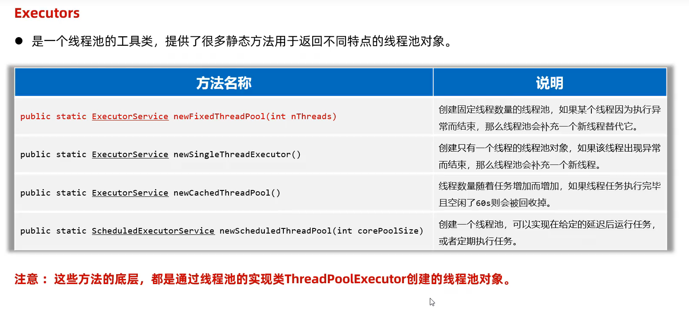

```java
package com.buercorp.wangyu.core1.ch12.threads.threadsPool;

import java.util.concurrent.*;

/**
 * 通过 Executors 创建线程池
 * Executors 是一个线程池的工具类
 * 提供了很多静态方法用于返回不同特点的线程池对象
 * @author liyiyu
 */
public class ThreadRunnableText3 {
    public static void main(String[] args) throws ExecutionException, InterruptedException {
        /**
         * 通过 ThreadPoolExecutor创建线程池
          */
//        ThreadPoolExecutor pool = new ThreadPoolExecutor(3, // 核心
//                5,
//                6,
//                TimeUnit.SECONDS, // 单位时间
//                new ArrayBlockingQueue<>(4), // 任务队列
//                Executors.defaultThreadFactory(), // 创建线程工厂
//                new ThreadPoolExecutor.AbortPolicy() // 任务拒绝策略
//        );

        // 通过 Executors 创建线程池
        ExecutorService pool = Executors.newFixedThreadPool(3);

        // 使用线程处理多任务
        Future<String> f1 = pool.submit(new MyCallable(100));
        Future<String> f2 = pool.submit(new MyCallable(200));
        Future<String> f3 = pool.submit(new MyCallable(300));
        Future<String> f4 = pool.submit(new MyCallable(400));

        System.out.println(f1.get());
        System.out.println(f2.get());
        System.out.println(f3.get());
        System.out.println(f4.get());
    }
}

```

```java
package com.buercorp.wangyu.core1.ch12.threads.threadsPool;

import java.util.concurrent.Callable;

public class MyCallable implements Callable {
    private int n;

    public MyCallable(int n) {
        this.n = n;
    }

    @Override
    public Object call() throws Exception {
        // 需求 求 1-n的和返回
        int sum = 0;
        for (int i = 1; i < n; i++) {
            sum += i;
        }
        return Thread.currentThread().getName() + " 求出1到" + n + "的和是：" + sum;
    }
}
```


#### 线程池处理Callable任务

```java
package com.buercorp.wangyu.core1.ch12.threads.threadsPool;

import java.util.concurrent.*;

/**
 * 线程池处理 Callable 任务 有返回值
 * @author liyiyu
 */
public class ThreadRunnableText2 {
    public static void main(String[] args) throws ExecutionException, InterruptedException {
        /**
         * 通过 ThreadPoolExecutor创建线程池
         * public ThreadPoolExecutor(int corePoolSize,
         *                               int maximumPoolSize,
         *                               long keepAliveTime,
         *                               TimeUnit unit,
         *                               BlockingQueue<Runnable> workQueue) {
         *         this(corePoolSize, maximumPoolSize, keepAliveTime, unit, workQueue,
         *              Executors.defaultThreadFactory(), defaultHandler);
         *     }
          */
        ThreadPoolExecutor pool = new ThreadPoolExecutor(3, // 核心
                5,
                6,
                TimeUnit.SECONDS, // 单位时间
                new ArrayBlockingQueue<>(4), // 任务队列
                Executors.defaultThreadFactory(), // 创建线程工厂
                new ThreadPoolExecutor.AbortPolicy() // 任务拒绝策略
        );

        // 使用线程处理多任务
        Future<String> f1 = pool.submit(new MyCallable(100));
        Future<String> f2 = pool.submit(new MyCallable(200));
        Future<String> f3 = pool.submit(new MyCallable(300));
        Future<String> f4 = pool.submit(new MyCallable(400));

        System.out.println(f1.get());
        System.out.println(f2.get());
        System.out.println(f3.get());
        System.out.println(f4.get());
    }
}

```

```java
package com.buercorp.wangyu.core1.ch12.threads.threadsPool;

import java.util.concurrent.Callable;

public class MyCallable implements Callable {
    private int n;

    public MyCallable(int n) {
        this.n = n;
    }

    @Override
    public Object call() throws Exception {
        // 需求 求 1-n的和返回
        int sum = 0;
        for (int i = 1; i < n; i++) {
            sum += i;
        }
        return Thread.currentThread().getName() + " 求出1到" + n + "的和是：" + sum;
    }
}

```

#### 线程池处理Runnable任务

```java
package com.buercorp.wangyu.core1.ch12.threads.threadsPool;

import java.util.concurrent.ArrayBlockingQueue;
import java.util.concurrent.Executors;
import java.util.concurrent.ThreadPoolExecutor;
import java.util.concurrent.TimeUnit;

/**
 * 线程池处理 Runnable 任务
 * @author liyiyu
 */
public class ThreadRunnableText {
    public static void main(String[] args) {
        /**
         * 通过 ThreadPoolExecutor创建线程池
         * public ThreadPoolExecutor(int corePoolSize,
         *                               int maximumPoolSize,
         *                               long keepAliveTime,
         *                               TimeUnit unit,
         *                               BlockingQueue<Runnable> workQueue) {
         *         this(corePoolSize, maximumPoolSize, keepAliveTime, unit, workQueue,
         *              Executors.defaultThreadFactory(), defaultHandler);
         *     }
          */
        ThreadPoolExecutor pool = new ThreadPoolExecutor(3, // 核心
                5,
                6,
                TimeUnit.SECONDS, // 单位时间
                new ArrayBlockingQueue<>(4), // 任务队列
                Executors.defaultThreadFactory(), // 创建线程工厂
                new ThreadPoolExecutor.AbortPolicy() // 任务拒绝策略
        );

        // 任务对象
        Runnable tagen = new MyRunnable();
        // 把任务对象交给线程池 线程池自动创建一个新的线程 自动处理这个任务 自动执行
        pool.execute(tagen); // 核心线程
        pool.execute(tagen); // 核心线程
        pool.execute(tagen); // 核心线程

        pool.execute(tagen); // 任务队列
        pool.execute(tagen); // 任务队列
        pool.execute(tagen); // 任务队列
        pool.execute(tagen); // 任务队列

        pool.execute(tagen); // 临时
        pool.execute(tagen); // 临时

        pool.shutdown(); // 等着线程池全部执行完 关闭线程池ThreadRunnableText

    }
}

```

```java
package com.buercorp.wangyu.core1.ch12.threads.threadsPool;

public class MyRunnable implements Runnable{
    @Override
    public void run() {
        System.out.println(Thread.currentThread().getName() + " ==》 输出666");
        try {
            Thread.sleep(1000);
        } catch (InterruptedException e) {
            throw new RuntimeException(e);
        }
    }
}

```


#### 核心线程数配置（具体还是要根据业务）

**计算密集型的任务：** 核心线程数量 = CPU的核数 + 1

**IO密集型的任务：**核心线程数量 = CPU核数 * 2


#### **Fork/Join**

* 概念：
  * 是JDK1.7加入的新的线程池实现，它体现的是一种分治思想，适用于能够进行任务拆分的cpu密集型运算
    * 任务拆分：是将一个大任务拆分为算法上相同的小任务，直至不能拆分可以直接求解。跟递归相关的一些计算，如：归并排序、斐波那契数列都可以用分治思想进行求解
  * Foek/Join在分治的基础上加入了多线程，可以把每个任务的分解和合并交给不同的线程来完成，，进一步提升了运算效率
  * Fork/Join默认会创建与cpu核心数大小相同的线程池

### **JMM**

* JMM（Java Memory Model）Java内存模型，定义了**共享内存**中**多线程程序读写操作**的行为规范，通过这些规则来规范对内存得读写操作从而保证指令的正确性
* JMM把内存分为两块，一块是私有线程的工作区域（工作内存），一块是所有线程的共享区域（主内存）
* 线程跟线程之间是相互隔离，线程跟线程交互需要通过主内存


## 。。。。。。。。。。。。。。。。。。。。。。。。。。。。。。。。。。。。。。


## **File**

### 概述：

File：它是文件和目录路径名的抽象表示

* 文件和目录是可以通过File封装成对象的

* 对于File而言，其封装的并不是一个真正存在的文件，仅仅是一个路径名而已。它可以是存在的，也可以是不存在的

  将来要通过具体的操作把这个路径的内容转化为具体存在的

### 构造方法：

|              方法名               |                             说明                             |
| :-------------------------------: | :----------------------------------------------------------: |
|       File(String pathname)       | 通过将给定的路径名字字符串转换为抽象路径名来创建新的File实例 |
| File(Strint parent, String child) |       从父路径名字符串和子路径名字符串创建新的File实例       |
|  File(File parent, String child)  |        从父抽象路径名和子路径名字符串创建新的File实例        |


```java
package com.buercorp.wangyu.file;

import java.io.File;

/**
 * File：文件和目录路径名的抽象表示
 * 1.文件和目录是可以通过File封装成对象的
 * 2.对于File而言，其封装的并不是一个真正存在的文件，仅仅是一个路径名而已 可以存在 也可不存在
 * 将来要通过具体的操作把这个路径的内容转换为具体存在
 * @author liyiyu
 */
public class FileTest1 {
    public static void main(String[] args) {
        // File(String pathname) 通过将给定的路径名字符串转换为抽象路径名来创建新的File实例
        File f1 = new File("E:\\fileTest\\java.txt");
        System.out.println(f1);

        // File(String parent, String child)从父路径名字符串和子路经字符串创建新的File实例
        File f2 = new File("E:\\fileTest", "java2.txt");
        System.out.println(f2);

        // File(File parent, String child)从父类路径名和子路径名字符串创建新的File实例
        File f3 = new File("E:\\fileTest");
        File f4 = new File(f3, "java3.txt");
        System.out.println(f4);
    }
}

```


### File创建功能


```java
package com.buercorp.wangyu.file;

import java.io.File;
import java.io.IOException;

/**
 * File 文件创建功能
 * @author liyiyu
 */
public class FileTest2 {
    public static void main(String[] args) throws IOException {
        /**
         * 在E：\\fileTest目录下创建一个 文件java.txt
         * public boolean createNewFile() 当具有该名称的文件不存在时 创建一个由该抽象路径名命名的新空文件
         * 如果文件不存在 就创建文件 并返回true
         * 如果文件存在 就不创建文件 并返回false
         */
        File f1 = new File("E:\\fileTest\\java.txt");
        System.out.println(f1.createNewFile());

        /**
         * 在E：\\fileTest目录下创建一个 目录JavaSE
         * public boolean mkdir() 创建由此抽象路径命名的目录
         * 如果目录不存在 就创建目录 并返回true
         * 如果目录存在 就不创建目录 并返回false
         */
        File f2 = new File("E:\\fileTest\\javaSE");
        System.out.println(f2.mkdir());

        /**
         * 在E：\\fileTest目录下创建一个多级目录JavaWeb\\HTML
         * public boolean mkdirs() 创建由此抽象路劲名命名的目录 包括任何必须但不存在的父目录
         */
        File f3 = new File("E:\\fileTest\\JavaWEB\\HTML");
        System.out.println(f3.mkdirs());
    }
}

```


### 判断和获取功能


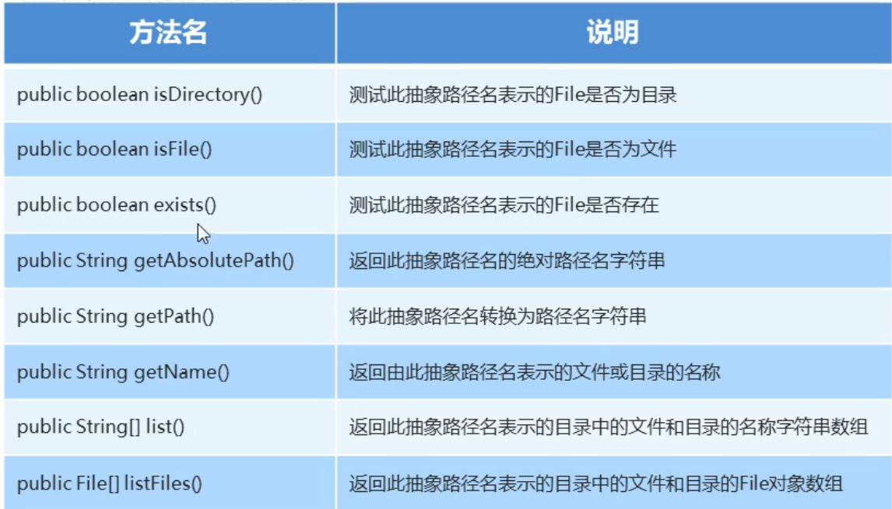


## IO流

### **概述：**

* IO：输入/输出（Input/Output）
* 流：是一种抽象概念，是对数据传输的总称。也是说数据在设备间的传输称为流，流的本质是数据传输
* IO流就是用来处理设备常见数据（存储和读取数据的解决方案）传输问题的
  * 常见的应用：文件复制、文件上传、文件下载


### **分类：**

* 按照数据的流向
  * 输入流：读数据
  * 输出流：写数据
* 按照数据类型
  * 字节流
    * 字节输入流；字节输出流
  * 字符流
    * 字符输入流；字符输出流


怎么使用：如果数据通过Window自带的记事本软件打开，我们可以**读懂里面的内容**，就使用字符流，否则使用字节流

如果不知道该使用哪种类型的流，就使用字节流


### IO流体系


### 字节流


#### FileQutputStream字节流
origin/master

操作本地文件的字节输出流，可以把程序中的数据写到本地文件中

**书写步骤：**

* 创建字节输出流对象
  * 参数是字符串表示的路径或者File对象都是可以的
  * 如果文件不存在会创建一个新的文件，但是要保证父级路径是存在的
  * 如果文件已经存在，则会清空文件
* 写数据
  * write方法的参数是整数，但是实际上写到本地文件中的是整数在ASCII上对应的字符
* 释放资源
  * 每次使用完流之后都要释放资源

```java
package com.buercorp.wangyu.file;

import java.io.FileNotFoundException;
import java.io.FileOutputStream;
import java.io.IOException;

/**
 * 字节流输出流 FileQutputStream
 * 写出一段文字到本地文件中
 * 步骤：
 *      创建对象
 *      写出数据
 *      释放资源
 * @author liyiyu
 */
public class FileTest3 {
    public static void main(String[] args) throws IOException {
        // 1.创建对象
        // 参数是字符串表示的路径或者是File对象都是可以的
        // 如果文件不存在会创建一个新的文件 但是要保证父级路劲是存在的
        // 如果文件已经存在 会清空文件
        FileOutputStream fos = new FileOutputStream("java.txt");
        FileOutputStream fos = new FileOutputStream("D:\\DevelopSpace\\IdeaSpace\\wy-test-demo\\java.txt");
        // 2.写出数据 a
        fos.write(97);
        // 3.释放资源
        fos.close();

      /*  // 1. 键入文件路径
        String filePath = "java.txt";
        // 2. 创建输出流
        FileOutputStream fos = new FileOutputStream(filePath);
        // 3. 写入字符
        fos.write("a".getBytes());
        // 4. 关闭输出流
        fos.close();*/
    }
}
```


**写出数据的三种方式：**

```java
package com.buercorp.wangyu.file;

import java.io.FileOutputStream;
import java.io.IOException;

/**
 * 字节流输出流 FileQutputStream
 * 字节输出流写出数据的三种方式
 * void write(int b)    一次写一个字节数据
 * void write(byte[] b)    一次写一个字节数组数据
 * void write(byte[] b, int off, int len)    一次写一个字节数组的部分数据  off 开始,  len 个数
 *
 * @author liyiyu
 */
public class FileTest5 {
    public static void main(String[] args) throws IOException {
        // 创建对象
        FileOutputStream fos = new FileOutputStream("D:\\DevelopSpace\\IdeaSpace\\wy-test-demo\\java2.txt");
        // 写入数据 a b c d
        // ASCII上对应的字符
        byte[] bytes = {97, 98, 99, 100};
        fos.write(bytes,1,2); // b c
        // 3.释放资源
        fos.close();

    }
}

```

**换行和续写：**

```java
package com.buercorp.wangyu.file;

import java.io.FileNotFoundException;
import java.io.FileOutputStream;
import java.io.IOException;
import java.io.Writer;

/**
 * FileOutputStream
 * 续写 true
 *         FileOutputStream fos = new FileOutputStream("D:\\DevelopSpace\\IdeaSpace\\wy-test-demo\\java2.txt",true);
 * 换行写
 *          String wrap = "\r\n";
 *         fos.write(wrap.getBytes());
 * @author liyiyu
 */
public class FileTest6 {
    public static void main(String[] args) throws IOException {
        // 创建对象 true 续写
        FileOutputStream fos = new FileOutputStream("D:\\DevelopSpace\\IdeaSpace\\wy-test-demo\\java2.txt",true);
        // 写入数据
        String str = "liyiyu";
        fos.write(str.getBytes());

        // 换行
        String wrap = "\r\n";
        fos.write(wrap.getBytes());

        // 写入数据
        String str2 = "666";
        fos.write(str2.getBytes());

        // 释放资源
        fos.close();
    }
}

```


#### FileInputStream字节流

读取数据 不要

操作本地文件的字节输入流，可以把本地文件中的数据读取到程序中来

read：读取一个数据并移动一次指针

```java
package com.buercorp.wangyu.file;

import java.io.FileInputStream;
import java.io.FileNotFoundException;
import java.io.IOException;

/**
 * 读取文件中的数据 FileInputStream
 * @author liyiyu
 */
public class FileTest01 {
    public static void main(String[] args) throws IOException {
        // 创建对象
        // 如果文件不存在，直接报错
        FileInputStream fis = new FileInputStream("D:\\DevelopSpace\\IdeaSpace\\wy-test-demo\\java.txt");
        
        // 读取数据
        // 一次读取一个字符，读取出来的数据是ASCII对应的数字
        // 如果读取末尾 read方法返回的是 -1
        // read：读取一个数据并移动一次指针
        int a = fis.read();
        System.out.println(a); // 97
        System.out.println((char) a); // a
        
        // 释放资源
        fis.close();
    }
}

```

**字节输入流循环读取**

```java
package com.buercorp.wangyu.file;

import java.io.FileInputStream;
import java.io.FileNotFoundException;
import java.io.IOException;

/**
 * 字节输入流循环读取文件中的数据
 * @author liyiyu
 */
public class FileTest02 {
    public static void main(String[] args) throws IOException {
        // 创建对象
        FileInputStream fis = new FileInputStream("D:\\DevelopSpace\\IdeaSpace\\wy-test-demo\\java2.txt");
        
        // 循环读取 定义int 
        int b;
        while ((b = fis.read()) != -1){
            System.out.print((char) b);
        }
		
        // 释放资源
        fis.close();
    }
}

```

**文件拷贝**

一次读一个字节

```java
	package com.buercorp.wangyu.file;

import java.io.FileInputStream;
import java.io.FileNotFoundException;
import java.io.FileOutputStream;
import java.io.IOException;

/**
 * 文件拷贝
 * 把C盘下的Java开发手册（嵩山版）.pdf 拷贝到 当前目录D:\DevelopSpace\IdeaSpace\wy-test-demo\
 * 选择较小的文件
 * @author liyiyu
 */
public class FileCopy {
    public static void main(String[] args) throws IOException {
        // 创建对象
        // 读
        FileInputStream fis = new FileInputStream("C:\\Users\\Administrator\\Desktop\\Java开发手册（嵩山版）.pdf");
        // 写
        FileOutputStream fos = new FileOutputStream("D:\\DevelopSpace\\IdeaSpace\\wy-test-demo\\Java开发手册（嵩山版）copy.pdf");

        // 读取 一次读取一个字节
        int b;
        while ((b = fis.read()) != -1){
            fos.write(b);
        }
        
	    // 开始计时
        long start = System.currentTimeMillis();
        
        int len;
        // 一次读取5M
        byte[] bytes = new byte[1024 * 1024 * 5];
        while ((len = fis.read(bytes)) != -1){
            fos.write(bytes,0,len);
        }
        
        // 释放资源
        // 先调用的最后释放
        fos.close();
        fis.close();
        
        
        // 结束时间
        long end = System.currentTimeMillis();
        // 耗时
        System.out.println(end - start);

    }
}

```


### 字符集

* 在计算机中，任意数据都是以二进制的形式来存储的
* 计算机中最小的存储单元是一个字节 
* 一个字节 8位

#### ASCII

一个英文占一个字节

#### GBK（系统显示：ANSI）

包含国家中日韩汉字，BIG5编码中的所有汉字

简体中文版Windows 默认使用GBK字符集

GBK字符集完全兼容ASCII字符集

​	一个英文占一个字节，二进制第一位是0

​	一个中文占两个字节，二进制高位字节的第一位是1

#### Unicode

国际标准字符集，它将世界各种语言的每个字符定义一个唯一的编码，以满足跨语言 、跨平台的文本信息转换

### UTF8编码

是Unicode字符集的一种编码格式

* 一个英文占一个字节，二进制第一位是0，转成十进制是正数
* 一个 中文占三个字节，二进制第一位是1，第一个字节转成十进制是负数


### 乱码

原因：

* 读取数据时未读完整个汉字
* 编码和解码时的方式不统一

解决：

* 不要使用字节流读取文本文件（字符流）

* 编码解码时使用同一个码表，同一个编码方式


### 编码 & 解码

```java
package com.buercorp.wangyu.file;

import java.io.UnsupportedEncodingException;
import java.util.Arrays;

/**
 * 编码 & 解码
 * @author 忆白
 */
public class FileTest7 {
    public static void main(String[] args) throws UnsupportedEncodingException {
        // 编码
        String str = "你好word";
        // 使用默认方式进行编码 我配置的是 UTF-8
        // 中文3个字节 英文1个字节
        byte[] bytes = str.getBytes();
        System.out.println(Arrays.toString(bytes)); // [-28, -67, -96, -27, -91, -67, 119, 111, 114, 100]
        
        
		// 使用指定的编码方式进行编码
        // 中文2个字节 英文1个字节
        byte[] bytes1 = str.getBytes("GBK");        
        System.out.println(Arrays.toString(bytes1)); // [-60, -29, -70, -61, 119, 111, 114, 100]


        // 解码
        // 默认方式
        String str1 = new String(bytes);
        System.out.println(str1);
        // 指定方式
        String str2 = new String(bytes1, "GBK");
        System.out.println(str2);
    }
}

```


### 字符流

* 概念

字符流的底层就是字节流

字符流 = 字节流 + 字符集

* 特点

输入流：一次读一个字节，遇到中文时，一次读多个字节

输出流：底层会把数据按照指定的编码方式进行编码，变成字节再写到文件中

* 使用场景

对于纯文本文件进行读写操作


#### FileReader

```java
package com.buercorp.wangyu.file;

import java.io.FileNotFoundException;
import java.io.FileReader;
import java.io.IOException;

/**
 * 字符输入流
 * 读取数据 
 * 			read(空参) public int read()				读取数据	 强转类型转换 把字节解码成十进制并返回
 * 			read(有参) public int read(char[] buffer)  读取多个数据  读取数据，解码，强转三步合并 把强转之后的字符放到数组中
 * @author 忆白
 */
public class FileTest8 {
    public static void main(String[] args) throws IOException {
        // 创建对象并关联本地文件
        FileReader fr = new FileReader("java3.txt");
        /**
         * 读取数据 read（）
         * 字符流的底层是字节流，所以要转换成字符
         * 默认也是一个字节一个字节的读取
         * 如果遇到中文就会一次读取多个 GBK一次读取两个字节 UTF-8一次读取三个字节
         *
         * read细节
         * 1.read（）：默认一次读取一个字节 遇到中文一次读取多个
         * 2.在读取之后，方法的底层还会进行解码并转成十进制 最终把十进制做为返回值
         * 3.读到末尾，返回-1
         *
         * 看到中文汉字，就把这些十进制数据，再进行强转就可以了
          */


        int ch;
        while ((ch = fr.read()) != -1) {
            System.out.print((char)ch);
        }
        
        // 关闭流
        fr.close();

    }
}

```

```java
package com.buercorp.wangyu.file;

import java.io.FileNotFoundException;
import java.io.FileReader;
import java.io.IOException;

/**
 * 字符输入流
 * 读取数据
 *
 *  			read(有参) public int read(char[] buffer)   读取多个数据  读取数据，解码，强转三步合并 把强转之后的字符放到数组中
 * @author 忆白
 */
public class FileTest9 {
    public static void main(String[] args) throws IOException {

        // 创建对象
        FileReader fr = new FileReader("java3.txt");

        // 读取数据
        char[] buffer = new char[2];
        int len;
        while ((len = fr.read(buffer)) != -1) {
            // 把数组中的数据变成字符串
            System.out.print(new String(buffer, 0, len));
        }

        // 关闭流
        fr.close();
    }
}

```


**底层：**

* 创建字符输入流对象

  关联文件，并创建缓冲区（长度为8192的字节数组）

* 读取数据

  判断缓冲区中是否有数据可以读取

  ​	缓冲区没有数据：

  ​		就从文件中获取数据，装到缓冲区中，每次尽可能装满缓冲区

  ​		如果文件中也没有数据了，就返回-1

  ​	缓冲区有数据：

  ​		空参read方法：一次读取一个字节，遇到中文一次读取多个字节，把字节解码并转成十进制返回

  ​		有参read方法：把读取字节，解码，强转三步合并了，强转之后的字符放到数组中


#### FileWriter

### flush & close

|      成员方法       |                说明                |
| :-----------------: | :--------------------------------: |
| public void flush() | 将缓冲区中的数据，刷新到本地文件中 |
| public void close() |           释放资源/关流            |

**flush刷新：**刷新之后，还可以继续往文件中写出数据

**close关流：**断开通道，无法再往文件中写出数据

```java
package com.buercorp.wangyu.file;

import java.io.FileWriter;
import java.io.IOException;

/**
 * flush 刷新 后面可以继续写数据
 * close 关流 断开连接 无法写数据
 * @author liyiyu
 */
public class FileTest10 {
    public static void main(String[] args) throws IOException {
        FileWriter fr = new FileWriter("java4.txt");
        fr.write("早");
        fr.write("你好");
        // 刷新
        fr.flush(); // 早你好
        
        fr.write("下午好");
        fr.write("hello");
        
        // 关流
        fr.close(); // 报错
        fr.write("666");
    }
}

```


### 使用场景

**字节流：**

​	拷贝任意类型的文件

**字符流：**

​	读取纯文本文件中的数据

​	往纯文本文件中写出数据


### 拷贝文件夹

```java
package com.buercorp.wangyu.file;

import java.io.File;
import java.io.FileInputStream;
import java.io.FileOutputStream;
import java.io.IOException;

/**
 * 文件夹拷贝 连里面的任意类型文件
 * 把 source文件夹 复制到 dest
 *
 * @author liyiyu
 */
public class FileCopy2 {
    public static void main(String[] args) throws IOException {
        // 1.创建对象表示数据源
        File source = new File("source");
        // 2.创建对象表示目的地
        File dest = new File("dest");
        // 3.调用方法开始拷贝
        copydir(source, dest);
    }

    private static void copydir(File source, File dest) throws IOException {
        // 如果没有该文件夹 就创建
        dest.mkdirs();
        // 递归
        // 1.进入数据源 获取一个目录（source）下的所有文件和子目录
        // listFiles() 返回一个抽象路径名数组，这些路径名表示由该抽象路径名表示的目录中的文件和目录
        // 用于获取文件夹中所有文件和子文件夹的方法
        File[] files = source.listFiles();
        // 2.遍历数组
        for (File file : files) {
            if (file.isFile()) {
                // 3.判断文件 拷贝
                FileInputStream fis = new FileInputStream(file);
                FileOutputStream fos = new FileOutputStream(new File(dest, file.getName()));
                byte[] bytes = new byte[1024];
                int len;
                while ((len = fis.read(bytes)) != -1) {
                    fos.write(bytes, 0, len);
                }
                fos.close();
                fis.close();
            } else {
                // 4.判断文件夹 递归
                copydir(file, new File(dest, file.getName()));
            }
        }
    }
}
```

### 缓冲流

#### 字节缓冲流

|                   方法名称                   |                          说明                           |
| :------------------------------------------: | :-----------------------------------------------------: |
|  public BufferedInputStream(InputStream is)  | 字节缓冲输入流 把基本流包装成高级流，提高读取数据的性能 |
| public BufferedOutputStream(OutputStream os) | 字节缓冲输出流 把基本流包装成高级流，提高读取数据的性能 |

**底层：**

​	自带了长度为**8192**的缓冲区提高性能

```java
package com.buercorp.wangyu.file;

import java.io.*;

/**
 * 利用字节缓冲区拷贝文件
 * 一次读取一个字节
 * 一次读取多个字节
 * @author 
 */
public class FileCopy3 {
    public static void main(String[] args) throws IOException {
        // 创建缓冲流的对象
        BufferedInputStream bis = new BufferedInputStream(new FileInputStream("java4.txt"));
        BufferedOutputStream bos = new BufferedOutputStream(new FileOutputStream("copy4.txt"));
        // 循环读取并写到目的地
        
        // 一次读取一个字节
        int b;
        while ((b = bis.read()) != -1) {
            bos.write(b);
        }
        
        //  一次读取多个字节
        byte[] bytes = new byte[1024];
        int len;
        while ((len = bis.read(bytes)) != -1) {
            bos.write(bytes, 0, len);
        }
        
        // 释放资源
        bos.close();
        bis.close();
    }
}

```

#### 字符缓冲流

|            方法名称             |               说明                |
| :-----------------------------: | :-------------------------------: |
| public BufferedReader(Reader r) | 字符缓冲输入流 把基本流变成高级流 |
| public BufferedWriter(Writer r) | 字符缓冲输出流 把基本流变成高级流 |

**字符缓冲输入流特有方法：**

​	public String **readLine()** 	读取一行数据，不会把回车换行读到内存中，如果没有数据可读了，会返回 null

**字符缓冲输出流特有方法：**

​	public void **newLine()** 	跨平台的换行


### 转换流

字节流想使用字符流里的方法


```java
package com.buercorp.wangyu.file;

import java.io.File;
import java.io.FileReader;
import java.io.FileWriter;
import java.io.IOException;
import java.nio.charset.Charset;

/**
 * 使用GBK编码读取java5.txt
 * 使用GBK编码写入数据
 * @author liyiyu
 */
public class FileTest11 {
    public static void main(String[] args) throws IOException {
        // 创建对象
        FileWriter fw = new FileWriter("java5.txt",Charset.forName("GBK"),true);
        FileReader fr = new FileReader("java5.txt", Charset.forName("GBK"));

        // 写入数据
        fw.write("你好呀");

        // 读取数据
        int ch;
        while ((ch = fr.read()) != -1){
            System.out.print((char) ch);
        }

        // 释放资源
        fr.close();
        fw.close();
    }
}

```

```java
package com.buercorp.wangyu.file;

import java.io.*;

/**
 * 转换流
 * 利用字节流读取一行内容 不出现乱码
 *      字节流读取中文会乱码
 *      字节流里面没有读一整行的方法
 * @author liyiyu
 */
public class FileTest12 {
    public static void main(String[] args) throws IOException {
        FileInputStream fis = new FileInputStream("java7.txt");
        InputStreamReader isr = new InputStreamReader(fis);
        BufferedReader br = new BufferedReader(isr);
        // 读取一行
        String str = br.readLine();
        System.out.println(str);
    }
}

```


### 序列化流


|                 构造方法                  |              说明              |
| :---------------------------------------: | :----------------------------: |
| public ObjectOutStream(OutputStream out)  |      把基本流包装成高级流      |
|               **成员方法**                |            **说明**            |
| public final void writeObject(Object obj) | 把对象序列化（写出）到文件中去 |


**利用序列化流/对象操作输出流，把一个对象写到本地文件中**

* 让javabean类实现Serializable接口

```java
package com.buercorp.wangyu.file.objectstream;

import java.io.FileNotFoundException;
import java.io.FileOutputStream;
import java.io.IOException;
import java.io.ObjectOutputStream;

/**
 * 利用序列化流/对象操作输出流 把一个对象写到本地文件中
 * 小细节：
 *      使用对象输出流将对象保存到文件时会出现NotSerializableException异常
 *      解决方案：
 *          需要让javabean类实现Serializable接口
 * @author
 */
public class ObjectOutputStreamTest {
    public static void main(String[] args) throws IOException {
        // 1.创建对象
        Student stu = new Student(22, "liyiyu");

        // 2.创建序列化流的对象/对象操作输出流
        ObjectOutputStream oos = new ObjectOutputStream(new FileOutputStream("java6.txt"));

        // 3.写出数据
        oos.writeObject(stu);

        // 4.释放资源
        oos.close();
    }
}

```

```java
package com.buercorp.wangyu.file.objectstream;

import java.io.Serializable;
// 让javabean类实现Serializable接口
public class Student implements Serializable {
    // 序列化的版本唯一
    private static final long serialVersionUID = 7629880685972599118L;
    private int age;
    private String name;

    public Student() {
    }

    public Student(int age, String name) {
        this.age = age;
        this.name = name;
    }

    /**
     * 获取
     * @return age
     */
    public int getAge() {
        return age;
    }

    /**
     * 设置
     * @param age
     */
    public void setAge(int age) {
        this.age = age;
    }

    /**
     * 获取
     * @return name
     */
    public String getName() {
        return name;
    }

    /**
     * 设置
     * @param name
     */
    public void setName(String name) {
        this.name = name;
    }

    public String toString() {
        return "Student{age = " + age + ", name = " + name + "}";
    }
}

```


**反序列化**

* 可以把序列化到本地文件中的对选哪个，读取到程序中来

|                 构造方法                  |                      说明                      |
| :---------------------------------------: | :--------------------------------------------: |
| public ObjectInputStream(InputStream out) |              把基本流包装成高级流              |
|               **成员方法**                |                    **说明**                    |
|      public final void readObject()       | 把对象序列化到本地文件中的对象，读取到程序中来 |

```java
package com.buercorp.wangyu.file.objectstream;

import java.io.FileInputStream;
import java.io.FileNotFoundException;
import java.io.IOException;
import java.io.ObjectInputStream;

/**
 *  利用序列化流/对象操作输出流  把文件中的对象读取到程序
 * @author
 */
public class ObjectInputStreamTest {
    public static void main(String[] args) throws IOException, ClassNotFoundException {
        // 创建反序列化流
        ObjectInputStream ois = new ObjectInputStream(new FileInputStream("java6.txt"));
        // 读取数据
        Object o = ois.readObject();

        System.out.println(o); // Student{age = 22, name = liyiyu}

        ois.close();
    }
}

```


#### 细节

**版本号sreialVersionUID** 


* 使用序列化流将对象写到文件时，需要让javabean类实现Serializable接口
  * 否则会出现NotSerializableException异常
* 序列化流写到文件中的数据是不能修改的，一旦修改就无法再次回来了
* 序列化对象后，修改了Javabean类，再次反序列化，会出问题
  * 会抛出InvalidClassException异常
  * 解决方案：给Javabean类添加serialVersionUID（序列号、版本号）
* 如果一个对象中的某个成员变量的值不想被序列化
  * 给该成员变量加transient关键字修饰，该关键字标记的成员变量不参与序列化过程


### 打印流

**特点：**

* 打印流只操作文件目的地，不操作数据源
* 特有的写出方法
  * 可以实现**数据原样写出**
  * 可以实现自动刷新，自动换行 
    * 打印一次数据 = 写出 + 换行 + 刷新


#### 字节打印流

 **PrintStream**

字节流底层没有缓冲区 开不开自动刷新都一样


```java
package com.buercorp.wangyu.file;

import java.io.FileNotFoundException;
import java.io.FileOutputStream;
import java.io.PrintStream;
import java.io.PrintWriter;
import java.nio.charset.Charset;

/**
 * 字节打印流
 * @author liyiyu
 */
public class FileTest13 {
    public static void main(String[] args) throws FileNotFoundException {
        // 创建字节流打印对象
        PrintStream ps = new PrintStream(new FileOutputStream("java8.txt"), true, Charset.forName("UTF-8"));
        // 写出数据
        /**
         * 97
         * aaa
         * 你好你好我喜欢你
         */
        // 打印任意数据，自动刷新，自动换行
        ps.println(97);
        ps.println("aaa");
        // 打印任意数据 不换行
        ps.print("你好你好");
        // 带有占位符的打印语句 不换行
        ps.printf("%s喜欢%s", "我", "你");
        // 释放资源
        ps.close();

    }
}

```


#### 字符打印流

**PrintWriter**

```java
package com.buercorp.wangyu.file;

import java.io.FileWriter;
import java.io.IOException;
import java.io.PrintWriter;

/**
 * 打印字符流
 * @author 忆白
 */
public class FileTest14 {
    public static void main(String[] args) throws IOException {
        // 创建一个打印流
        PrintWriter pw = new PrintWriter(new FileWriter("java9.txt"),true);
        /**
         * hello 摩西摩西
         * 你好你好我喜欢你
         */
        pw.println("hello 摩西摩西");
        pw.print("你好你好");
        pw.printf("%s喜欢%s", "我", "你");
        pw.close();
    }
}

```


### 压缩流

**压缩包里面的每一个文件或文件夹都是ZipEntry对象**


#### 解压缩流

**解压本质：**把每一个ZipEntry按照层级拷贝到本地另一个文件夹中

```java
package com.buercorp.wangyu.file;

import java.io.*;
import java.util.zip.ZipEntry;
import java.util.zip.ZipInputStream;

/**
 * 解压
 * 解压流用来读取压缩包里面中的数据
 *
 * @author liyiyu
 */
public class FileTest15 {
    public static void main(String[] args) throws IOException {
        // 1.创建一个File表示要解压的压缩包
        File src = new File("dest.zip");
        // 2.创建一个File表示解压的目的地
        File dest = new File("destzip");
        // 调用方法
        unzip(src,dest);
    }

    // 定义一个方法来解压
    public static void unzip(File src, File dest) throws IOException {
        // 解压的本质： 把压缩包里面的每一个文件或者文件夹读取出来 按照层级拷贝到目的地中

        // 创建一个解压流用来读取压缩包里面中的数据、
        ZipInputStream zis = new ZipInputStream(new FileInputStream(src));

        // 要获取到压缩包里面的每一个zipentry对象

        // 表示当前在压缩包中获取的文件或者文件夹
        ZipEntry entry;
        while ((entry = zis.getNextEntry()) != null) {
            System.out.println(entry);
            if (entry.isDirectory()) {
                // 文件夹 需要在目的地dest处创建一个同样的文件夹
                File file = new File(dest, entry.toString());
                file.mkdirs();
            } else {
                // 文件 需要读取到压缩包中的文件 并把他存放到目的地dest文件中（按照层级目录进行存放）
                FileOutputStream fos = new FileOutputStream(new File(dest, entry.toString()));
                /* int b;
                while ((b = zis.read()) != -1) {
                    // 写到目的地
                    fos.write(b);
                } */
                byte[] bytes = new byte[1024];
                int len;
                while ((len = zis.read(bytes)) != -1) {
                    // 写到目的地
                    fos.write(bytes, 0, len);
                }
                fos.close();
                // 表示在压缩包中的一个文件处理完毕
                zis.closeEntry();
            }
        }
        zis.close();
    }


}

```


#### 压缩流

**本质：**把每一个文件或者文件夹看成ZipEntry对象放到压缩包中

```java
package com.buercorp.wangyu.file;

import java.io.*;
import java.util.zip.ZipEntry;
import java.util.zip.ZipOutputStream;

/**
 * 压缩单个文件
 *
 * @author liyiyu
 */
public class FileTest16 {
    public static void main(String[] args) throws IOException {
        // 1.创建一个File表示要压缩的文件
        File src = new File("java10.txt");
        // 2.创建一个File表示解压的目的地
        File dest = new File("D:\\DevelopSpace\\IdeaSpace\\wy-test-demo");
        // 调用方法 要压缩的文件 压缩包的位置
        tozip(src, dest);
    }

    private static void tozip(File src, File dest) throws IOException {
        // 创建压缩流关联压缩包
        ZipOutputStream zos = new ZipOutputStream(new FileOutputStream(new File(dest, "javazip.zip")));
        // 创建ZipEntry对象，表示压缩包里面的每一个文件和文件夹
        ZipEntry entry = new ZipEntry("java10.txt");
        // 把ZipEntry对象放到压缩包当中
        zos.putNextEntry(entry);
        // 把src文件的数据写到压缩包文件中
        FileInputStream fis = new FileInputStream(src);
        int len;
        byte[] bytes = new byte[1024];
        while ((len = fis.read(bytes)) != -1) {
            zos.write(bytes, 0, len);
        }
        zos.closeEntry();
        zos.close();
    }
}

```

```java
package com.buercorp.wangyu.file;

import java.io.File;
import java.io.FileInputStream;
import java.io.FileOutputStream;
import java.io.IOException;
import java.lang.invoke.VarHandle;
import java.util.zip.ZipEntry;
import java.util.zip.ZipOutputStream;

/**
 * 压缩流
 * 压缩文件夹
 * 把D:\DevelopSpace\IdeaSpace\wy-test-demo\aaa文件压缩成一个压缩包
 * @author liyiyu
 */
public class FileTest17 {
    public static void main(String[] args) throws IOException {
        // 1.创建File对象表示要压缩的文件夹
        File src = new File("D:\\DevelopSpace\\IdeaSpace\\wy-test-demo\\aaa");
        // 2.创建File对象表示压缩包放在哪里 (压缩包的父级路径)
        File destParent = src.getParentFile(); // D:\DevelopSpace\IdeaSpace\wy-test-demo
        // 3.创建File对象表示压缩包的路径 src.getName() aaa
        File dest = new File(destParent, src.getName() + ".zip");
//        System.out.println(dest); // D:\DevelopSpace\IdeaSpace\wy-test-demo\aaa.zip
        // 4.创建压缩流关联压缩包
        ZipOutputStream zos = new ZipOutputStream(new FileOutputStream(dest));
        // 5.获取src里面的每一个文件，变成ZipEntry对象，放入到压缩包当中
        tozip(src,zos, src.getName());
        // 6.释放资源
        zos.close();
    }

    public static void tozip(File src, ZipOutputStream zos, String name) throws IOException {
        // 1.进入src文件夹 获取一个目录（src）下的所有文件和子目录
        File[] files = src.listFiles();

        for (File file : files) {
            if (file.isFile()) {
                // 判断文件 变成ZipEntey对象 放入到压缩包当中
                ZipEntry entry = new ZipEntry(name + "\\" + file.getName());
                zos.putNextEntry(entry);
                // 读取文件的数据 写到压缩包中
                FileInputStream fis = new FileInputStream(file);
                int len;
                byte[] bytes = new byte[1024];
                while ((len = fis.read(bytes)) != -1) {
                    zos.write(bytes, 0 ,len);
                }
                fis.close();
                zos.closeEntry();
            } else {
                // 文件夹 递归
                tozip(file,zos,name + "\\" + file.getName());
            }
        }
    }

}

```


### commons-io工具包

**使用步骤：**

* 在项目中创建一个文件夹：lib
* 将jar包复制粘贴到lib文件中
* 右键点击jar包，选择Add as Libary
* 在类中导包使用


## 。。。。。。。。。。。。。。。。


## 网络


### 网络编程

#### 概念：

* 在网络通信协议下，不同计算机上运行的程序，进行的数据传输
* 简单来说就是 计算机跟计算机之间通过网络进行数据传输

#### 架构：

C/S B/S

**C/S:**Client/Server 客户端/服务器

* **概念：**
  * 在用户本地需要下载并安装客户端程序，在远程有一个服务器端程序
* **优缺点：**
  * 画面可以做的非常精细，用户体验好
  * 需要开发客户端，也需要开发服务端
  * 用户需要下载和更新的时候太麻烦

**B/S:**Browser/Server 浏览器/服务器

* **概念：**
  * 只需要一个浏览器，用户通过不同的网址。客户访问不同的服务器
* **优缺点：**
  * 不需要开发客户端，只需要页面+服务端
  * 用户不需要下载，打开浏览器就能使用
  * 如果应用过大，影响用户体验

### 网络编程三要素

**IP 端口号 协议**

#### IP：

* **概念：**
  * 设备在网络上的地址，是唯一的标识
* **常见IP：**
  * IPv4：
    * 最多只有2^32次方个IP，目前已经用完
  * IPv6：
    * 为了解决IPv4不够用
    * 最多2^128次方个IP
* **特殊IP：**
  * **127.0.0.1** 也可以是localhost：是回送地址也称本地回环地址，也称本机IP 
* 常见两个CMD命令：
  * **ipconfig:**查看本机ip地址
  * **ping：**检查网络是否连通
* **InetAddress：**

```java
package com.buercorp.wangyu.socket;

import java.net.InetAddress;
import java.net.UnknownHostException;

/**
 * 表示IP的类InetAddress
 * @author liyiyu
 */
public class Test01 {
    public static void main(String[] args) throws UnknownHostException {
        // 确定主机名称的IP地址 主机名称可以是机器名称 也可以是IP地址
        InetAddress address = InetAddress.getByName("MS-ZFXFFGYIDJPM");
        System.out.println(address);

        // 获取此IP地址的主机名
        String hostName = address.getHostName();
        System.out.println(hostName);

        // 返回文本显示的IP地址字符串
        String ip = address.getHostAddress();
        System.out.println(ip);

        /**
         * MS-ZFXFFGYIDJPM/192.168.10.137
         * MS-ZFXFFGYIDJPM
         * 192.168.10.137
         */
    }
}

```


#### 端口号：

* **概念：**
  * 应用程序在设备中唯一的标识
* **端口号**：
  * 由两个字节表示的整数，取值范围：0~65535
  * 其中0~1023之间的端口号用于一些知名的网络服务或者应用
  * 我们自己使用1024以上的端口号就可以了
* **注意**：
  * 一个端口号只能被一个应用程序使用

#### 协议：

* **概念：**
  * 数据在网络中传输的规则，
* 常见的协议：TCP、UDP、HTTP、FTP等


### 参考模型


### UDF协议

#### **概念：**

* 用户数据报协议（User Datagram Protocol）
* UDP是**面向无连接**通信协议
  * 速度快，有大小限制一次最多发送64k，数据不安全，容易丢失数据

#### **接收数据：**

```java
package com.buercorp.wangyu.socket;

import java.io.IOException;
import java.net.*;

/**
 * UDP发送数据
 * @author liyiyu
 */
public class Test02 {
    public static void main(String[] args) throws IOException {
        // 1.创建DatagramSocket对象
        /**
         * 细节：
         *      绑定端口，以后我们就是通过这个端口往外发送
         *      空参：所有可用的端口中随机一个进行使用
         *      有参：指定端口号进行绑定
         */

        DatagramSocket ds = new DatagramSocket();

        // 2.打包数据
        String str = "hello";
        byte[] bytes = str.getBytes();
        InetAddress address = InetAddress.getByName("127.0.0.1");
        int port = 10088; // 端口
        DatagramPacket dp = new DatagramPacket(bytes,bytes.length,address,port);

        // 3.发送数据
        ds.send(dp);

        // 4.释放资源
        ds.close();
    }
}

```


#### **发送数据：**

```java
package com.buercorp.wangyu.socket;

import java.io.IOException;
import java.net.DatagramPacket;
import java.net.DatagramSocket;
import java.net.InetAddress;
import java.net.SocketException;

/**
 * 接收数据
 * @author liyiyu
 */
public class Test03 {
    public static void main(String[] args) throws IOException {
        // 1.创建DatagramSocket对象
        /**
         * 细节：
         *      在接收的时候，一定要绑定数据
         *      绑定的数据一定要跟发送一样
         */
        DatagramSocket ds = new DatagramSocket(13333);

        // 2.接收数据包
        byte[] bytes = new byte[1024];
        DatagramPacket dp = new DatagramPacket(bytes,bytes.length);

        // 该方法阻塞
        ds.receive(dp);

        // 3.解析数据包
        byte[] data = dp.getData();
        int len = dp.getLength();
        InetAddress address = dp.getAddress(); // ip
        int port = dp.getPort(); // 获取端口

        System.out.println("接收到数据" + new String(data, 0,len));
        System.out.println("该数据是从" + address + "这台电脑中的" + port + "这个端口发出的");
        // 4.释放资源
        ds.close();


    }
}

```


### TCP协议

* 传输控制协议TCP（Transmission Control Protocol）
* TCP协议是**面向连接**的通信协议
  * 速度慢，没有大小限制，数据安全

TCP通信协议是一种可靠的网络协议，它在通信的两端各建立一个Socket对象

通信之前要保证连接已经建立

通过Socket**产生IO流**来进行网络通信


**发送数据：**

```java
package com.buercorp.wangyu.socket.tcpdemo01;

import com.buercorp.wangyu.oop.Demo08.Outer;

import java.io.IOException;
import java.io.OutputStream;
import java.net.Socket;

/**
 * TCP 发送数据
 * @author liyiyu
 */
public class Client {
    public static void main(String[] args) throws IOException {
        // 1.创建Socket对象
        //  没有链接上之直接报错
        Socket socket = new Socket("127.0.0.1",13333);

        // 2.可以从链接通道获取输出流
        OutputStream os = socket.getOutputStream();
        // 写出数据
        os.write("Hello 你好".getBytes());

        // 3.释放资源
        os.close();
        socket.close();
    }
}

```

**读取数据：**

```java
package com.buercorp.wangyu.socket.tcpdemo01;

import java.io.BufferedReader;
import java.io.IOException;
import java.io.InputStream;
import java.io.InputStreamReader;
import java.net.ServerSocket;
import java.net.Socket;

/**
 * TCP 接受数据
 * @author liyiyu
 */
public class Server {
    public static void main(String[] args) throws IOException {
        // 1.创建对象ServerSocker
        ServerSocket ss = new ServerSocket(13333);
        // 2.监听客户端的链接
        Socket socket = ss.accept();
        // 3.从链接通道中获取输入流读取数据
        InputStream is = socket.getInputStream();
        // 把字节流转换为字符流
        InputStreamReader isr = new InputStreamReader(is);
        // 缓冲流提高效率
        BufferedReader br = new BufferedReader(isr);
        // 最终
        BufferedReader br2 = new BufferedReader(new InputStreamReader(socket.getInputStream()));
        // 提高效率 br2
        int b2;
        while ((b2 = br2.read()) != -1) {
            System.out.print((char) b2); // Hello 你好
        }

        int len;
        byte[] bytes = new byte[1024];
        while ((len = is.read(bytes)) != -1) {
            System.out.println(new String(bytes,0,len));
        } // Hello 你好

        int b;
        while ((b = isr.read()) != -1) {
            System.out.print((char) b); // Hello 你好
        }

        socket.close();
        ss.close();
    }
}

```

#### 接收并反馈

```java
package com.buercorp.wangyu.socket.tcpdemo02;

import java.io.IOException;
import java.io.InputStream;
import java.io.InputStreamReader;
import java.io.OutputStream;
import java.net.Socket;

/**
 * 客户端发送数据并接收服务器返回的数据
 * @author liyiyu
 */
public class Client {
    public static void main(String[] args) throws IOException {
        // 创建socket对象，连接服务器
        Socket socket = new Socket("127.0.0.1", 13333);
        // 写出数据
        OutputStream os = socket.getOutputStream();
        String str = "客户端发送的数据";
        os.write(str.getBytes());

        // 写出结束标记
        socket.shutdownOutput();

        // 接收服务器回写的数据
        InputStream is = socket.getInputStream();
        InputStreamReader isr = new InputStreamReader(is);
        int b;
        while ((b = isr.read()) != -1){
            System.out.println((char) b);
        }

        // 释放资源
        socket.close();
    }
}
```

```java
package com.buercorp.wangyu.socket.tcpdemo02;

import java.io.IOException;
import java.io.InputStream;
import java.io.InputStreamReader;
import java.io.OutputStream;
import java.net.ServerSocket;
import java.net.Socket;

/**
 * 服务器接收返回的数据
 * @author liyiyu
 */
public class Server {
    public static void main(String[] args) throws IOException {
        // 绑定端口
        ServerSocket ss = new ServerSocket(13333);
        // 等待客户端连接
        Socket socket = ss.accept();
        // 获取输入流信息
        InputStream is = socket.getInputStream();
        InputStreamReader isr = new InputStreamReader(is);
        int b;
        /**
         * 细节：
         * read方法会从连接通道中读取数据
         * 但是 需要有结束标记 此处循环才会停止
         * 否则 程序会一直停在read这
         */
        while ((b = isr.read()) != -1){
            System.out.println((char) b);
        }

        // 回写数据
        String str = "服务器回写数据";
        OutputStream os = socket.getOutputStream();
        os.write(str.getBytes());

        socket.close();
        ss.close();
    }
}
```

#### 上传文件

```java
package com.buercorp.wangyu.socket.tcpdemo03;

import java.io.*;
import java.net.Socket;

/**
 * 本地文件上传
 * 客户端：将本地文件上传到服务器 接收服务器的反馈
 * 服务器：接收客户端上传的文件 上传完毕之后给出反馈
 *
 * @author liyiyu
 */
public class Client {
    public static void main(String[] args) throws IOException {
        // 连接服务器
        Socket socket = new Socket("127.0.0.1", 13333);
        // 读取本地文件数据 并写到服务器
        BufferedInputStream bis = new BufferedInputStream(new FileInputStream("src\\main\\resources\\clientdir\\lan.jpg"));
        BufferedOutputStream bos = new BufferedOutputStream(socket.getOutputStream());
        int len;
        byte[] bytes = new byte[1024];
        while ((len = bis.read(bytes)) != -1) {
            bos.write(bytes, 0, len);
        }
        // 往服务器写出结束标记
        socket.shutdownOutput();
        // 接收服务器的回写数据
        BufferedReader br = new BufferedReader(new InputStreamReader(socket.getInputStream()));
        String line = br.readLine();
        System.out.println(line);

        socket.close();
    }
}
```

```java
package com.buercorp.wangyu.socket.tcpdemo03;

import java.io.*;
import java.net.ServerSocket;
import java.net.Socket;
import java.util.UUID;

/**
 * 本地文件上传
 * 客户端：将本地文件上传到服务器 接收服务器的反馈
 * 服务器：接收客户端上传的文件 上传完毕之后给出反馈
 *
 * @author liyiyu
 */
public class Server {
    public static void main(String[] args) throws IOException {
        // 绑定端口
        ServerSocket ss = new ServerSocket(13333);
        // 等待客户端来连接
        Socket socket = ss.accept();
        // 读取数据并保存在本地文件中
        BufferedInputStream bis = new BufferedInputStream(socket.getInputStream());
        // UUID 生成 随机的 文件名
        String name = UUID.randomUUID().toString().replace("-", "");
        BufferedOutputStream bos = new BufferedOutputStream(new FileOutputStream("src\\main\\resources\\serverdir\\" + name + ".jpg"));
        int len;
        byte[] bytes = new byte[1024];
        while ((len = bis.read(bytes)) != -1) {
            bos.write(bytes, 0, len);
        }
        // 回写数据
        BufferedWriter bw = new BufferedWriter(new OutputStreamWriter(socket.getOutputStream()));
        bw.write("上传成功");
        bw.newLine();
        // 用于清空BufferedWriter的缓冲区并强制写入所有剩余字符
        bw.flush();
        // 释放资源
        socket.close();
        ss.close();
    }
}
```

#### 上传文件（多线程）

```java
package com.buercorp.wangyu.socket.tcpdemo04;

import java.io.*;
import java.net.ServerSocket;
import java.net.Socket;
import java.util.UUID;

/**
 * 本地文件上传
 * 客户端：将本地文件上传到服务器 接收服务器的反馈
 * 服务器：接收客户端上传的文件 上传完毕之后给出反馈
 *
 * @author liyiyu
 */
public class Server {
    public static void main(String[] args) throws IOException {
        // 绑定端口
        ServerSocket ss = new ServerSocket(13333);
        while (true) {
            // 等待客户端来连接
            Socket socket = ss.accept();
            // 开启一条线程
            new Thread(new Myrunnable(socket)).start();
        }
    }
}
```

```java
package com.buercorp.wangyu.socket.tcpdemo04;

import java.io.*;
import java.net.Socket;
import java.util.UUID;

public class Myrunnable implements Runnable{
    Socket socket;
    public Myrunnable(Socket socket){
        this.socket = socket;
    }
    @Override
    public void run() {
        try {
            // 读取数据并保存在本地文件中
            BufferedInputStream bis = new BufferedInputStream(socket.getInputStream());
            // UUID 生成 随机的 文件名
            String name = UUID.randomUUID().toString().replace("-", "");
            BufferedOutputStream bos = new BufferedOutputStream(new FileOutputStream("src\\main\\resources\\serverdir\\" + name + ".jpg"));
            int len;
            byte[] bytes = new byte[1024];
            while ((len = bis.read(bytes)) != -1) {
                bos.write(bytes, 0, len);
            }
            // 回写数据
            BufferedWriter bw = new BufferedWriter(new OutputStreamWriter(socket.getOutputStream()));
            bw.write("上传成功");
            bw.newLine();
            // 用于清空BufferedWriter的缓冲区并强制写入所有剩余字符
            bw.flush();


        } catch (IOException e) {
            throw new RuntimeException(e);
        }finally {
            // 释放资源
            if (socket != null){
                try {
                    socket.close();
                } catch (IOException e) {
                    throw new RuntimeException(e);
                }
            }


        }
    }
}
```

#### 上传文件（线程池）

```java
package com.buercorp.wangyu.socket.tcpdemo04;

import java.io.*;
import java.net.ServerSocket;
import java.net.Socket;
import java.util.UUID;
import java.util.concurrent.ArrayBlockingQueue;
import java.util.concurrent.Executors;
import java.util.concurrent.ThreadPoolExecutor;
import java.util.concurrent.TimeUnit;

/**
 * 本地文件上传 线程
 * 客户端：将本地文件上传到服务器 接收服务器的反馈
 * 服务器：接收客户端上传的文件 上传完毕之后给出反馈
 *
 * @author liyiyu
 */
public class Server {
    public static void main(String[] args) throws IOException {
        // 绑定端口
        ServerSocket ss = new ServerSocket(13333);
        // 创建线程池对象
        ThreadPoolExecutor pool = new ThreadPoolExecutor(
                3,
                10,
                60,
                TimeUnit.SECONDS,
                new ArrayBlockingQueue<>(2),
                Executors.defaultThreadFactory(),
                new ThreadPoolExecutor.AbortPolicy()
        );
        while (true) {
            // 等待客户端来连接
            Socket socket = ss.accept();
            // 开启一条线程
//            new Thread(new Myrunnable(socket)).start();
            // 线程池创建对象
            pool.submit(new Myrunnable(socket));
        }
    }
}
```


#### 三次握手（建立连接）

* 确保连接建立
* 客户端向服务器发出连接请求，等待服务器确认
* 服务器向客户端返回一个响应，告诉客户端收到了请求
* 客户端向服务器再次发出确认信息，连接建立


#### 四次挥手（释放连接）

* 确保连接断开，且数据处理完毕
* 客户端向服务器发出取消连接请求
* 服务器向客户端返回一个响应，表示收到客户端取消请求
* 服务器向客户端发出确认取消信息
* 客户端再次发送确认消息，连接取消


## 。。。。。。。。。。。。。。。。

## JDBC

### 简介：

* **概念：**
  * JDBC就是使用java语言操作关系型数据库的一套API
  * 全称：（Java DataBase Connectivity ）java数据库连接
* **JDBC本质：**
  * sun公司定义的一套操作所有关系型数据库的规则，即接口
  * 各个数据库厂商去实现这套接口，提供数据库驱动**jar包**
  * 我们可以使用这套接口（JDBC）编程，真正执行的代码是驱动jar包中的实现类
* **JDBC好处：**
  * 各数据库厂商使用相同的接口，java代码不需要针对不同数据库分别开发
  * 可随时替换底层数据库，访问数据库的java代码基本不变


### 步骤


```java
package com.buercorp.wangyu.jdbcdemo;

import java.sql.Connection;
import java.sql.DriverManager;
import java.sql.Statement;

public class JdbcDemo01 {
    /**
     * 快速入门
     * 1. 导入mysql驱动包
     * 2. 注册驱动
     * 3. 获取连接
     * 4. 定义sql
     * 5. 获取执行sql的对象
     * 6. 执行sql
     * 7. 处理结果
     * 8. 关闭资源
     * @author liyiyu
     */

    public static void main(String[] args) throws Exception {
        // 导入jar包 mysql-connector-java-8.0.11.jar
        // 注册驱动
        Class.forName("com.mysql.cj.jdbc.Driver");
        System.out.println("驱动注册成功");

        // 数据库连接
        String url = "jdbc:mysql://127.0.0.1:3306/test02";
        String username = "root";
        String password = "123456";
        Connection conn = DriverManager.getConnection(url, username, password);

        // 定义sql 添加数据
        String sql = "INSERT INTO `user` VALUES(4,'liyi4',22,'v')";

        // 获取执行sql的对象
        Statement stmt = conn.createStatement();

        // 执行sql
        int result = stmt.executeUpdate(sql);

        // 处理结果
        System.out.println("更新结果：" + result);

        // 关闭资源
        stmt.close();
        conn.close();
    }
}

```

### AIP详解

#### DriverManager

* 注册驱动（可以省略）

```java
Class.forName("com.mysql.jdbc.Driver");
```

* 获取数据库连接

```java
String url = "jdbc:mysql://127.0.0.1:3306/test02";
String username = "root";
String password = "123456";
Connection conn = DriverManager.getConnection(url, username, password);
```


#### Connection

**获取执行SQL的对象**

**管理事务**


#### Statement

**执行SQL语句**


#### ResultSet

**封装了DQL查询语句的结果**


#### PreparedStatement

**预编译SQL语句并执行，预防SQL注入问题**

**SQL注入：**

* SQL注入是通过操作输入来修改事先定义好的SQL语句，用以达到执行代码对服务器进行**攻击**的方法

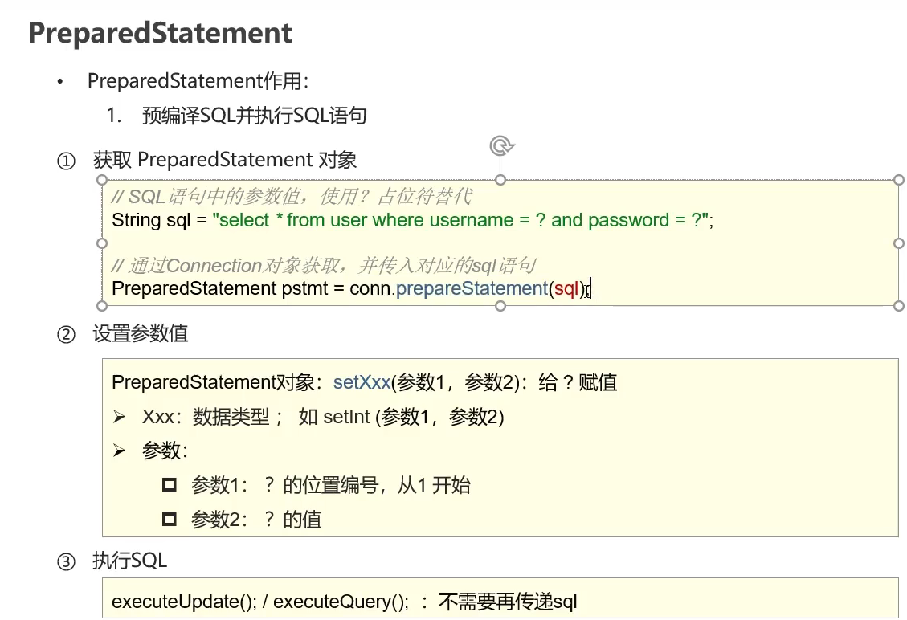


```java
package com.buercorp.yiyu.jdbc;

import java.sql.*;
import java.util.stream.Stream;

/**
 * SQL注入
 *
 * @author liyiyu
 */
public class UserLogin {
    public static void main(String[] args) throws Exception {
        // 导入jar包 mysql-connector-java-8.0.11.jar
        // 注册驱动
        Class.forName("com.mysql.cj.jdbc.Driver");

        // 数据库连接
        String url = "jdbc:mysql://127.0.0.1:3306/userpwdsql?useSSL=false&useServerPrepStmts=true";
        String username = "root";
        String password = "123456";
        Connection conn = DriverManager.getConnection(url, username, password);

        // 接受用户输入的账号 密码
        String name = "xiaoli";
        String pwd = "or 1 = 1";

        /*// sql注入
        String pwdsql = "'or '1' = '1";
        // SELECT * FROM usepwd WHERE  PASSWORD='123456' AND Username='xiaoli'
        String sql = "SELECT * FROM usepwd WHERE USERNAME='" + name + "' AND PASSWORD='" + pwdsql + "'";
        // 登入成功
        System.out.println("sql注入原因：" + sql); // SELECT * FROM usepwd WHERE USERNAME='xiaoli' AND PASSWORD=''or '1' = '1'
        // 获取stmt对象
        Statement stmt = conn.createStatement();

        ResultSet resultSet = stmt.executeQuery(sql);*/


        // 解决sql注入

        // 定义sql
        String sql = "SELECT * FROM usepwd WHERE USERNAME= ? AND PASSWORD= ?";

        // 获取pstmt对象
        PreparedStatement pstmt = conn.prepareStatement(sql);

        // 设置 ？ 的值
        pstmt.setString(1,name);
        pstmt.setString(2,pwd);

        // 执行sql
        ResultSet resultSet = pstmt.executeQuery();
        System.out.println("sql注入原因：" + sql);
        if (resultSet.next()) {
            System.out.println(name + "登入成功");
        } else {
            System.out.println("登入失败");
        }

        // 关闭资源
        pstmt.close();
        conn.close();
    }
}

```


#### 数据库链接池

**概念：**

* 数据库链接池是个容器，负责分配、管理数据库链接（Connection）
* 它允许应用程序重复使用一个现有的数据库链接，而不是再重新建立一个
* 释放空闲时间超过最大空闲时间的数据库链接来避免因为没有释放数据库链接而引起的数据库链接遗漏

**好处：**

* 资源重用
* 提升系统相应速度
* 避免数据库链接遗漏

标准接口：Data

#### Druid

阿里巴巴数据库连接池

**使用步骤：**

* 导入jar包druid
* 定义配置文件
* 加载配置文件
* 获取数据库连接池对象
* 获取链接

```properties
# properties
driverClassName=com.mysql.jdbc.Driver
url=jdbc:mysql:///test02?useSSL=false&useServerPrepStmts=true
username=root
password=123456
# 初始化链接数量
initialSize=5
# 最大链接数
maxActive=10
# 最大等待时间
maxWait=3000
```

```java
package com.buercorp.yiyu.jdbc;

import com.alibaba.druid.pool.DruidDataSourceFactory;

import javax.sql.DataSource;
import java.io.FileInputStream;
import java.sql.Connection;
import java.util.Map;
import java.util.Properties;

/**
 * Driud数据库连接池基本使用
 * @author liyiu
 */
public class Driud {
    public static void main(String[] args) throws Exception {
        // 1.导入jar包

        // 2.定义配置文件.properties

        // 3.加载配置文件
        System.out.println("文件根位置是："+ System.getProperty("user.dir"));
        Properties prop = new Properties();
        prop.load(new FileInputStream("src/main/resources/druid.properties"));

        // 4.获取连接池对象
        DataSource dataSource = DruidDataSourceFactory.createDataSource(prop);

        // 5.获取数据库链接 Connection
        Connection connection = dataSource.getConnection();
        System.out.println(connection);
    }
}
```

#### 案列

```xml
-- 删除tb brand表
drop table if exists tb_brand;
-- 创建tb_brand表
create table tb_brand
(
-- id 主键
id	int primary key auto_increment,
-- 品牌名称
brand_name	varchar(20),
-- 企业名称
company_name varchar(20),
-- 排序字段
ordered	int,
-- 描述信息
description	varchar(100),
-- 状态:0:禁用1:启用
status	int
);
-- 添加数据
insert into tb_brand (brand_name, company_name, ordered, description, status)
values('三只松鼠','三只松鼠股份有限公司'，5，'好吃不上火'，0),
('华为','华为技术有限公司'，188，'华为致力于把数字世界带入每个人、每个家庭、每个组织，构建万物互联的智能世界'，1)，
('小米',小米科技有限公司'，50，'are you ok'，1);
SELECT * FROM tb_brand;
```


## 。。。。。。。。。。。。。。。。

## Junit单元测试

### 配置

先检查插件JUnit（高版本自带），在配置maven，在pom.xml直接引用


```xml
<dependency>
    <groupId>org.junit.jupiter</groupId>
    <artifactId>junit-jupiter</artifactId>
      <version>5.9.1</version>
    <scope>test</scope>
</dependency>
```

### maven UTF-8

打开环境变量，新建系统变量名为MAVEN_OPTS，值为 -Xms256m -Xmx512m -Dfile.encoding=UTF-8，点击确定后重新打开cmd，执行mvn -v可见编码格式已经修改为utf-8	


### 链表


### 自定义单向链表


## 可达性算法

判断对象是否是一个垃圾的标准

​	选取一个节点，作为GC ROOTS顶点，其他对象或者引用去指向咋们的GC ROOT顶点，如果这些对象能够到达咋们的GC ROOTS 顶点，那么这些对象不是垃圾，反之是


## 源码、反码、补码

### 原码


### 反码


### 补码


## & | 运算符


**8**

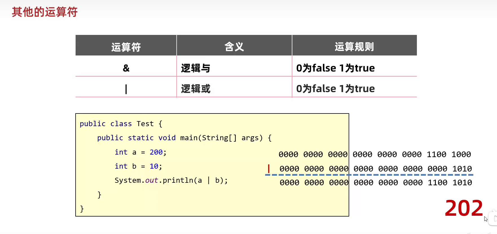


## Stream流

* 流不存储元素
* 流的操作不会修改其数据源
* 流的操作尽可能是惰性操作（意味着在需要结果之前，不会执行任何操作）

#### 不可变集合

LIst、Set、Map接口中都存在 of 方法可以创建不可变集合

#### 细节：

​	List：直接用

​	Set：元素不能重复

​	Map：元素不能重复、键值对数量最多是10个

​				超过10个用 ofEntries (用ofcopy简单)

```java
package com.buercorp.wangyu.Stream;

import java.util.Iterator;
import java.util.List;
import java.util.Set;
import java.util.Stack;

/**
 * 不可变集合
 * 一旦创建完毕之后，是无法进行修改的 在集合中添加元素和删除元素，都会报错 只能查询集合中的元素
 * List Set Map
 * @author 忆白
 */
public class ListSet {
    public static void main(String[] args) {
        // List.of() 创建一个不可变集合
        List<Object> list = List.of("1","2","3","4","5");
        // 遍历集合
        for (Object li : list) {
            System.out.print(li);
        }
        Iterator<Object> it = list.iterator();
        while (it.hasNext()) {
            System.out.print(it.next());
        }
        // 添加元素
        //list.add("6"); // 报错
        // 删除元素
        //list.remove("1"); // 报错

        System.out.println("-------------------");

        // Set创建一个不可变集合
        // 元素不能重复
        Set<Object> set = Set.of("1","2","3","4","5");
        // 遍历集合
        for (Object li : set) {
            System.out.print(li);
        }
        Iterator<Object> it1 = set.iterator();
        while (it1.hasNext()) {
            System.out.print(it1.next());
        }
        // 添加元素
        //set.add("6"); // 报错
        // 删除元素
        //set.remove("1"); // 报错


        System.out.println("-------------------");

        // Map创建一个不可变集合
        HashMap<Object, Object> hm = new HashMap<>();
        hm.put("1","2");
        hm.put("2","3");
        hm.put("3","4");
        hm.put("4","5");
        hm.put("5","6");

        Map<Object, Object> map = Map.copyOf(hm);
        for (Object li : map.keySet()) {
            System.out.print(li);
        }

        Iterator<Object> it2 = map.keySet().iterator();
        while (it2.hasNext()) {
            System.out.print(it2.next());
        }
        
        // 添加元素
        map.put("6","7"); // 报错
        // 删除元素
        map.remove("1"); // 报错
    }
}

```


### 初爽Stream流

```java
package com.buercorp.wangyu.Stream;

import java.util.stream.Stream;

/**
 * 初爽Stream流
 * 把所有以“李”开头的元素存到集合中
 * 把“李”开头 长度为 3 的元素存到集合中
 *
 * @author 忆白
 */
public class Test1 {
    public static void main(String[] args) {
        //1.把所有以“李”开头的元素存到集合中
        Stream.of("李四", "李五", "李六", "张三", "张四", "张五", "李忆鱼")
                .filter(name -> name.startsWith("李"))
            	// 长度为 3 的元素存到集合中
                .filter(name -> name.length() == 3)
                .forEach(System.out::println);

    }
}
```

### 作用

结合Lambda表达式，简化集合、数组的操作

#### 使用步骤

* 先得到一条Stream流（流水线），并把数据放上去
* 使用**中间方法**对流水线上的数据进行操作
* 使用**终结方法**对流水线上的数据进行操作
  * 中间方法：过虑	转换	方法调用完毕之后，还可以调用其他方法
  * 终结方法：统计    打印    最后一步，调用完毕之后，不能调用其他方法

**获取Stream对象**

|   获取方式   |                  方法名                   |           说明           |
| :----------: | :---------------------------------------: | :----------------------: |
|   单列集合   |        default Stream<E> stream()         |  Collection中的默认方法  |
|   双列集合   |                    无                     |   无法直接使用stream流   |
|     数组     | public static<T> Stream stream(T[] array) | Arrays工具类中的静态方法 |
| 一堆零散数据 | public static<T> Stream<T>of(T...values)  |  Stream接口中的静态方法  |

```
// stream.of()细节：
//          方法的形参是一个可变的参数，可以传入多个参数，也可以传入一个数组
//          但是数组必须是引用数据类型，不能传入基本数据类型
```


```java
package com.buercorp.wangyu.Stream;

import java.util.*;
import java.util.stream.Stream;

/**
 * 获取Stream流
 * @author 忆白
 */
public class Test2 {
    public static void main(String[] args) {
        // 单列集合获取Stream流
        // 创建单列集合
        ArrayList<Object> list = new ArrayList<>();
        Collections.addAll(list, "1", "2", "3", "4", "5");
        list.stream().forEach(System.out::println); // 1 2 3 4 5

        // 双列集合获取Stream流
        // 创建双列集合
        HashMap<String, Integer> hm = new HashMap<>();
        hm.put("1", 1);
        hm.put("2", 2);
        // 第一种获取Stream流
        hm.keySet().stream().forEach(System.out::println); // 1 2
        // 第二种获取Stream流
        hm.entrySet().stream().forEach(System.out::println); // 1=1 2=2

        // 数组
        int[] arr = {1, 2, 3, 4, 5};
        Arrays.stream(arr).forEach(System.out::println); // 1 2 3 4 5

        // 一堆零散数据
        // stream.of()细节：
        //          方法的形参是一个可变的参数，可以传入多个参数，也可以传入一个数组
        //          但是数组必须是引用数据类型，不能传入基本数据类型
        Stream.of("1", "2", "3", "4", "5").forEach(System.out::println); // 1 2 3 4 5
        Stream.of(1, 2, 3, 4, 5).forEach(System.out::println); // 1 2 3 4 5
    }
}

```


### 中间方法

**注意：**

* 中间方法，返回新的Stream流，原来的Stream流只能使用一次，建议链式编程
* 修改Stream流中的数据，不会影响原来集合或者数组中的数据


### 终结方法


**collect收集:**

```java
package com.buercorp.wangyu.Stream;

import java.util.*;
import java.util.function.Function;
import java.util.stream.Collectors;

/**
 * 在list集合和set集合
 * collect搜集方法
 * 把所有男性搜集起来
 * set集合会排重
 * @author liyiyu
 */
public class Test3 {
    public static void main(String[] args) {
        ArrayList<String> list = new ArrayList<>();
        Collections.addAll(list, "张三-男-23", "张三-男-23", "张三-男-23", "李四-男-22", "王五-女-21", "赵六-女-20", "李忆鱼-男-23");

        // 使用list集合收集collect不会去重
        List<String> newlist = list.stream()
                // split 分割
                .filter(s -> "男".equals(s.split("-")[1]))
                .collect(Collectors.toList());
        System.out.println(newlist); // [张三-男-23, 张三-男-23, 张三-男-23, 李四-男-22, 李忆鱼-男-23]

        // 使用set集合收集collect会去重
        Set<String> newset = list.stream()
                .filter(s -> "男".equals(s.split("-")[1]))
                .collect(Collectors.toSet());
        System.out.println(newset); // [李忆鱼-男-23, 张三-男-23, 李四-男-22]

        // 收集map集合
        // 谁作为键 谁作为值
        // 把所有男性收集起来 键：姓名 值：年龄
        ArrayList<String> list2 = new ArrayList<>();
        Collections.addAll(list2, "张三-男-23", "李四-男-22", "王五-女-21", "赵六-女-20", "李忆鱼-男-23");

        /**
         * toMap: 参数一表示键的生成规则
         *        参数二表示值的生成规则
         *
         * 参数一：
         *       Function泛型一：表示流中每一个数据的类型
         *               泛型二：表示Map集合中键的数据类型
         *       方法apply形参：依次表示流里面的每一个数据
         *             方法体：生成键的代码
         *             返回值：已经生成的键
         *
         *  参数二：
         *         Function泛型一：表示流中每一个数据的类型
         *                泛型二：表示Map集合中值的数据类型
         *         方法apply形参：依次表示流里面的每一个数据
         *              方法体：生成键的代码
         *              返回值：已经生成的键
         */
        Map<String,Integer> newmap = list2.stream()
                .filter(s -> "男".equals(s.split("-")[1]))
                .collect(Collectors.toMap(new Function<String, String>() {
                                              @Override
                                              public String apply(String s) {
                                                  return s.split("-")[0];
                                              }
                                          },
                        new Function<String, Integer>() {
                            @Override
                            public Integer apply(String s) {
                                return Integer.parseInt(s.split("-")[2]);
                            }
                        }

                ));

        System.out.println(newmap);
        
        
	    ArrayList<String> list2 = new ArrayList<>();
        Collections.addAll(list2, "张三-男-23", "李四-男-22", "王五-女-21", "赵六-女-20", "李忆鱼-男-23");
        Map<String,Integer> newmap2 = list2.stream()
                .filter(s -> "男".equals(s.split("-")[1]))
                .collect(Collectors.toMap(s -> s.split("-")[0],s -> Integer.parseInt(s.split("-")[2])));

        System.out.println(newmap2);

    }
}

```


**并行流：**

```java
package com.buercorp.wangyu.Stream;

import java.util.Arrays;
import java.util.List;

/**
 * 使用并行流计算平方和
 * @author liyiyu
 */
public class Test4 {
    public static void main(String[] args) {
        // Arrays.asList()是一个静态方法，用于将一组元素转换为一个不可变的列表
        List<Integer> numbers = Arrays.asList(1, 2, 3, 4, 5, 6, 7, 8, 9, 10);
        // parallelStream()方法将列表转换为并行流
        int sumOfSquares = numbers.parallelStream()
                // mapToInt()方法将流中的每个元素映射为其平方值
                .mapToInt(x -> x * x)
                // sum()方法计算平方和
                .sum();

        System.out.println("平方和：" + sumOfSquares);
    }
}

```


## 。。。。。。。。。。。。。。。。


## 快捷键

*  **快速生成构造器** ：alt + insert
*  **生成右边的变量** ：ctrl + alt + v
*  **包围方式**：ctrl + alt + t 异常
*  **单元测试**：ctrl + shift + t
*  **查看源码** ：ctrl + b
*  **上下移动**：ctrl + alt + 上下箭头
* **批量修改**：shift + f6
* **小写转大写：**ctrl + shift + u


