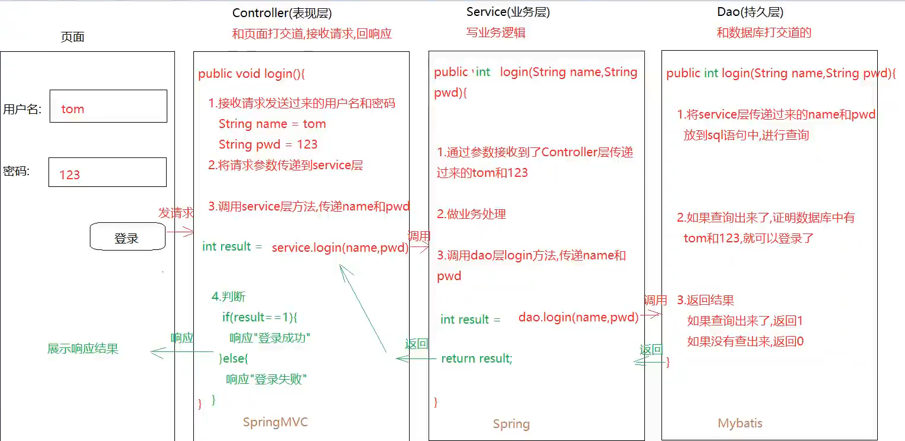

# **java**

## **方法**

### **方法介绍以及简单方法定义（无参无返回值）**

1.问题描述：

之前所有的代码都在main方法中写，如果我们所有代码都在main方法中写，main代码就会太多 -> 不好维护

```java
通用格式：
    修饰符 返回值类型 方法名（参数）{
		方法体
         return 结果
}

通过通用格式，分成四种方法来学习：
    a.无参无返回值
    b.有参无返回值
    c.无参有返回值
    d.有参有返回值

```

#### 1.无参数无返回值

1.无参无返回值    
public static void 方法名(){
    方法体
}

2.直接调用：
    在其他方法中：方法名()
    
3.注意事项：
    a.void关键字代表无返回值类型，写了void，方法中就不要写return 结果 ；可以写return
    b.方法不调用不执行，main方法是jvm调用的
    c.方法之间不能相互嵌套，方法之间是平级关系
    d.方法的执行只跟调用顺序有关

4.个部分解释
    a.修饰符：public static
    b.返回值类型：
    	该方法的结果最终返回数据类型（int、double、string等）
    c.方法名：见名知意（小驼峰）
    d.参数：进入到方法内部参与的数据（数据类型 变量名，数据类型 变量名）
    e.方法体：实现该方法的具体代码
    f.return结果：如果有返回值，用return将结果返回

``` java
public class Teacher {
    public static void main(String[] args) {
        // 方法调用
        teacher();
        student();
    }
    // 方法之间是平级关系
    // void 代表无返回值
    public static void teacher(){
        System.out.println("备课");
        System.out.println("讲课");
        System.out.println("管理");
    }

    public static void student(){
        System.out.println("听课");
        System.out.println("学习");
    }
}

```

####  2.有参数无返回值

1.格式：

public static void 方法名(数据类型 变量名){
    方法体
}

2.直接调用：
    方法名（具体的值）调用的时候要给参数赋值

``` java
public class sumMet {
    public static void main(String[] args) {
        sum(14,10);
    }
    public static void sum(int a, int b){
        int sum = a + b;
        System.out.println("结果" + sum);
    }
}
```

#### 3.无参数有返回值

1.格式：
    public static 返回值类型 方法名(){
		方法体
         return 结果
}

2.调用：
    a.打印调用 （不推荐）
    b.赋值调用 
    	数据类型 变量名 = 方法名()

```java
public class sumMet {
    public static void main(String[] args) {
        // 打印调用
        System.out.println(sum());

        // 赋值调用
        int result = sum();
        System.out.println(result);
    }
    public static int sum(){
        int a = 10;
        int b = 20;
        int sum = a + b;
        return sum;
    }
}
```

#### 4.有参数有返回值

1.格式：
    public static 数据类型 方法名(){
    	方法体
        返回值
}

```java
public class sumMet {
    public static void main(String[] args) {
        // 打印调用
        System.out.println(sum(10,20));

        // 赋值调用
        int result = sum(10,20);
        System.out.println(result);
    }
    public static int sum(int a, int b){
        int sum = a + b;
        return sum;
    }
}
```

#### 5.返回值



1.Controller接受的请求参数需要一层一层传递到service层，service层需要将请求参数再传递到dao层

此时service的方法以及dao的方法都需要去接受

2.dao层的结果需要传递给service，service再传递给controller层，此时dao层和service方法需要返回值

## **面向对象**

## **封装**

## **static关键字**

**1.概述**：static是静态关键字
    
**2.使用**：
    a.修饰一个成员变量（类中方法外）
    	static 数据类型 变量名
    b.修饰一个方法
    	修饰符 static 返回值类型 方法名（形参）{
    		方法体
             return 结果
}

**3.调用静态成员：**
    类名直接调用（不用new对象）
    
**4.静态成员特点**：
    a.静态成员属于类成员，不属于对象成员（非静态的成员属于对象成员 要new对象）
    b.静态成员会随着类的加载而加载
    c.静态成员优先于非静态成员存在在内存中
    d.凡是根据静态成员所在的类型创建出来的对象，都可以共享这个静态成员

```java
public class Student {
        String name;
        int age;
    	// static 静态属性
        static String classRoom;
}
```

```java
public class Test {
    public static void main(String[] args) {
        // 直接赋值 点 类名直接调用	
        Student.classRoom = "222";
        
        Student s1 = new Student();
        s1.name = "xiaoyi";
        s1.age = 18;
        System.out.println(s1.name + "今年" + s1.age + "在" + Student.classRoom + "教室");

        Student s2 = new Student();
        s2.name = "yibai";
        s2.age = 18;
        System.out.println(s2.name + "今年" + s2.age + "在" + Student.classRoom + "教室");
    }
}
```

**5.总结**：

​	a.不管在不在同一个类中，非静态成员都可以**new**对象调用

​	b.不管在不在同一个类中，静态成员都可以类名调用

```java
public class Person {
    public static void sleep(){
        System.out.println("这是静态方法，睡觉");
    }
    public void eat(){
        System.out.println("干饭人");
    }
}
```

```java
public class Test {
    public static void main(String[] args) {
        // 在静态成员中访问非静态成员
        Test t1 = new Test();
        t1.method3(); // 这是非静态方法03

        Person p1 = new Person();
        p1.eat(); // 干饭人

        t1.method04();
    }
    public static void method1(){
        // 静态方法
        System.out.println("这是静态方法01");
    }
    public static void method2(){
        // 静态方法
        System.out.println("这是静态方法02");
    }
    public void method3(){
        // 非静态方法
        System.out.println("这是非静态方法03");

        // 非静态直接访问静态成员
            // 在同类中
            method1(); // 这是静态方法01
            // 不同类
            Person.sleep(); // 这是静态方法，睡觉
            Person p2 = new Person();
            p2.sleep(); // 这是静态方法，睡觉
    }
    public void method04(){
        // 非静态直接访问非静态
            // 在同类中
            method3(); // 这是非静态方法03
            // 不同类
            Person p4 = new Person();
            p4.eat(); // 干饭人
    }
}
```

构造方法用private修饰

工具类中的成员都是静态的，静态成员都是类名调用，不需要new对象

所以工具类中的构造方法都是用private修饰

如果构造方法被private修饰，那么在别的类中，就不能利用构造方法new对象

## **递归**

```java
1.概述：在方法内部自己调用自己
2.分类：
    a.直接递归
    	public static void method(){
    		method()
}

	b.间接递归
        A(){
			B()
    	}
		B(){
            C()
        }
		C(){
			A()
        }
3.注意：
    递归必须要有出口，否则栈内存溢出
```

