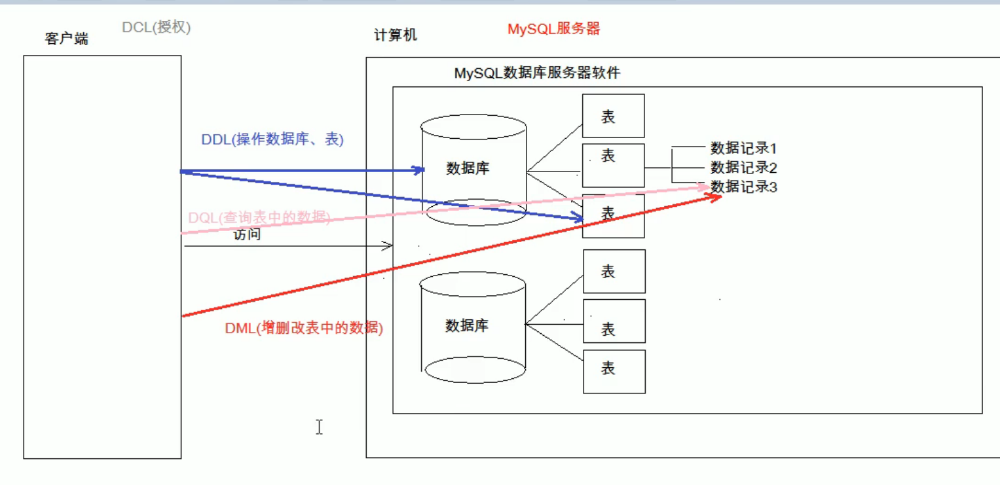
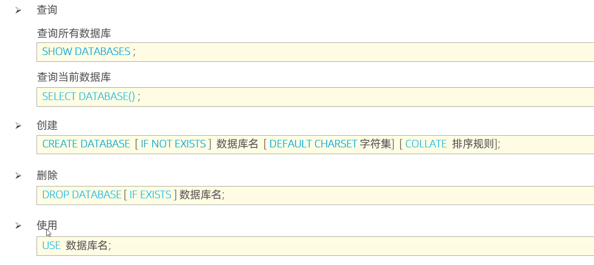

# MySQL

## **配置：**

* **服务启动：**
  * 使用管理员打开cmd  
  * net start mysql：启动mysql的服务
  * net stop mysql：关闭mysql的服务
* **登入：**
  * mysql -uroot -p密码
* **退出：**
  * exit
  * quit

|       数据库       |            存储数据的仓库，数据是有组织的进行存储            |           DataBase（DB）            |
| :----------------: | :----------------------------------------------------------: | :---------------------------------: |
| **数据库管理系统** |                  操纵和管理数据库的大型软件                  | DataBase Management System （DBMS） |
|      **SQL**       | 操作关系型数据库的编程语言，定义了一套操作关系型数据库统一标准 |  Structured Query Language（SQL）   |

## 关系型数据库（RDBMS）

### 概念：

* 建立在关系模型基础上，由多张相互连接的二维表组成的数据库

### 特点：

* 使用表存储数据，格式统一，便于维护
* 使用SQL语言操作，标准统一，便于方便

## SQL

### **概念：**

Structured Query Language：操作关系型数据库的编程语言，是一套标准

其实就是定义了操作所有关系型数据库的规则，每一种数据库操作的方式存在不一样

### **通用语法：**

SQL语句可以单行或多行书写，以分号结尾

MySQL数据库的SQL语句不区分大小写 关键字建议大写

注释：

​	单行注释：-- 注释内容 	# 注释内容

​	多行注释：/* 注释内容 */

### 分类

* **DDL**（Data Definition Language）**数据定义语言**
  * 用来定义数据库对象：数据库，表，列，字段等	关键字：create，drop，alter等
* **DML**（Data Manipulation Language）**数据操作语言**
  * 用来对数据库中表的数据进**行增删改**	关键字：insert，delete，update等
* **DQL**（Data Query Language）**数据查询语言**
  * 用来**查询**数据库中表的记录（数据）	关键字：select，where等
* DCL（Data Control Language）数据控制语言（了解）
  * 用来定义数据库的访问权限和安全级别，及创建用户	关键字：GRANT，REVOKE等

### DDL

**数据库操作**

### DML

### DQL

### DCL

## 函数

## 约束

## 多表查询

## 事物

