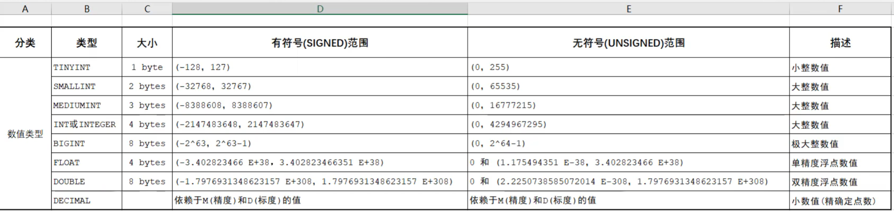

# MySQL

## **配置：**

* **服务启动：**
  * 使用管理员打开cmd  
  * net start mysql：启动mysql的服务
  * net stop mysql：关闭mysql的服务
* **登入：**
  * mysql -uroot -p密码
* **退出：**
  * exit
  * quit

|       数据库       |            存储数据的仓库，数据是有组织的进行存储            |           DataBase（DB）            |
| :----------------: | :----------------------------------------------------------: | :---------------------------------: |
| **数据库管理系统** |                  操纵和管理数据库的大型软件                  | DataBase Management System （DBMS） |
|      **SQL**       | 操作关系型数据库的编程语言，定义了一套操作关系型数据库统一标准 |  Structured Query Language（SQL）   |

## 关系型数据库（RDBMS）

### 概念：

* 建立在关系模型基础上，由多张相互连接的二维表组成的数据库

### 特点：

* 使用表存储数据，格式统一，便于维护
* 使用SQL语言操作，标准统一，便于方便

## SQL

### **概念：**

Structured Query Language：操作关系型数据库的编程语言，是一套标准

其实就是定义了操作所有关系型数据库的规则，每一种数据库操作的方式存在不一样

### **通用语法：**

SQL语句可以单行或多行书写，以分号结尾

MySQL数据库的SQL语句不区分大小写 关键字建议大写

注释：

​	单行注释：-- 注释内容 	# 注释内容

​	多行注释：/* 注释内容 */

### 分类

* **DDL**（Data Definition Language）**数据定义语言**
  * 用来定义数据库对象：数据库，表，列，字段等	关键字：create，drop，alter等
* **DML**（Data Manipulation Language）**数据操作语言**
  * 用来对数据库中表的数据进**行增删改**	关键字：insert，delete，update等
* **DQL**（Data Query Language）**数据查询语言**
  * 用来**查询**数据库中表的记录（数据）	关键字：select，where等
* DCL（Data Control Language）数据控制语言（了解）
  * 用来定义数据库的访问权限和安全级别，及创建用户	关键字：GRANT，REVOKE等

### DDL

**定义数据库对象：数据库，表，列，字段等**

#### **数据库操作**

#### **表操作-查询**

#### **表操作-创建**

#### **数据类型**

#### 表操作-修改

#### **总结**

| DDL-数据库操作                                        |                      |
| ----------------------------------------------------- | -------------------- |
| SHOW DATABASES;                                       | 查询所有数据库       |
| SELECT DARABASE();                                    | 查询当前数据库       |
| CREATE DATABASE 数据库名;                             | 创建数据库           |
| USE 数据库名;                                         | 使用数据库           |
| DROP DATABASE 数据库名；                              | 删除                 |
|                                                       |                      |
| **表操作**                                            |                      |
| SHOW TABLES;                                          | 查询当前数据库所有表 |
| CREATE TABLE 表名 （字段 字段类型，字段 字段类型）;   | 创建                 |
| DESC 表名;                                            | 查询表结构           |
| SHOW CREATE TABLE 表名;                               | 查询指定表的建表语句 |
| ALTER TABLE 表名 ADD/MODIFY/CHANGE/DROP/RENAME TO...; | 增修改               |
| DROP TABLE 表名;                                      | 删除表               |

### DML

**对数据库中的表数据进行增、删、改**

#### 添加数据

**注意：**

* 插入数据时，指定的字段顺序需要与值的顺序一一对应
* 字符串和日期型数据应该包含在引导中
* 插入的数据大小，应该在字段的规定范围内

#### 修改数据

**注意：**

* **修改语句的条件可以有，也可以没有**
* **如果没有条件，则会修改整张表的所有数据**

#### 删除数据

**注意：**

* DELETE语句的条件可以有，也可以没有，如果没有条件，则会删除整张表的所有数据
* DELETE语句不能删除某

#### **总结**

| INSERT INTO 表名（字段1，字段2，.....）VALUES（值1，值2，.....）【，（值1，值2，.....）....】; | 添加数据     |
| ------------------------------------------------------------ | ------------ |
| UPDATE 表名 SET 字段1=值1，字段2=值2【WHERE 条件】；         | **修改数据** |
| DELETE EROM 表名【WHERE 条件】；                             | **删除数据** |

### DQL

**查询数据库中的表的记录**

#### 基本查询

#### 条件查询

#### 聚合函数

**介绍：**

* 将一列数据作为一个整体，进行纵向计算

**常见聚合函数：**

| 函数  | 功能     |
| ----- | -------- |
| count | 统计数量 |
| max   | 最大值   |
| min   | 最小值   |
| avg   | 平均值   |
| sum   | 求和     |

#### 分组查询

**where和having区别：**

* 执行时机不同：where是分组之前进行过滤，不满足where条件，不参与分组；而having是分组之后对结果进行过滤
* 判断条件不同：where不能对聚合函数进行判断，而having可以

**注意：**

* **执行顺序**：where > 聚合函数 > having
* **分组之后**，查询的字段一般为聚合函数和分组字段，查询其他字段无任何意义

#### 排序查询

**排序方式：**

**ASC**：升序（默认值）

**DESC**：降序

**注意：**

如果是多字段排序，当第一个字段值相同时，才会根据第二个字段进行排序

#### 分页查询

**注意：**

* 起始索引从0开始，起始索引=（查询页码-1） * 每页显示记录数
* 分页查询时数据库的方言，不同的数据库有不同的实现，MySQL中是LIMIT
* 如果查询的是第一页数据，起始索引可以省略，直接简写limit 10

#### 执行顺序

#### 总结

### DCL

**用来管理数据库 用户、控制数据库的访问 权限**

#### 管理用户

#### 权限控制

## 函数

## 约束

## 多表查询

## 事物

