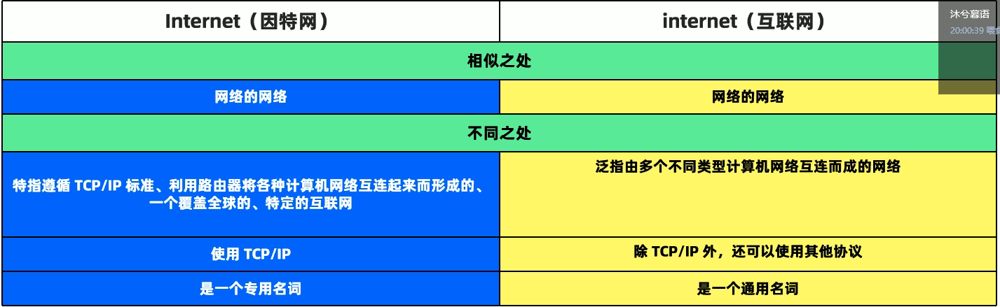
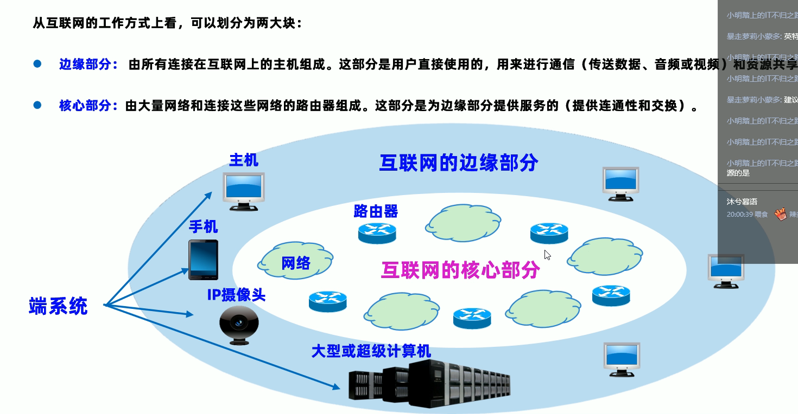
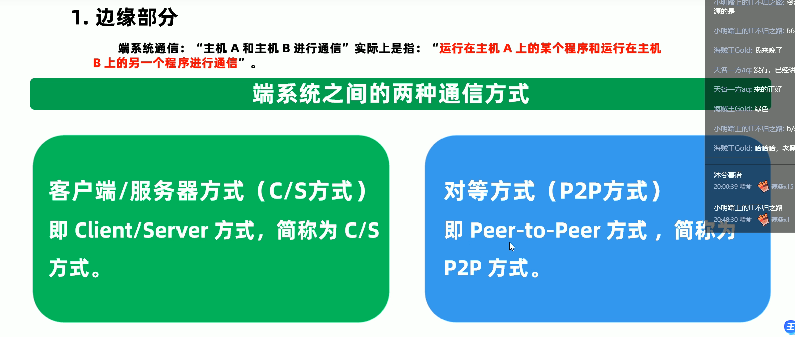
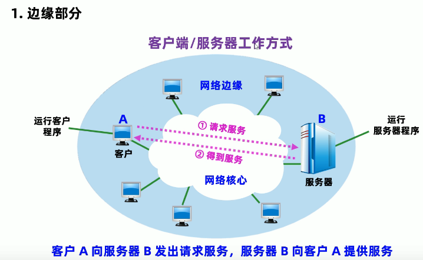
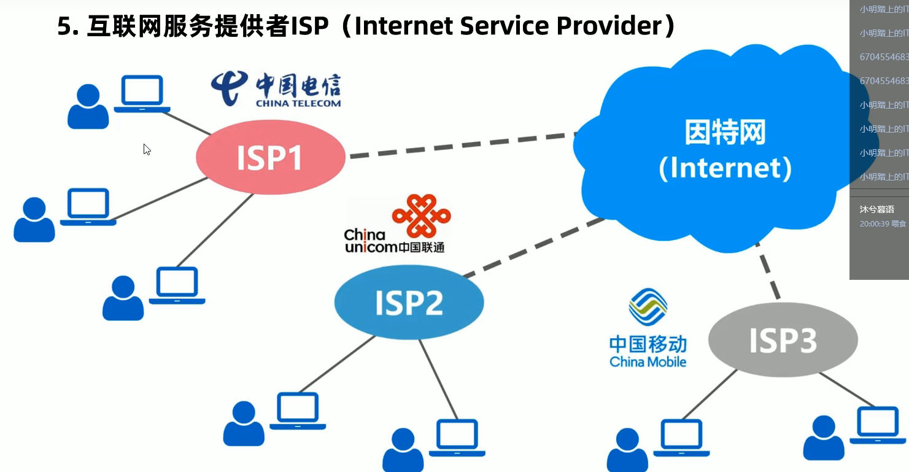
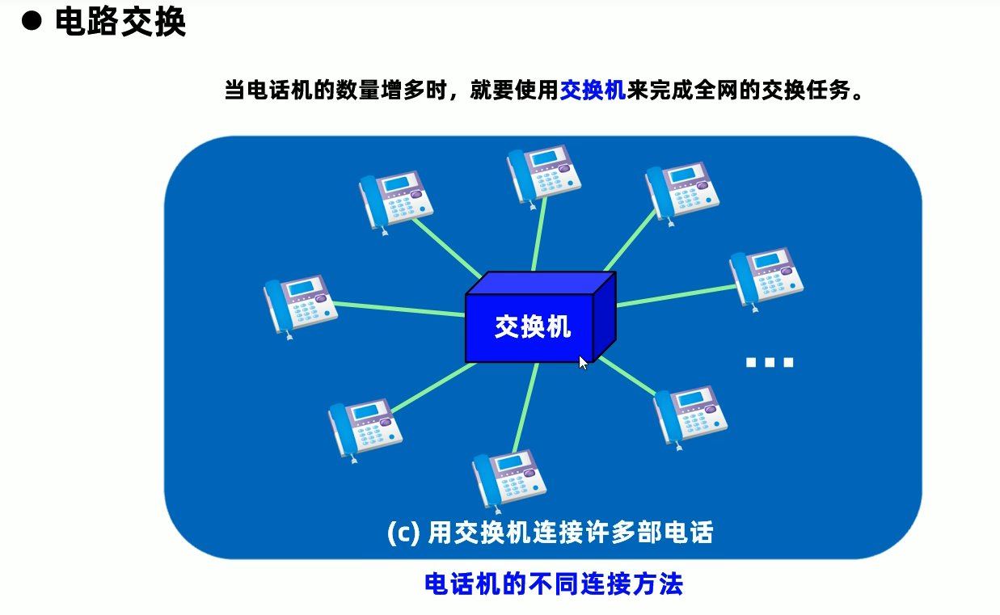
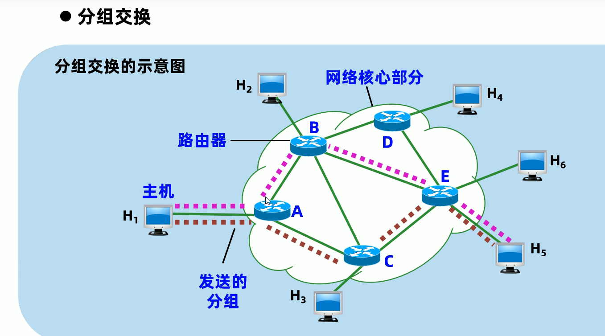
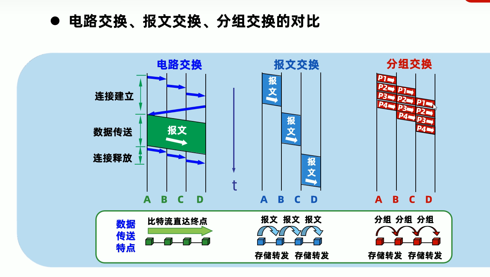
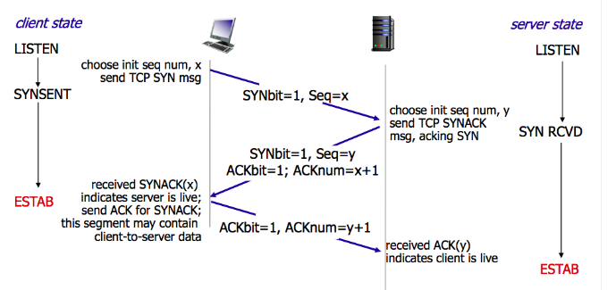
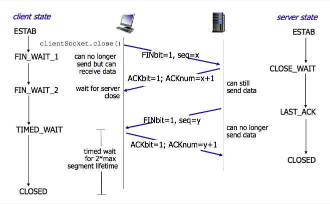

# 计算机网络

## 计算机网络概述

### 定义

网络（Network）由若干节点（Node）和连接这些节点的链路（Link）组成

互联网（Internetwork）由多个网络通过路由器互相连接起来，构成的一个覆盖范围更大的网络

因特网（Internet）世界上最大的、覆盖全球的计算机网络

### 概念

计算机网络就是相互连接(通过有线或无线)但又相互独立的计算机集合(至少有两台计算机)

### 组成

计算机网络由硬件和软件组成

​	硬件：主机、终端、路由器等

​	软件：协议、系统程序、应用程序

### 结构

​	网络边缘：位于互联网边缘与互联网相连的计算机和其他设备,如桌面计算机、移动计算机、服务器、其他智能终端设备

​	网络核心：通过数据交换实现数据通过网络核心从源主机到达目的主机

​		路由：确定数据分组从源到目标的路径

​		转发：路由器或交换机将接受到的数据分组转发出去

​	接入网络

### 功能

信息交换、资源共享、分布式处理、负载均衡、数据通信、资源共享、远程传输、集中管理、提高性能及可靠性

​	信息交换：利用网络收发电子邮件、发布信息、进行电子商务等

​	分布式处理：在网络操作系统的控制下，使网络中的计算机协同工作，完成仅靠单机无法完成的大型任务

### 分类

传输介质：有线网络、无线网络

传输技术：广播式网络、点到点式

使用范围：公用网络、专用网

信息交换：报文交换网络、分组交换网络

服务方式：客户机/服务机网络、对等网

拓扑结构：总状、星状、环状、树状、网状网络

通信距离：广域网、城域网、局域网

### 家庭接入

### 性能指标

速率

带宽：最高速率

吞吐量：实际速率

时延

时延带宽积：

往返时间RTT；

利用率：

## 网络协议

### 概念

计算机网络的所有通信过程都必须遵守某种规则

协议规定了通信实体之间交换的消息的格式、意义、顺序以及针对收到信息或发生的事情所采取的”动作“

### 三要素

​	语法（Syntax）：

​		数据与控制信息的结构或格式

​	语义（Semantics）：

​		需要发出何种控制信息

​		完成何种动作以及做出何种响应

​		差错控制

​	时序（Timing）：

​		事件顺序

​		速度匹配 

## 数据交换

交换类型：电路交换、报文交换、分组交换

### 电路交换

就是计算机终端之间的通信。整个通信过程中双方一直占用该电路，独占资源。

典型电路交换网络：电话网络

三个阶段：建立连接、通信、释放连接

优点：实时性强、时延小、交换设备低

缺点：线路利用低、电路接续时间长、同信效率低、不同类型终端用户之间不能通信

适用于：信息量大、报文长、经常使用的固定用户之间的通信

### 报文交换

将用户的报文存储在交换机的存储器中。以单位进行存储——转发

中继电路利用高、多个用户可以同时在一条线路传送、可以实现不同速率、不同规程的终端间互通

缺点：网络传输时延大、占用大量的交换机的内存和外存、实时性低

适用于：传输报文较短、实时性要求低

### 分组交换

将用户传送的数据划分成一定的长度，每个分组的前面有一个分组头，指明该分组发往何地址，然后由交换机根据分组的标识把他们转发目的地

## 计算机网络性能

速率、带宽、

###  速率

单位时间（秒）传输信息（比特）量

### 带宽

网络通信线路所能传送数据的能力，最高数据率

## 计算机网络体系结构

## 物理层

（实现信号在两台相邻网络实体之间的传输）

物理层是计算机OSI模型最低的一层，物理层规定：为传输数据所需要的物理链路创建、维持、拆除，而提供具有机械的、电子的、功能的和规范的特性；

**主要功能是**：利用传输介质为数据链路层提供物理连接，负责处理数据传输并监控数据出错率，以便数据流的透明传输

简单的说就是：确保原始的数据在各种物理媒体上传输

## 数据链路层

（为相连或同一局域网中设备实现数据帧传输、差错校验和流量控制）

**主要功能是：**在物理层提供服务的基础上，在通信的实体间建立数据链路连接，传输以“帧”为单位的数据包，并采用差错控制和流量控制的方法，使有差错的物理线路变成无差错链路

## 网络层

（将数据从源转发给目的设备。网络层PDU是包（分组）如：定义地址格式、寻址方式）

**主要功能是：**为数据在节点之间传输创建逻辑链路，通过路由选择算法为分组通过通信子网选择最适当的路径，以及实现拥堵控制、网络互联等功能

### 路由

指把数据从一个地方传送到另外一个地方的行为和动作，在路上，至少遇到一个中间节点，而路由器。正是执行这种行为和动作的机器

路由器的基本功能：

* 网络互联：主要用于互联局域网和广域网，实现不同网络相互通信
* 数据处理：分组过滤、分组转发、优先级、复用、加密、压缩、防火墙等
* 网络管理：路由器配置管理、性能管理、容错管理、流量控制管理等

## 传输层

（规范数据传输功能和流程 PDU叫段 如：数据分片、重组）

**主要功能是：**向用户提供可靠的端到端（End-to-End）服务，处理数据包错误、数据包次序，以及其他一些关键传输问题

传输层向高层屏蔽了下层数据通信的细节，因此，它是计算机通信体系结构中关键的一层

## 会话层

（完成各方交互信息之前的会话建立准备工作，确认通信的身份及可以执行的操作 如：AAA认证、授权、计费）

**主要功能是：**负责维扩两个节点之间的传输连接，以便确保点到点传输不中断，以及管理数据交换等功能

## 表示层

（保证通信各方在应用层相互发送的信息可以相互解读，且表达方式上是一致的 如：加解密、编码）

**主要功能是：**用于处理在两个通信系统中交换信息的表示方式，主要包括数据格式变换、数据加密与解密、数据压缩与恢复等功能

## 应用层

（提供用户接口，包含了各类用户常用的协议 如：HTTP、FTP、SMtp、POP）

**主要功能是：**为应用软件提供了很多服务，如文件服务器、数据库服务、电子邮件与其他网络软件服务

数据传输基本单位为报文

主要协议：FTP（文件传送协议）、Telnet（远程登录协议）、DNS（域名解析协议）、SMTP（邮件传送协议），POP3协议（邮局协议），HTTP协议（Hyper Text Transfer Protocol 超文本传输协议）

**HTTP请求报文方式：**

- GET：请求指定的页面信息，并返回实体主体；
- POST：向指定资源提交数据进行处理请求；
- DELETE：请求服务器删除指定的页面；
- HEAD：请求读取URL标识的信息的首部，只返回报文头；
- OPETION：请求一些选项的信息；
- PUT：在指明的URL下存储一个文档。

**TCP（Transmission Control Protocol）** ：传输控制协议。

**UDP（User Datagram Protocol）** ：用户数据报协议。

**端口（port） ** ：端口的目的是为了确认对方机器是那个进程在于自己进行交互，比如 MSN 和 QQ 的端口不同，如果没有端口就可能出现 QQ 进程和 MSN 交互错误。端口又称协议端口号。

**UDP的主要特点是 **

* 无连接 
* 尽最大努力交付 
*  面向报文 
* 无拥塞控制 
* 支持一对一，一对多，多对一和多对多的交互通信
*  首部开销小（只有四个字段：源端口，目的端口，长度和检验和）

**TCP 的主要特点是**

* 面向连接
* 每一条 TCP 连接只能是一对一的
* 提供可靠交付
* 提供全双工通信
* 面向字节流

## TCP

### 建立连接（三次握手）

* 第一次：客户向服务器发送连接请求段，此时服务器知道客户能发
* 第二次：服务器发回确认报文段，同意建立新连接的确认段，此时客户知道服务器能发能收
* 第三次：客户对服务器的同一连接进行确认，此时服务器知道客户能收

三次握手可携带数据

### 释放连接（四次挥手）

* 第一次：客户向服务器发送释放连接报文段，发送端数据发送完毕，请求释放连接
* 第二次：服务器向客户发送确认段，确认字号段有效
* 第三次：服务器向客户发送释放连接报文段，请求释放连接，确认字号段有效
* 第四次：客户向服务器发送确认段，确认字号段有效

